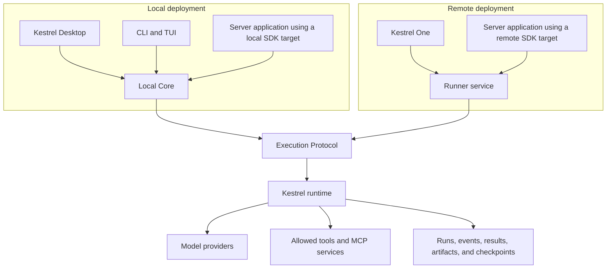

# Kestrel Architecture

Kestrel is a runtime for agent work that may take multiple steps, use tools,
wait for input, survive interruptions, and produce durable results. You can use
it through Kestrel Desktop, the CLI and TUI, Kestrel One, or server-side
packages.

These products provide different experiences, but they share the same model for
runs, sessions, events, tools, persistence, cancellation, recovery, and terminal
results. In this document, **one runtime** means one execution architecture and
one set of contracts—not one global process serving every Kestrel installation.

## One Runtime, Two Deployment Forms

Kestrel runs locally through **Local Core** or remotely through a **runner
service**. Both expose the same **Execution Protocol** and use the same runtime
implementation.



Local Core is the runtime host for work on a user's machine. It exposes an
authenticated Unix socket, manages local configuration and credentials, and
uses embedded PGlite by default. An external PostgreSQL database is available
as an advanced configuration.

A runner service is the network-hosted form. It exposes the Execution Protocol
through authenticated HTTP and streaming endpoints so trusted application
servers can reach Kestrel without depending on a user's computer.

The `kestrel web` command does not start a second local runtime. It exposes the
existing Local Core execution endpoint through an authenticated loopback HTTP
bridge for local server applications. Browser code should call its application
server, never Local Core or a runner service directly.

## Core Components

### Execution Protocol

The Execution Protocol defines the commands and events shared by local and
remote clients. It covers starting and controlling runs, live streams, durable
subscriptions, session inspection, and terminal results. A local SDK target
uses the protocol over Local Core's Unix socket; a remote target uses it over a
runner-service URL.

### Runtime

The runtime creates and continues sessions, advances runs through validated
steps, coordinates model and tool calls, and records explicit outcomes. It does
not depend on which product initiated the work.

### Agent policy and environment composition

Kestrel One has one versioned agent policy across Desktop, CLI/TUI, and the
hosted product. The policy owns agent identity, prompt selection, interaction
modes, safety defaults, and the model-visible collaborator contract. Only
`dialog.open`, `dialog.send`, and `dialog.close` are model-visible collaboration
tools; legacy spawn/delegate operations remain internal, and collaborators
cannot create nested collaborators.

Environment presets are separate from agent policy. `cli_dev_local`,
`desktop_dev_local`, and `workspace_hosted` contribute only their runtime
capabilities. Model, App/MCP, approval, concurrency, and instruction overlays
are typed inputs to composition and cannot replace managed policy fields.
Composition produces a resolved `RunnerProfile` snapshot without changing the
Execution Protocol.

Local Core is the authority for this composition on a user's machine. Desktop
and CLI/TUI resolve typed selections through Core and execute with immutable,
fingerprinted profile references. Local Core rejects inline execution profiles.
Trusted remote application servers may continue sending resolved inline
profiles to a runner service.

### Model and tool gateways

Models, filesystems, shells, networks, code execution, and MCP services are
reached through validated gateways. Tool definitions describe the available
operation and its inputs; runtime policy determines whether a requested effect
is allowed.

### Persistence and evidence

The store retains sessions, runs, events, artifacts, checkpoints, and operator
decisions. That durable record supports continuation, diagnosis, recovery,
replay, and evaluation after the original request has ended.

## What Happens During a Run

1. A product or trusted application server identifies the person or service
   making the request, the session to use, and the work to perform.
2. Local Core or the runner service authenticates the caller and validates the
   request before execution begins.
3. The runtime creates or continues the session and starts a run.
4. The execution engine advances the work through model and tool steps.
5. Progress events, tool outcomes, artifacts, and checkpoints are persisted as
   the run proceeds.
6. The run completes, fails, is cancelled, or waits for a person or external
   condition.
7. The terminal result keeps the human-facing response separate from structured
   application data.

A live stream follows the request that opened it. Durable subscriptions and
replay read persisted events, so they can continue or inspect work after that
request disconnects.

## Products and Integration Surfaces

### Kestrel Desktop

Desktop is the packaged local experience. It starts or reconnects to Local Core
and uses it for agent execution and durable runtime state. The Electron
application remains responsible for its windows, typed IPC bridge, workspace
selection, local diagnostics, and other desktop-specific interactions; it does
not contain a separate execution engine.

### CLI and TUI

The CLI and TUI use Local Core for local sessions, runs, history, and operator
controls. Commands may provide different workflows, but they use the same
execution and result contracts as Desktop and the SDK.

### Kestrel One

Kestrel One is the hosted product for shared Threads, Projects, Knowledge,
artifacts, access control, and managed model access. Its trusted server routes
send work to remote runner-service targets on behalf of authenticated users and
organizations.

### Server applications

Server applications use the SDK, framework adapters, or compatible HTTP routes.
They choose an explicit execution target: Local Core for a local Node.js process
or a runner-service URL for a remote deployment. Browser and renderer code do
not receive runner or provider credentials.

## What the Runtime Guarantees

- Every run and session has a stable identity.
- Unknown boundary input is parsed and validated before use.
- Completed, failed, cancelled, and waiting outcomes are explicit.
- Human-facing text and structured result data remain separate.
- Tool and effect outcomes are available in machine-readable forms.
- Steering, approval, cancellation, retry, and recovery stay attached to the
  original work.
- Live streaming remains request-scoped while durable evidence supports later
  subscription and replay.
- Credentials remain in Local Core, the Electron main process, or trusted
  application-server boundaries rather than browsers and renderers.

## Persistence, Recovery, and Replay

Kestrel treats runs as durable work rather than disposable requests. Closing a
window or losing a stream does not erase the session, its recorded events, or
its terminal result.

Recovery continues or repairs existing work when its contract permits that
action. Replay reads recorded evidence to explain or compare what happened; it
does not rerun the model or silently replace the original result.

## Tools and Trust Boundaries

Filesystem, development-shell, network, provider, code-execution, and MCP
capabilities are explicit tools. Inputs are validated before the effect occurs,
and results remain structured so a caller can distinguish a rejected request,
a tool failure, a waiting state, and a runtime failure.

For source changes, Kestrel records which revision the model observed and
validates edits against that revision. Partial reads remain visibly partial,
and workspace mutations leave inspectable results and checkpoint evidence. See
[I/O and tools](apps/docs/content/runtime/io-and-tools.mdx) for the detailed
runtime behavior.

## Public Packages

Kestrel's public packages share the Execution Protocol while serving different
integration needs:

```text
@kestrel-agents/protocol
  └─ @kestrel-agents/sdk
       ├─ @kestrel-agents/next
       ├─ @kestrel-agents/ai-sdk
       └─ @kestrel-agents/observability
```

- `protocol` defines commands, events, and terminal results.
- `sdk` provides typed local and remote clients, agents, sessions, streams, and
  operator controls.
- `next` and `ai-sdk` adapt those contracts to application frameworks.
- `observability` adds application-facing traces and OpenTelemetry export.

Use compatible release lines across the runtime and public packages.

## Evaluation with Ruhroh

Kestrel records the execution evidence needed for inspection and replay. Ruhroh
is the separate evaluation system that runs and compares Kestrel's declarative
evaluation specifications and maintains the Kestrel evaluation adapter.

## Read Next

- [Core concepts](apps/docs/content/docs/core-concepts.mdx)
- [Kestrel Desktop](apps/docs/content/apps/desktop.mdx)
- [Build your first agent](apps/docs/content/build/building-your-first-agent.mdx)
- [Terminology](apps/docs/content/reference/terminology.mdx)
- [Reliability](RELIABILITY.md)
- [Security](SECURITY.md)
