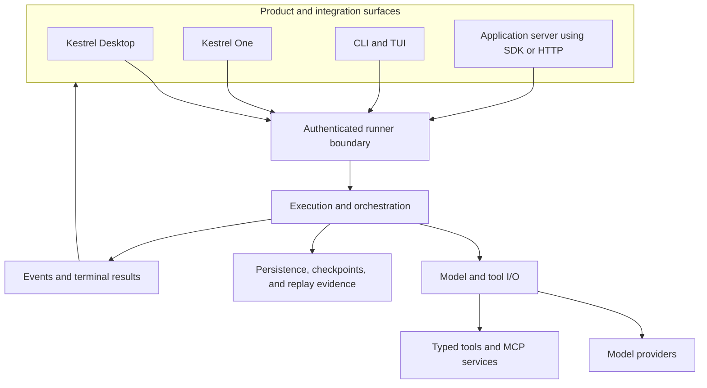

# Kestrel Architecture

Kestrel is one durable execution system with several product and integration
surfaces. Desktop, Kestrel One, the CLI/TUI, and public packages may present
different workflows, but they must not invent different meanings for runs,
sessions, events, tools, waiting, cancellation, or terminal results.

This document defines the high-level ownership and authority model. Exact
machine-enforced dependency rules live in
[`docs/references/architecture-rules.json`](docs/references/architecture-rules.json).

## System Model



The runner boundary is the shared entrance to execution. Hosted deployments
mount it as a service. Local Core mounts it behind an authenticated Unix socket.
Browsers call an application server; they do not hold runner or provider
credentials directly.

## Authority and Ownership

| Area | Owner | Contract |
| --- | --- | --- |
| Canonical runtime types | [`src/kestrel/contracts/`](src/kestrel/contracts) | Run, step, effect, error, and model-I/O contract families |
| Execution | [`src/engine/`](src/engine) | Step progression, transition validation, scheduling, and guardrails |
| Orchestration | [`src/orchestration/`](src/orchestration) | Thread runtime, supervision, operator control, and assembly policy |
| External I/O | [`src/io/`](src/io) | Validated model and tool gateways |
| Persistence and replay | [`src/store/`](src/store), [`src/replay/`](src/replay) | Durable state, logs, artifacts, checkpoints, and replay material |
| Local execution service | [`src/localCore/`](src/localCore) | Local authority, authenticated transport, and PGlite or explicit external PostgreSQL |
| Commands | [`cli/`](cli) | CLI/TUI and runner-service entry points |
| Public wire contract | [`packages/protocol/`](packages/protocol) | Versioned runner events and terminal result parsing |
| Application API | [`packages/sdk/`](packages/sdk) | Typed server-side run, stream, resume, memory, and subscription operations |
| Framework adapters | [`packages/next/`](packages/next), [`packages/ai-sdk/`](packages/ai-sdk) | Server-route and UI-message translation over the public SDK/protocol |
| Observability | [`packages/observability/`](packages/observability) | Application-facing Kestrel traces and OTEL export |
| Product UX | [`apps/desktop/`](apps/desktop), [`apps/web/`](apps/web) | Local and hosted workflows over shared contracts |
| Evaluation specifications | [`evals/`](evals) | Declarative scenarios, suites, targets, and ownership evidence |

Ownership follows the first component that makes behavior wrong. A downstream
validator may reject bad data without becoming the owner of the upstream bug.

## Request Lifecycle

1. A trusted product surface or application server establishes actor, tenant,
   session, model access, and requested work.
2. The runner boundary parses unknown input, authenticates the caller, and
   validates the request before mutation or tool execution.
3. Orchestration creates or continues the durable session and run.
4. The execution core advances typed steps, applies transition rules, and
   delegates model or tool effects through explicit gateways.
5. Events are emitted as work progresses and persisted with artifacts,
   checkpoints, and operator evidence.
6. The run reaches an explicit terminal state: completed, failed, cancelled, or
   waiting for a person or external condition.
7. The terminal contract keeps human-facing `assistantText` separate from
   structured `finalizedPayload` data.

Live streaming is request-scoped. Durable subscriptions and replay consume
persisted state; they are not aliases for an unbounded global event stream.

## Product Boundaries

### Local Core

Local Core is the target sole authority for local execution and durable runner
events. The 0.6 default store is embedded PGlite. External PostgreSQL is an
explicit advanced mode, not an implicit dependency.

The CLI is a Local Core client. Desktop is moving to the same authority model;
any remaining compatibility path is migration work, not a second intended
runtime architecture.

### Kestrel Desktop

Desktop owns the packaged local experience, Electron lifecycle, typed IPC,
workspace selection, local diagnostics, and operator-facing views. It does not
own a separate execution engine, Kestrel One source, hosted credentials, or a
browser-accessible runner token.

### Kestrel One

Kestrel One owns hosted authentication, organizations, Threads, Projects,
Knowledge, streaming, artifacts, sharing, administration, billing, and managed
model access. It consumes the public Kestrel package boundaries and uses the
runner service for execution.

### Public packages

Public packages form a layered contract:

```text
@kestrel-agents/protocol
  └─ @kestrel-agents/sdk
       ├─ @kestrel-agents/next
       ├─ @kestrel-agents/ai-sdk
       └─ @kestrel-agents/observability
```

Framework helpers translate the SDK and protocol; they do not copy runtime
internals. Consumers should use exact compatible release lines.

## Runtime Invariants

- Parse and validate unknown boundary input before use.
- Keep lifecycle transitions and guardrails inside runtime control flow.
- Keep credentials in trusted server, Local Core, or Electron main-process
  boundaries—not in browsers or renderers.
- Expose tool and effect outcomes in machine-readable shapes.
- Preserve request-scoped streaming and deterministic replay semantics.
- Attach steering, approval, cancellation, retry, and recovery to the original
  run or session.
- Persist enough evidence to explain terminal state without reconstructing it
  from UI text.
- Release cross-repository contracts before downstream products consume them.
- Prefer model-visible prompts, schemas, validators, retries, and result shaping
  before adding hidden heuristic policy.

## Effects and Trust Boundaries

Filesystem, development shell, network, code execution, provider calls, and MCP
capabilities are typed tool families. A tool definition carries the contract;
runtime policy decides whether a requested effect is allowed. Product surfaces
must not bypass that boundary through ad hoc capability access.

Workspace mutation and checkpoint behavior are operator-visible actions. Error
results remain structured so callers can distinguish a rejected request, a tool
failure, a waiting state, and a runtime failure.

## Persistence, Recovery, and Replay

Runs, events, logs, artifacts, checkpoints, and operator decisions are durable
evidence. Recovery continues existing work when the contract allows it. Replay
uses recorded evidence to inspect behavior; it is not a second evaluator hidden
inside the runtime.

Ruhroh is the separate evaluation system that executes and compares the
declarative specifications owned in this repository.

## Outside This Repository

- **Ruhroh** owns evaluation execution, reports, comparison, and the maintained
  Kestrel adapter.

## Making Architecture Changes

Before proposing a runtime fix or boundary change, identify:

1. the observed wrong behavior
2. the component that first made it wrong
3. the existing surface that owns the repair
4. the contract and evidence that prove the repair

Schema migrations, irreversible data moves, new policy, and new heuristic
runtime behavior require explicit escalation. Validate architecture work with
the repository gates in [Reliability](RELIABILITY.md).

## Read Next

- [Design principles](DESIGN.md)
- [Published architecture overview](apps/docs/content/docs/architecture-overview.mdx)
- [Architecture rules](docs/references/architecture-rules.json)
- [Local platform architecture](docs/plans/2026-07-13-kestrel-local-platform-architecture.md)
- [Reliability](RELIABILITY.md)
- [Security](SECURITY.md)
