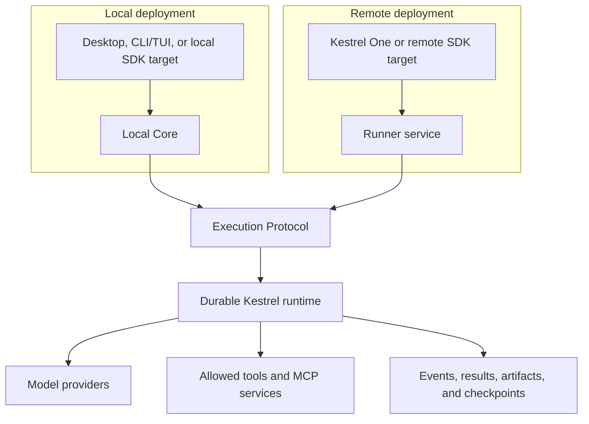

<p align="center">
  
</p>

<h1 align="center">Kestrel</h1>

<p align="center">
  <strong>Durable infrastructure for agent work that has to finish.</strong>
</p>

<p align="center">
  Build, run, inspect, recover, and govern AI agents across local workspaces,
  team products, and application backends.
</p>

<p align="center">
  <a href="https://github.com/LumiCorp/kestrel/actions/workflows/ci.yml"></a>
  <a href="LICENSE"></a>
  <a href="apps/docs/content/start/release-status.mdx"></a>
</p>

Kestrel is an open runtime platform for agent work that cannot be reduced to a
single request and response. It gives every run an identity, terminal outcome,
event history, artifacts, and operator controls so work can survive
interruptions without becoming a black box.

Use Kestrel through a packaged desktop application, the hosted Kestrel One
product, a CLI/TUI, or typed server-side packages. Every surface shares the
same execution and result contracts.

> **Release status:** this repository and its documentation describe the
> `0.6.0` contract line. Package and product availability may differ by surface.
> Check [0.6 release status](apps/docs/content/start/release-status.mdx)
> before distributing an installer or pinning a production dependency.

[Read the docs](https://docs.kestrelagents.dev) ·
[Choose a quickstart](apps/docs/content/docs/quickstart.mdx) ·
[Understand the architecture](ARCHITECTURE.md) ·
[Contribute](CONTRIBUTING.md)

## Why Kestrel

A direct model call is enough for a disposable answer. Production agent work
usually needs more:

- **Continuity:** sessions and runs persist beyond one browser request or
  process lifetime.
- **Control:** people can inspect, steer, stop, resume, retry, and approve work
  without creating an unrelated conversation.
- **Durable outcomes:** completed, failed, cancelled, and waiting states are
  explicit rather than inferred from the last message.
- **Evidence:** events, artifacts, checkpoints, and operator decisions remain
  available for diagnosis, replay, and evaluation.
- **Governed effects:** filesystem, shell, network, model, and MCP capabilities
  cross typed and policy-aware tool boundaries.
- **Application contracts:** human-facing `assistantText` stays separate from
  structured `finalizedPayload` data.

The result is agent work that can be operated as a system—not merely watched
as a chat transcript.

## Choose Your Path

| Goal | Start here | What you get |
| --- | --- | --- |
| Run agents against local files and repositories | [Kestrel Desktop](apps/docs/content/apps/desktop.mdx) | A packaged macOS application with local workspaces, persistent sessions, recovery, and operator control |
| Continue agent work with a team | [Kestrel One](apps/docs/content/apps/web.mdx) | Shared Threads, Projects, Knowledge, artifacts, access control, and managed model access |
| Add durable agents to an application | [Build your first agent](apps/docs/content/build/building-your-first-agent.mdx) | Typed TypeScript SDK, runner protocol, Next.js helpers, AI SDK adapter, and observability |
| Operate or troubleshoot a deployment | [Operations](apps/docs/content/operations/index.mdx) | Reliability, security, replay, evaluation, deployment, and incident workflows |
| Work from the terminal | [CLI and TUI](apps/docs/content/cli/index.mdx) | Local Core commands, interactive sessions, durable jobs, evidence, and automation |

## How It Fits Together



Local Core and remote runner services expose the same Execution Protocol and
use the same runtime implementation. Credentials and trusted identity stay in
Local Core, the Electron main process, or application servers—not browsers or
renderers.

Read [Kestrel Architecture](ARCHITECTURE.md) for the local and remote deployment
model, request lifecycle, trust boundaries, and public packages.

## Build With Kestrel

The application-facing SDK talks to an explicit Local Core or remote runner
target. It does not run agents in the browser or choose an execution target
from ambient process state.

```bash
pnpm add @kestrel-agents/sdk@0.6.0
```

```ts
import { createAgent } from "@kestrel-agents/sdk";

const agent = createAgent({
  id: "support-agent",
  profileId: "reference",
  target: {
    kind: "remote",
    baseUrl: process.env.KESTREL_RUNNER_SERVICE_URL!,
    authToken: process.env.KESTREL_RUNNER_SERVICE_TOKEN!,
  },
});

const terminal = await agent.run(
  {
    sessionId: "customer-42",
    message: "Investigate the failed deployment and prepare a recovery plan.",
  },
  {
    actor: { actorId: "user-42", actorType: "end_user" },
    tenantId: "acme",
  },
);

console.log(terminal.payload.result.assistantText);
console.log(terminal.payload.result.finalizedPayload);
```

Go deeper with the [SDK guide](packages/sdk/README.md),
[Next.js helpers](packages/next/README.md),
[AI SDK adapter](packages/ai-sdk/README.md), and
[observability package](packages/observability/README.md).

## Run the Repository Locally

Kestrel uses Node.js 22 in CI and pnpm 9. No provider credentials are required
to install dependencies or run the offline validation suites.

```bash
git clone https://github.com/LumiCorp/kestrel.git
cd kestrel
corepack enable
pnpm install
```

Start the surface you are working on:

```bash
pnpm run desktop:dev  # packaged local product
pnpm run web:dev      # Kestrel One
pnpm run docs:dev     # documentation site
pnpm run tui          # terminal interface
```

Model-backed development requires a configured provider. Start from
[`.env.example`](.env.example); Kestrel One has additional settings in
[`apps/web/.env.example`](apps/web/.env.example).

## Repository Map

| Path | Responsibility |
| --- | --- |
| [`src/`](src) | Runtime contracts, execution, orchestration, persistence, replay, Local Core, and shared adapters |
| [`cli/`](cli) | `kestrel`, `ks`, `kcron`, TUI, Local Core, and app-facing HTTP commands |
| [`apps/desktop/`](apps/desktop) | Electron desktop application over Local Core |
| [`apps/web/`](apps/web) | Kestrel One hosted product |
| [`apps/docs/`](apps/docs) | Public Next.js/MDX documentation site |
| [`packages/`](packages) | Protocol, SDK, Next.js, AI SDK, and observability packages |
| [`agents/reference-react/`](agents/reference-react) | Canonical reference agent |
| [`tools/`](tools) | Typed tool contracts, catalog, and handlers |
| [`evals/`](evals) | Declarative evaluation scenarios and release ownership evidence |
| [`docs/`](docs) | ADRs, plans, runbooks, references, analysis, and maintainer evidence |

## Quality Gates

Run focused checks while iterating. Before any pull request is considered ready,
run the same complete portable validation contract used by GitHub Actions:

```bash
pnpm validate
```

Every automated test declares a named contract and exactly one of four
boundaries: hermetic, process, PostgreSQL, or Chromium. Critical contracts carry
current targeted killed-mutation evidence, and the validation runner enforces
phase and whole-suite runtime budgets. Ruhroh owns model-quality evaluation execution;
Kestrel validates only its declarative Ruhroh configuration.

## Project Boundaries

- **Kestrel** owns the open runtime, Local Core, CLI/TUI, Desktop, Kestrel One,
  public packages, tools, and declarative evaluation specifications in this
  repository.
- **Ruhroh** is a separate evaluation project. It owns evaluation execution,
  reports, comparison, and the maintained Kestrel adapter; this repository
  owns the specifications under [`evals/`](evals).

## Documentation

- [Documentation map](docs/index.md)
- [Architecture](ARCHITECTURE.md)
- [Design principles](DESIGN.md)
- [Reliability](RELIABILITY.md)
- [Security](SECURITY.md)
- [Quality score](QUALITY_SCORE.md)
- [Contributing](CONTRIBUTING.md)
- [Support](SUPPORT.md)

## Contributing and Support

Contributions are welcome. Read [CONTRIBUTING.md](CONTRIBUTING.md) for setup,
change ownership, and validation expectations.

Use [GitHub Issues](https://github.com/LumiCorp/kestrel/issues) for reproducible
bugs and feature requests. Do not report vulnerabilities publicly; follow the
private disclosure process in [SECURITY.md](SECURITY.md).

Kestrel is available under the [MIT License](LICENSE).
