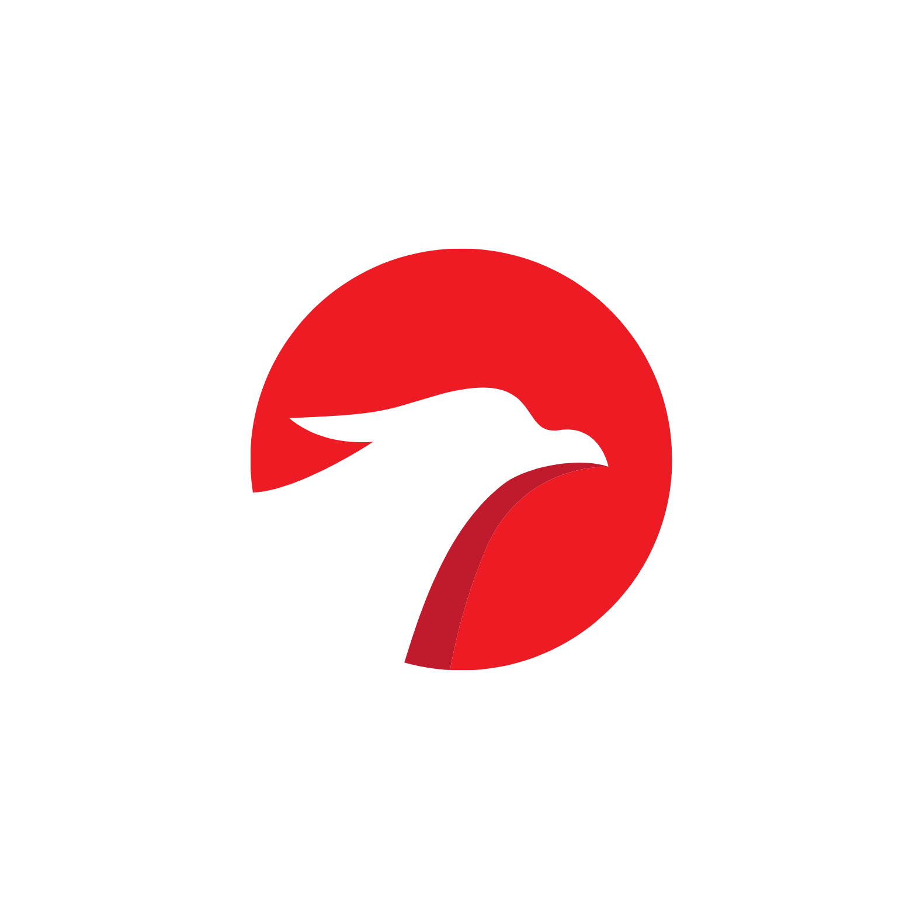
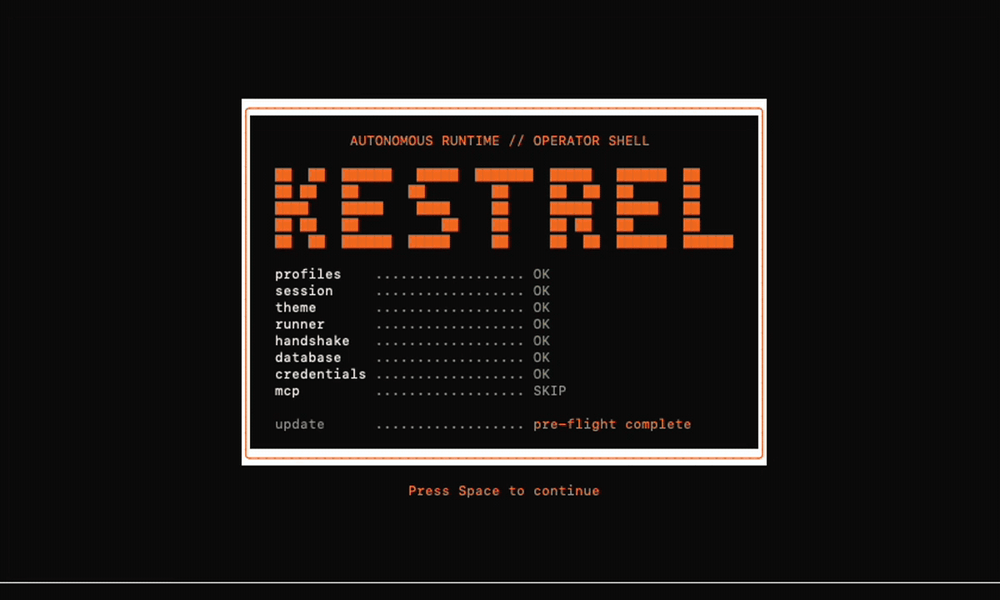
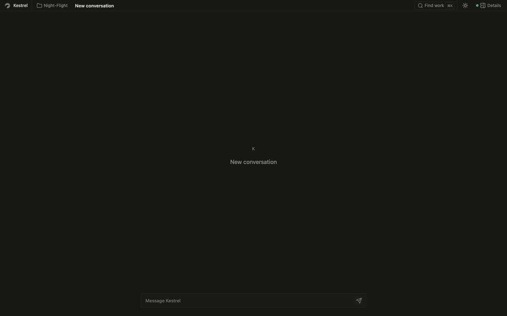

<p align="center">
  
</p>

<h1 align="center">Kestrel</h1>

<p align="center">
  <strong>One Kestrel everywhere.</strong>
</p>

<p align="center">
  Kestrel is an open-source agent platform for building software, researching
  questions, analyzing data, and producing reports, spreadsheets,
  presentations, and other files.
</p>

<p align="center">
  Kestrel 0.8.0 is one coordinated Beta release across Desktop, Kestrel One,
  the CLI/TUI, Runtime, Protocol, SDK, Memory, adapters, and observability.
  Each surface uses the same execution, Mission Control, recovery, approval,
  memory, and evidence contracts.
</p>

<p align="center">
  Kestrel is maintained and supported by <a href="https://www.lumicorp.ai">Lumi</a>.
</p>

<p align="center">
  <a href="https://github.com/LumiCorp/kestrel/releases/tag/v0.8.0">Get Kestrel 0.8.0</a> ·
  <a href="https://docs.kestrelagents.dev">Read the docs</a> ·
  <a href="https://github.com/LumiCorp/kestrel/tree/v0.8.0/apps/web">View Kestrel One source</a>
</p>

<p align="center">
  <a href="https://github.com/LumiCorp/kestrel/actions/workflows/ci.yml"></a>
  <a href="LICENSE"></a>
  <a href="https://docs.kestrelagents.dev/start/release-status"></a>
  <a href="https://docs.kestrelagents.dev/start/release-status"></a>
</p>

<p align="center">
  
</p>

## Kestrel Desktop

<p align="center">
  
</p>

Kestrel Desktop 0.8.0 is the signed and notarized macOS application for local
project work. Give it a folder, connect a compatible provider/model, and work
through one durable conversation while Local Core owns execution, credentials,
sessions, recovery, and project evidence. Mission Control keeps work items,
attempts, validation, review, and acceptance visible without turning the
conversation into a status database.

Desktop 0.8.0 supports macOS 13 or newer on Apple silicon. It is a manual DMG
installation; the stable OTA pointer remains unchanged until the planned 0.8.1
OTA proof. Installing over 0.7 preserves settings, credentials, sessions, and
Local Core state.

[Learn about Desktop](https://docs.kestrelagents.dev/desktop) ·
[Install Desktop 0.8.0](https://docs.kestrelagents.dev/desktop/install) ·
[Desktop updates](https://docs.kestrelagents.dev/desktop/updates)

## Kestrel One

Kestrel One is a real versioned product at 0.8.0. Its source is available in
this repository and from the `v0.8.0` tag. You can inspect it, clone it, and run
the documented local-development setup without joining the hosted service.

Kestrel One adds organizations, shared Projects and Threads, context revisions,
Knowledge, Apps, Environments, Mission Control, governed model access, workers,
and operator evidence. Lumi-hosted Kestrel One is an invitation-only deployment
of the same 0.8.0 source/product line. Invitation-only describes hosted access;
it is not Kestrel One's version or the only way its source exists.

[Learn about Kestrel One](https://docs.kestrelagents.dev/kestrel-one) ·
[Source and hosting](https://docs.kestrelagents.dev/kestrel-one/source-and-hosting) ·
[View the 0.8.0 source](https://github.com/LumiCorp/kestrel/tree/v0.8.0/apps/web) ·
[Hosted getting started](https://docs.kestrelagents.dev/kestrel-one/getting-started)

## Install the CLI/TUI

The CLI/TUI is a first-class 0.8 surface for local sessions, terminal work,
operator control, Mission Control, profiles, tools, jobs, and Local Core.

Requirements: Node.js 22 on macOS arm64 or Linux x64.

```bash
npm install -g @kestrel-agents/kestrel@0.8.2
kestrel --version
kestrel
```

A packaging omission made the immutable `0.8.0` Runtime npm artifact incomplete.
The `0.8.2` npm patch is the supported distribution of the 0.8.0 Runtime and
CLI contracts; its first-party dependencies remain exactly `0.8.0`.

A checksum-bearing macOS arm64 standalone archive is also attached to the
unified `v0.8.0` GitHub release and reports product version `0.8.0`.

[CLI installation](https://docs.kestrelagents.dev/cli/install) ·
[Command suite](https://docs.kestrelagents.dev/cli/command-suite) ·
[TUI guide](https://docs.kestrelagents.dev/cli/kchat)

## Build with Kestrel

Install exact matching 0.8 packages. Kestrel does not provide a 0.7 wire/API
compatibility shim around the current Runtime, Protocol, SDK, adapters, or
clients.

```bash
pnpm add @kestrel-agents/sdk@0.8.0 @kestrel-agents/protocol@0.8.0
```

The eight public artifacts are:

- `@kestrel-agents/kestrel` — Runtime and CLI/TUI
- `@kestrel-agents/protocol` — commands, events, health, and results
- `@kestrel-agents/sdk` — server-side Agent and runner clients
- `@kestrel-agents/memory` — governed memory contracts and retrieval
- `@kestrel-agents/next` — Next.js route helpers
- `@kestrel-agents/ai-sdk` — AI SDK presentation mapping
- `@kestrel-agents/observability` — tracing and correlation
- `@kestrel-agents/workspace-skills` — secure project-owned skills

[Build your first agent](https://docs.kestrelagents.dev/build/building-your-first-agent) ·
[Upgrade to 0.8](https://docs.kestrelagents.dev/build/upgrading-to-0-8) ·
[Compatibility](https://docs.kestrelagents.dev/reference/compatibility)

## Develop Kestrel

Kestrel is a TypeScript monorepo built with Node.js and pnpm.

```bash
git clone https://github.com/LumiCorp/kestrel.git
cd kestrel
corepack enable
pnpm install --frozen-lockfile
```

Run the surface you are working on:

```bash
pnpm run desktop:dev
pnpm run web:dev
pnpm run tui
pnpm run docs:dev
```

| Path | Contains |
| --- | --- |
| [`apps/desktop/`](apps/desktop) | Kestrel Desktop |
| [`apps/web/`](apps/web) | Kestrel One and the public landing page |
| [`cli/`](cli) | CLI/TUI and Local Core clients |
| [`src/`](src) | Shared Runtime and Mission Control implementation |
| [`packages/`](packages) | Protocol, SDK, Memory, adapters, observability, and Workspace Skills |
| [`apps/docs/`](apps/docs) | Public documentation site |

## Quality gates

Before a pull request is ready, run the portable validation contract used by
GitHub Actions:

```bash
pnpm validate
```

Run `validate:process`, `validate:postgres`, `validate:chromium`,
`validate:audit`, focused mutation proofs, and product/release checks when you
change the boundary they own. Gate evidence should identify the first component
that made behavior wrong; downstream rejection alone does not establish
ownership.

## Learn more

- [Release status](https://docs.kestrelagents.dev/start/release-status)
- [Kestrel 0.8 release notes](https://docs.kestrelagents.dev/reference/releases)
- [Runtime model](https://docs.kestrelagents.dev/start/runtime-model)
- [Kestrel One source and hosting](https://docs.kestrelagents.dev/kestrel-one/source-and-hosting)
- [Upgrade from 0.7 to 0.8](https://docs.kestrelagents.dev/build/upgrading-to-0-8)
- [Compatibility matrix](https://docs.kestrelagents.dev/reference/compatibility)
- [Lumi](https://www.lumicorp.ai)
- [Architecture](ARCHITECTURE.md)
- [Security](SECURITY.md)
- [Support](SUPPORT.md)

Use [GitHub Issues](https://github.com/LumiCorp/kestrel/issues) for reproducible
bugs and feature requests. Report security concerns through the private process
in [SECURITY.md](SECURITY.md), not in a public issue.

Kestrel is available under the [MIT License](LICENSE).
