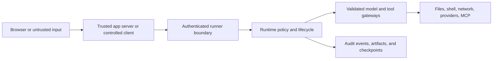

# Kestrel Security

Kestrel runs models that can request real effects against files, shells,
networks, provider APIs, and connected MCP services. Security therefore depends
on explicit authority, validated boundaries, least-visible credentials, and a
durable record of what the system and its operators did.

## Report a Vulnerability

Use [GitHub Security Advisories](https://github.com/LumiCorp/kestrel/security/advisories/new)
for private vulnerability disclosure.

Do not open a public issue for a suspected vulnerability. Include:

- affected version, commit, and product surface
- reproduction steps or a minimal proof of concept
- expected and observed trust boundary
- known data, credential, workspace, or execution impact
- whether the issue involves Desktop, Local Core, runner service, tool
  execution, Kestrel One tenancy, or public packages

For normal bugs and usage questions, use [Support](SUPPORT.md).

## Trust Model

The browser is not a trusted runner client. Product servers, Local Core, and
the Electron main process establish identity and hold sensitive execution
credentials. Renderer and browser code receive only the data and capabilities
required for their interface.

## Hard Constraints

- Parse and validate unknown external input before use.
- Keep runner tokens, provider credentials, signing keys, and database secrets
  out of browser and renderer code.
- Expose filesystem, shell, internet, code execution, model, and MCP effects
  only through typed tool contracts and policy-aware runtime handling.
- Validate lifecycle transitions before state mutation.
- Keep tenant, organization, actor, project, and session authority explicit at
  every cross-service boundary.
- Return normalized machine-readable errors without leaking credentials or
  internal secrets.
- Record operator-sensitive actions and retain evidence required for incident
  reconstruction.
- Escalate new policy, irreversible migration, or heuristic runtime behavior
  before shipping it.
- Enforce approved dependency edges with
  [`architecture-rules.json`](docs/references/architecture-rules.json).

## Security-Critical Boundaries

### Runner service and Local Core

The runner service is the authenticated entrance to execution. Hosted products
call it from trusted servers. Local clients use Local Core's authenticated Unix
socket. Requests must be authenticated and validated before runtime mutation or
tool execution.

### Desktop IPC

Desktop keeps Local Core and provider credentials in the Electron main process.
The renderer receives a typed, capability-scoped preload bridge and non-secret
settings projections. Credential setup is write-only where possible.

### Kestrel One tenancy

Kestrel One owns organization, membership, Project, Thread, Knowledge, model,
and administrative authorization. Application data must be scoped by the
authoritative organization and resource relationship rather than UI route or
client-provided labels.

### Tools, workspaces, and MCP

Tool availability is not permission to execute every request. Inputs are
validated, capabilities remain explicit, and workspace mutations should be
inspectable through results, events, artifacts, and checkpoints. Discovered MCP
credentials must not be projected into UI or logs.

### Provider and deployment credentials

API keys, runner tokens, signing material, and infrastructure credentials
belong in server-side, Local Core, or operating-system-backed configuration.
Examples must not imply that secrets belong in browser bundles, source control,
or machine-global defaults without explicit operator intent.

### Persistence, replay, and shared artifacts

Logs and replay material can contain sensitive prompts, paths, tool output, and
user data. Access controls and retention must match the product surface.
Sharing an artifact or Thread must not implicitly grant broader organization or
workspace access.

## Contributor Checklist

When changing a boundary, ask:

- What input is untrusted, and where is it parsed?
- Which component authenticates the actor and authorizes the resource?
- Could a browser, renderer, model, or tool result influence authority?
- Are credentials readable in a less-trusted process, log, error, or response?
- Can the action write files, execute code, access the network, or cross tenant
  boundaries?
- Is failure machine-readable without exposing sensitive detail?
- What evidence will remain if the action must be investigated later?
- Does the change add hidden heuristic or fallback policy?

Run the narrow security-relevant tests and the repository governance gates
before merging. Workspace, tool, runner, IPC, auth, and data-scope changes
should include regression coverage at the owning boundary.

## Operator Responsibilities

- Use documented runner, deployment, credential, and recovery flows.
- Scope tokens and keys to the minimum required system and environment.
- Rotate exposed credentials and preserve incident evidence before cleanup.
- Review new tools and MCP services for input, output, network, filesystem, and
  credential behavior.
- Treat destructive reset as a recovery action, not a first diagnostic step.
- Keep exact compatible release lines across runtime and public packages.

## Read Next

- [Architecture](ARCHITECTURE.md)
- [Reliability](RELIABILITY.md)
- [Operations security guide](apps/docs/content/operations/security.mdx)
- [Environment and authentication](apps/docs/content/deploy/environment-and-auth.mdx)
- [Architecture rules](docs/references/architecture-rules.json)
- [Contributing](CONTRIBUTING.md)
