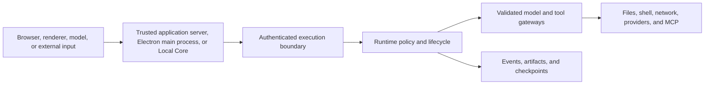

# Kestrel Security

Kestrel can let models request effects against files, shells, networks,
provider APIs, and connected MCP services. Its security model keeps authority
explicit, validates requests at trust boundaries, limits where credentials are
visible, and records sensitive actions for later inspection.

## Report a Vulnerability

Use [GitHub Security Advisories](https://github.com/LumiCorp/kestrel/security/advisories/new)
for private vulnerability disclosure. Do not open a public issue for a
suspected vulnerability.

Include the affected version and product surface, reproduction steps, expected
and observed behavior, and any known impact to data, credentials, workspaces,
execution, or organization boundaries. For normal bugs and usage questions,
use [Support](SUPPORT.md).

## Trust model

Browsers and Electron renderers are not trusted runner clients. Trusted servers,
Local Core, and the Electron main process establish identity and hold sensitive
execution credentials. Less-trusted interfaces receive only the data and
capabilities required for their work.

## Execution boundaries

Local Core authenticates local clients over its Unix socket. A runner service
authenticates trusted application servers over its network endpoints. Both
validate commands before the Runtime changes state or invokes a tool.

Tool availability does not grant unlimited execution. Filesystem, shell,
internet, model, code-execution, and MCP operations have typed inputs and
policy-aware handling. Their results remain inspectable without exposing stored
credentials.

## Desktop

Desktop keeps Local Core and provider credentials in the Electron main process.
The renderer communicates through a typed, capability-scoped preload bridge and
receives non-secret settings projections. Provider credentials are never added
to project files, prompts, or transcripts by the setup flow.

## Kestrel One

Kestrel One scopes data and actions by the authenticated organization and the
relevant Project, Thread, Knowledge, App, or Environment relationship. Client
labels and browser routes do not establish authority.

Environment policy sets the maximum shared capability available to its
Projects. A Project can narrow that access but cannot expand it. Personal App
connections remain associated with the person who connected them.

## Credentials and secrets

Provider keys, runner tokens, signing material, database credentials, and MCP
secrets belong in server-side, Local Core, or operating-system-backed
configuration. They do not belong in browser bundles, source control, public
logs, or readable API responses.

## Stored evidence and sharing

Logs, replay data, artifacts, and checkpoints can contain prompts, paths, tool
output, and user data. Their access and retention follow the product surface's
authorization model. Sharing an artifact or Thread does not implicitly grant
access to the containing organization, Environment, Project, or workspace.

## Read Next

- [Architecture](ARCHITECTURE.md)
- [Reliability](RELIABILITY.md)
- [Operations security guide](apps/docs/content/operations/security.mdx)
- [Environment and authentication](apps/docs/content/deploy/environment-and-auth.mdx)
- [Contributing](CONTRIBUTING.md)
