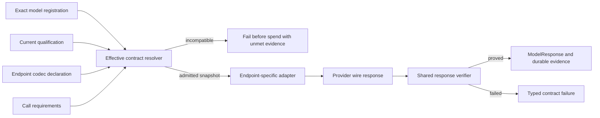

# Model Provider Contract Hardening Change Design

## Executive Summary

Kestrel should make every model call run against one exact, versioned execution contract. That contract binds the provider, model, API endpoint, upstream routing policy, supported features, qualification evidence, and the strength of output assurance. Runtime admission checks the contract before spend; endpoint-specific adapters transport it; a shared verifier proves the response before Kestrel reports success.

This is deeper than repairing three mappers. The first component that makes current behavior wrong is model admission: Kestrel turns provider-wide declarations into exact-model truth, marks every pinned hosted model as tool- and structured-output capable, and then carries almost none of that detail into the gateway. The adapters add real wire and parsing defects, while downstream failures such as `MODEL_REQUIRED_TOOL_CALL_MISSING` merely expose the earlier mismatch.

The chosen seam extends the existing versioned model-registration boundary rather than creating a second catalog. A versioned registration holds exact capability evidence. A derived effective contract admits one call. Provider adapters own Chat, Responses, and Messages codecs. A shared response verifier owns JSON Schema and tool-input proof. Smaller models such as GLM remain useful for the assurance modes they can actually satisfy; they are not allowed to impersonate strict-schema or reliable agent-tool routes.

## Requested Outcome

Kestrel must support OpenAI, Anthropic, OpenRouter, and smaller routed models without equating “the API accepted the request” with “the model fulfilled the contract.”

The changed behavior is:

- A model route is eligible for a call only when current evidence supports every feature that call requires.
- JSON syntax, locally schema-validated JSON, provider-strict JSON Schema, native tools, strict tool inputs, reasoning continuation, and streaming are distinct capabilities.
- OpenRouter cannot route a contract-carrying request to an upstream that ignores required parameters.
- Chat Completions, Responses, and Anthropic Messages use separate codecs even when their fields look similar.
- A structured response is successful only after Kestrel validates it against the exact requested schema.
- Malformed tool arguments, premature stream termination, refusal, truncation, incomplete generation, and unsupported reasoning continuation are explicit model-contract failures.
- No fallback, retry, parser recovery, or model substitution may weaken the admitted contract silently.
- Capability evidence and qualification are visible in hosted and local model status so operators can understand why a model is ready for one role and not another.

## Relevant Current Behavior

### Registration and selection overstate capability

Kestrel already has a canonical, fingerprinted `ModelRegistrationV1`. Its descriptor can represent tools, structured-output modes, streaming, reasoning, modalities, limits, and cache behavior ([`model-registration.ts`](../../src/kestrel/contracts/model-registration.ts#L50)). Production does not create that exact registration from an approved model. Instead, `ProviderRegistry` declares one broad descriptor per provider. Every OpenRouter route inherits tools, parallel tools, JSON Schema, reasoning, streaming, and image input from the adapter declaration ([`ProviderRegistry.ts`](../../models/ProviderRegistry.ts#L78)).

Hosted OpenRouter approval is already strong on identity and economics. It resolves the exact route through the provider detail API, rejects an identity mismatch, retains the provider payload, and persists an exact economics profile. General capabilities in that payload remain opaque. `ai_gateway_models` has generic metadata but no normalized registration projection ([`schema.ts`](../../apps/web/drizzle/schema.ts#L5004)). Runtime eligibility checks approval, gateway health, language modality, and exact economics—not the capabilities required by the call ([`runtime-model-selection.ts`](../../apps/web/lib/ai/runtime-model-selection.ts#L16)).

Profile composition makes the claim stronger and the evidence weaker. A pinned overlay receives `toolCallingEnabled: true` and `structuredOutputEnabled: true` regardless of model; most nonlocal providers receive every reasoning mode ([`kestrelOnePolicy.ts`](../../src/profile/kestrelOnePolicy.ts#L661)). The ordinary `TuiProfile` and hosted runtime selection do not carry an exact capability descriptor or registration fingerprint. Gateway creation then selects an adapter from the provider name alone ([`KestrelChatRuntime.ts`](../../cli/runtime/KestrelChatRuntime.ts#L3909)). A brokered call replaces the model with the credential lease's route and invokes the provider without capability admission ([`gateway-credential-broker.ts`](../../cli/runtime/gateway-credential-broker.ts#L231)).

This is the first wrong behavior. The system has exact identity and a rich registration type, but the runtime runs on optimistic booleans and provider identity.

### Endpoint codecs have drifted

The current adapters then translate one generic request through overlapping helper functions:

- OpenAI Responses correctly places structured output under `text.format`, but supplies a Chat-style nested `json_schema` object instead of the Responses format shape. It also omits `temperature` and `top_p`, and appends encrypted reasoning continuation after newer input items rather than preserving the original output-item order ([`OpenAiMapper.ts`](../../models/openai/OpenAiMapper.ts#L124), [`OpenAiMapper.ts`](../../models/openai/OpenAiMapper.ts#L172), [`OpenAiMapper.ts`](../../models/openai/OpenAiMapper.ts#L464)).
- OpenRouter Responses sends `response_format`, although OpenRouter documents that endpoint as OpenResponses with `text.format`. Its final response parser looks for function calls inside each output item's `content`, even though function calls are direct output items ([`OpenRouterMapper.ts`](../../models/openrouter/OpenRouterMapper.ts#L150), [`OpenRouterMapper.ts`](../../models/openrouter/OpenRouterMapper.ts#L578)).
- Anthropic sends adaptive thinking for every non-off reasoning request, although thinking type support differs by exact model. It emulates structured output with a synthetic forced tool and cannot combine that mode with ordinary tools, while current Anthropic supports native JSON output and strict tool schemas on supported models ([`AnthropicMapper.ts`](../../models/anthropic/AnthropicMapper.ts#L25), [`AnthropicMapper.ts`](../../models/anthropic/AnthropicMapper.ts#L188)).

These defects should be fixed in their endpoint codecs. They should not be hidden by a retry, model-name exception, or downstream parser.

### Parsing is treated as proof

OpenRouter's JSON parser accepts direct JSON, fenced JSON, or the substring from the first opening brace to the last closing brace. It never applies the requested schema ([`OpenRouterMapper.ts`](../../models/openrouter/OpenRouterMapper.ts#L483)). OpenAI Chat and Anthropic report structured-output `success` whenever the mode was requested, including cases where output is absent or invalid ([`OpenAiMapper.ts`](../../models/openai/OpenAiMapper.ts#L105), [`AnthropicMapper.ts`](../../models/anthropic/AnthropicMapper.ts#L159)). OpenAI and OpenRouter convert malformed function arguments to `{}`, changing a provider parse failure into a later tool-schema or missing-tool failure ([`OpenAiMapper.ts`](../../models/openai/OpenAiMapper.ts#L290)).

The shared versioned boundary validates the response envelope but not correlations between the request, output, tools, continuation, and telemetry. Runtime consumers compensate unevenly. The user-reply classifier falls back to unresolved on a bad shape ([`userReplyIntent.ts`](../../src/runtime/userReplyIntent.ts#L117)); continuation checkpoints apply their own syntactic and semantic checks ([`ContinuationCoordinator.ts`](../../src/engine/ContinuationCoordinator.ts#L1146)); runtime evaluation parses another exact verdict shape ([`CompletionEvidenceEvaluator.ts`](../../src/evaluation/CompletionEvidenceEvaluator.ts#L76)). Those semantic checks remain valuable, but they should run after one shared schema proof.

The current provider-registry conformance test proves that an adapter serializes a declared field. Adapter integration tests mostly exercise valid happy paths; one test deliberately accepts a schema request downgraded to `json_object` for a local model ([`shared-adapters.test.ts`](../../tests/integration/shared-adapters.test.ts#L262)). No common test proves that valid JSON with the wrong shape is rejected.

## Affected Surface

| Surface | Current responsibility | Proposed responsibility |
| --- | --- | --- |
| Provider registry | Provider-wide protocol declaration and factory | Adapter and endpoint codec envelope only |
| Model approval/discovery | Exact identity and economics | Exact identity, normalized provider capability evidence, and registration revision |
| Model registration | Rich but largely disconnected V1 descriptor | Authoritative exact-route V2 evidence contract |
| Qualification | Provider-specific or absent | Capability-specific live proof bound to registration and credential revisions |
| Profile and run grant | Model identity, credentials, economics, coarse booleans | Registration revision/fingerprint and role eligibility |
| Model request | Generic fields plus duplicated provider options | Provider-neutral output, tool, reasoning, streaming, and assurance requirements |
| Provider adapter | Request mapping, response parsing, telemetry | Endpoint-specific codec and provider-native terminal-state interpretation |
| Shared model boundary | Shape normalization | Admission correlation and response/tool schema proof |
| Runtime consumers | Uneven schema and semantic validation | Domain-semantic validation after shared contract proof |
| Operator UI | Approved, reachable, economics-ready | Declared, qualified, stale, failed, and eligible-by-role |

The economics controller, credential broker, tool authorization, prepared-call replay, and domain-specific semantic validators remain authoritative in their existing domains.

## External Findings That Shaped the Design

OpenRouter's model catalog exposes `supported_parameters`; it distinguishes `response_format` from `structured_outputs`, the latter meaning JSON Schema enforcement. It also exposes an authenticated endpoint list for a model. That makes provider evidence useful but does not make a provider-wide Boolean sufficient. [OpenRouter models guide](https://openrouter.ai/docs/guides/overview/models), [OpenRouter endpoint API](https://openrouter.ai/docs/api/api-reference/endpoints/list-all-endpoints-for-a-model)

OpenRouter routing defaults `require_parameters` to false. When a preferred parameter such as tools or `response_format` is unsupported, routing can continue and ignore it if no supporting endpoint is available. Contract-carrying requests must therefore set `require_parameters: true`; availability routing cannot silently outrank correctness. [OpenRouter provider routing](https://openrouter.ai/docs/guides/routing/provider-selection), [OpenRouter structured outputs](https://openrouter.ai/docs/guides/features/structured-outputs)

Live OpenRouter endpoint evidence for GLM 5.2 shows why capability intersection matters. On August 26, 2026, all 38 endpoints advertised tools, 36 advertised `tool_choice`, only one advertised `parallel_tool_calls`, and that one did not advertise `tool_choice`. The current Kestrel request shape—tools plus tool choice plus defaulted parallel calls—therefore has no endpoint satisfying every parameter under strict routing. Thirty-three endpoints advertise `structured_outputs`, but OpenRouter documents that enforcement can still vary by upstream. Parameter support is evidence, not qualification. [OpenRouter GLM 5.2 model record](https://openrouter.ai/api/v1/model/z-ai/glm-5.2), [OpenRouter GLM 5.2 endpoints](https://openrouter.ai/api/v1/models/z-ai/glm-5.2/endpoints)

OpenRouter's Responses endpoint follows OpenResponses: structured text configuration is under `text`, output is an item array, and function-call argument streaming has dedicated events. Chat's `response_format` and nested `tool_calls` cannot be reused unchanged. [OpenRouter Responses reference](https://openrouter.ai/docs/api/api-reference/responses/create-responses), [OpenRouter Responses streaming](https://openrouter.ai/docs/agent-sdk/call-model/streaming)

OpenAI's Models API returns basic identity, ownership, and lifecycle metadata rather than a machine-readable capability object. OpenAI model pages carry feature truth, while a live qualification must prove Kestrel's exact codec path. [OpenAI model retrieval](https://developers.openai.com/api/reference/typescript/resources/models/methods/retrieve), [OpenAI model catalog](https://developers.openai.com/api/docs/models)

OpenAI Responses uses `text.format`, returns ordered output items, exposes incomplete status, and supports `temperature` and `top_p`. OpenAI also directs stateless clients to pass relevant returned output items back in later turns. [OpenAI Responses create](https://developers.openai.com/api/reference/cli/resources/responses/methods/create), [OpenAI model guidance](https://developers.openai.com/api/docs/guides/latest-model)

Anthropic now exposes model capabilities programmatically, including structured outputs and the supported thinking types. Native JSON output uses `output_config.format`; strict tool use uses `strict: true`; supported models and schema limits are explicit. Anthropic also documents grammar-compilation latency and caching, which rewards stable canonical schemas. [Anthropic Models API](https://platform.claude.com/docs/en/api/models), [Anthropic structured outputs](https://platform.claude.com/docs/en/build-with-claude/structured-outputs), [Anthropic thinking](https://platform.claude.com/docs/en/about-claude/models/extended-thinking-models)

## Options and Candidate Seams

### Adapter-only repair

Correcting the listed mapper defects and adding local schema validation would remove immediate false success. It would not stop Kestrel from selecting a model or OpenRouter upstream that never supported the request. The runtime would still spend tokens to discover a known incompatibility.

### Static model allowlists or name exceptions

An allowlist could label GLM and other small models as supported or unsupported. It becomes stale as providers, endpoints, and aliases change. It also collapses different guarantees into one model-name policy and introduces the exact heuristic ownership Kestrel avoids.

### Provider SDK replacement

Provider SDKs can reduce wire-shape drift, but they do not own Kestrel's cross-provider request semantics, qualification, exact route eligibility, replay evidence, or local verification. Adopting an SDK can be an adapter-internal choice; it is not the system design.

### Effective model contract from registration through response proof

This is the chosen seam. It separates five truths that currently blur together: what Kestrel's codec supports, what the provider declares, what the exact route has qualified, what this call requires, and what the returned response proved. It reuses exact registrations, profile revisions, credential guards, and evidence patterns already present in Kestrel.

## Proposed Delta

### Make exact model registration authoritative

Keep `ProviderRegistry` as the closed registry of protocol and endpoint codecs. It may state that the OpenRouter adapter knows how to encode strict JSON Schema for Chat; it must not claim that every OpenRouter model and upstream can honor it.

Introduce a versioned successor to `ModelRegistrationV1`. V2 retains exact provider/model identity, provider configuration, revision, and fingerprint, but changes capability claims from broad modes to evidence-backed endpoint profiles. It distinguishes:

- JSON syntax support
- locally schema-validated JSON support
- provider-strict JSON Schema support
- native tool calls and required tool choice
- provider-strict tool-input support
- parallel tool calls
- reasoning modes and accepted continuation kinds
- streaming event and terminal-state support
- input modalities, limits, and cache behavior

Each claim has a state—`unsupported`, `declared`, `qualified`, `failed`, or `stale`—and references normalized evidence. Evidence records source, observed revision, credential revision when relevant, observed time, and a hash of the retained secret-free provider or qualification payload. Administrators do not author capability truth.

Hosted approval retains the normalized V2 registration inside `ai_gateway_models.metadata` beside the provider payload and economics profile. That avoids a parallel table while keeping the JSON boundary typed and fingerprinted. Anthropic capability data comes from its Models API. OpenRouter combines exact model details, supported parameters, endpoint evidence, and routing policy. OpenAI combines an adapter-owned, reviewed model manifest with live qualification because its Models API does not publish equivalent capabilities. Local Core produces the same registration shape from local discovery and qualification instead of advertising only `ready` and a vision flag.

The existing environment binding already has `modelRegistrationRevision`; runtime model selection must carry both revision and fingerprint through `TuiProfile` rather than reducing capabilities to vision. The hosted run grant should add model-registration revision and fingerprint to its durable evidence snapshot, just as it already snapshots credential revision ([`schema.ts`](../../apps/web/drizzle/schema.ts#L5045)). This is a deliberate schema migration: a mutable metadata lookup is not enough to prove which contract admitted a historical run.

### Derive and admit one effective contract per call

Move provider-neutral intent out of duplicated provider options. A versioned model request should express:

- output kind: text, JSON object, or JSON Schema
- required assurance: local validation allowed or provider-strict required
- tool choice: none, auto, required, or exact named tool
- whether strict arguments and parallel calls are required
- reasoning mode, effort, and continuation kind
- streaming and input-modality requirements

Provider options remain for true transport choices such as an endpoint or OpenRouter routing preferences. Schema names, tool choice, and parallelism should no longer be repeated under OpenAI, OpenRouter, and Anthropic.

At the model gateway boundary, resolve an immutable `EffectiveModelContractV1` as the intersection of the exact registration, endpoint codec, routing policy, current qualification, and request requirements. Admission happens after the runtime has finalized context and tools but before credential spend and provider dispatch.

The request, profile, and effective contract all bind the same provider, model, registration fingerprint, credential revision, API endpoint, schema hash, tool-surface hash, and routing policy. A changed registration makes future calls stale. An in-flight call remains attached to the immutable snapshot it admitted.

OpenRouter contract-carrying requests send only behaviorally required parameters and set `provider.require_parameters: true`. `parallel_tool_calls` is omitted unless the caller requires or explicitly permits parallelism; the adapter never defaults it to true merely because tools are present. A qualification is bound to the resulting allowed upstream endpoint set or provider routing constraint. Availability fallback may move only within that set and only while preserving the same effective contract. A route that offers `response_format` but not `structured_outputs` can qualify for locally validated JSON; it cannot satisfy provider-strict schema work. An endpoint advertising `structured_outputs` still needs qualification because OpenRouter documents provider-varying enforcement.

### Give each endpoint its own codec

The adapters keep a shared Kestrel semantic request and response, but endpoint wire objects are separate:

- OpenAI Chat maps Chat `response_format`, nested function tools, and Chat terminal reasons. OpenAI Responses maps flat `text.format`, direct function-call output items, `temperature`, `top_p`, incomplete/refusal state, and ordered reasoning items. Stateless continuation replays the original returned output items in order.
- OpenRouter Chat maps Chat fields and nested tool calls. OpenRouter Responses maps OpenResponses `text.format`, direct function-call items, dedicated function-argument stream events, and OpenRouter routing metadata. Responses continuation is either implemented and qualified or rejected before dispatch; extraction without replay is not support.
- Anthropic Messages uses `output_config.format` and `strict: true` only when the exact model contract supports them. Thinking configuration is selected from the model's advertised types. The synthetic output-tool path may remain only as an explicit, separately qualified compatibility mode; it is never labeled native strict JSON and never silently replaces ordinary tools.

Every streaming codec requires its documented terminal event. EOF without `[DONE]`, `response.completed`, or `message_stop`, as applicable, is an incomplete transport failure. Streamed function arguments are assembled by call ID and validated only at their terminal event.

### Verify responses once, before runtime use

Place a shared semantic verifier between adapter normalization and `ModelResponseV1`. Adapters preserve provider-native facts; the verifier owns provider-neutral proof.

For structured output, the verifier parses exactly one final JSON value and validates it against the caller's schema with the repository's existing strict Ajv infrastructure. Prose slicing and response healing are not success paths for a contract-carrying response. For tools, it resolves every provider tool name against the exact request and validates arguments against that tool's input schema. Malformed JSON is a typed `MODEL_TOOL_ARGUMENTS_MALFORMED` failure, not `{}`. An unknown tool, duplicate call ID, missing required tool action, or argument-schema mismatch has its own typed outcome.

The verifier also correlates response state:

- provider-strict requested but not sent is a codec failure
- refusal, failed, cancelled, incomplete, or max-token truncation cannot report structured success
- `parse_failed` cannot carry usable output
- reasoning continuation provider and kind must match the admitted endpoint
- response provider/model and observed upstream evidence must match the route contract
- required stream terminal evidence must exist

Telemetry stops using `success` as a mapper assertion. Durable response evidence records requested assurance, provider enforcement requested, local validation result, schema hash, registration revision/fingerprint, qualification revision, provider request ID, observed model, endpoint, terminal status, and failure code. Runtime consumers still perform business-semantic checks—such as whether a checkpoint asks a valid continuation question—but they receive schema-proved data.

Equivalent failures use one `MODEL_*` taxonomy across adapters. Provider-native status and safe diagnostics remain attached as evidence. Shared retry behavior continues to prohibit retry after visible output and across nonretryable schema/contract failures.

### Separate conformance, qualification, and quality

Adapter conformance is hermetic. Each endpoint codec has fixtures for request shape, direct and streamed responses, malformed JSON, schema-invalid JSON, malformed tools, refusal/incomplete state, continuation ordering, and premature EOF. The registry declaration must have conformance proof before it ships.

Model qualification is live and capability-specific. A small bounded probe exercises Kestrel's exact codec and verifier for only the capabilities a route will advertise: JSON object, strict schema, required tool choice, strict tool arguments, parallel tools, reasoning continuation, and streaming terminal behavior. The record binds exact provider/model, endpoint/routing policy, adapter revision, registration revision, credential revision, and probe revision. A successful JSON probe does not qualify tools; a successful tool probe does not qualify reasoning continuation.

Qualification is not a benchmark. A model can be contract-correct but poor at a domain task, so existing evaluation calibration remains separate. Conversely, a strong benchmark score cannot override a failed transport contract.

The provider comparison and live GLM endpoint intersection are retained in the companion [provider output-contract research](../research/2026-08-26-provider-output-contracts.md).

### Optimize around stable contracts

Canonicalize schemas and tool definitions once, fingerprint them, and cache compiled Ajv validators by hash. Reuse the same canonical ordering in provider payloads. This reduces local compilation work, improves prompt-cache stability, and aligns with Anthropic's grammar-compilation cache without changing assurance.

Provider capability discovery and qualification happen at approval, explicit refresh, or stale-evidence reconciliation—not before every call. Runtime admission is a local intersection over immutable evidence. Qualification runs only the probes needed by the roles assigned to a model.

Expose eligibility by role. A GLM route that qualifies for locally validated classification can serve that role even if it fails strict evaluation output or required agent-tool use. Model selection can explain the unmet contract instead of producing a late generic failure. This expands honest use of smaller models without lowering Kestrel's runtime guarantees.

## Transition and Coexistence

| State | Selection behavior | Runtime behavior |
| --- | --- | --- |
| Existing committed result | Retained with historical provider evidence | Replay remains readable; no new provider work |
| V1 or legacy overlay | Visible as `legacy_unqualified` | Plain text only; no inherited tool, structured, continuation, or streaming claims |
| V2 declared | Provider evidence is current, qualification incomplete | Visible with pending capabilities; eligible only for capabilities not requiring live proof |
| V2 qualified | Exact required probes pass | Eligible only for roles whose requirements are a subset of the effective contract |
| V2 stale or failed | Evidence changed, expired, or probe failed | Existing history remains; new incompatible calls fail before spend |

Legacy callers can enter through an explicit V1-to-V2 adapter. `responseSchema` always means local schema conformance is required; a legacy call does not acquire provider-strict assurance unless it explicitly requests it through the new contract. Duplicated provider tool-choice fields remain readable during coexistence but normalize into one provider-neutral value and fail if they disagree.

Existing approved model rows remain visible. They do not receive optimistic capabilities. OpenRouter rows can be normalized from retained provider detail and then qualified. Anthropic and OpenAI rows are refreshed through their adapter-owned acquisition paths. Desktop models remain visible as reachable but not role-ready until Local Core publishes an exact registration.

The synthetic Anthropic output-tool path and local-model JSON-object downgrade remain separately named compatibility modes. They can be removed after no current registration or durable call depends on them. Neither path may report provider-strict JSON Schema.

## Decisions

- **Exact registration is the persisted source of capability truth.** Confidence: high. Reopen only if a different existing contract can bind the same identity, evidence, revision, and replay semantics without duplication.
- **The effective contract is derived per call, not persisted as another catalog.** Confidence: high. Persist its fingerprint in call evidence, while retaining source registration and qualification records.
- **Provider-neutral requirements belong in the model request.** Confidence: high. Endpoint and routing controls remain provider-specific; output and tool semantics do not.
- **Contract-critical capability requires current live qualification as well as declaration.** Confidence: high. Provider metadata alone cannot prove Kestrel's codec and verifier; qualification alone cannot prove durable identity or provider policy.
- **Provider enforcement and Kestrel validation are separate.** Confidence: high. Even strict providers can return refusal or incomplete output, and local proof gives every adapter one runtime meaning.
- **No silent downgrade or substitution.** Confidence: high. Best-effort JSON is a legitimate explicit contract, not a fallback interpretation of strict schema.
- **OpenRouter uses `require_parameters: true` for contract-carrying requests.** Confidence: high. Reopen only if OpenRouter provides a stronger exact endpoint pin that preserves availability without parameter loss.
- **Chat, Responses, and Messages retain separate codecs.** Confidence: high. Shared semantic types are valuable; shared wire objects have already caused drift.
- **No output healing or correction retry in the base design.** Confidence: high. A later explicitly requested repair policy may improve best-effort JSON success rates, but it cannot establish strict support and must never run after visible output.
- **Add registration revision and fingerprint to hosted run-grant evidence.** Confidence: high. This requires a schema migration, because historical proof should not depend on mutable model metadata.

## Remaining Design Questions

Two operating values remain intentionally outside the structural design:

- The freshness duration for provider declarations and live qualifications. It should be set from observed provider churn and failure data, with an operator-triggered refresh available immediately.
- Whether explicitly best-effort, locally validated JSON calls may request one schema-correction attempt. Evidence would need to show that the added spend and latency materially improve valid-output rate. Such a policy would remain inside the same exact model contract and could not upgrade the route to strict.

Neither question changes the owning seams, persisted evidence, admission rule, endpoint codecs, or response proof.
