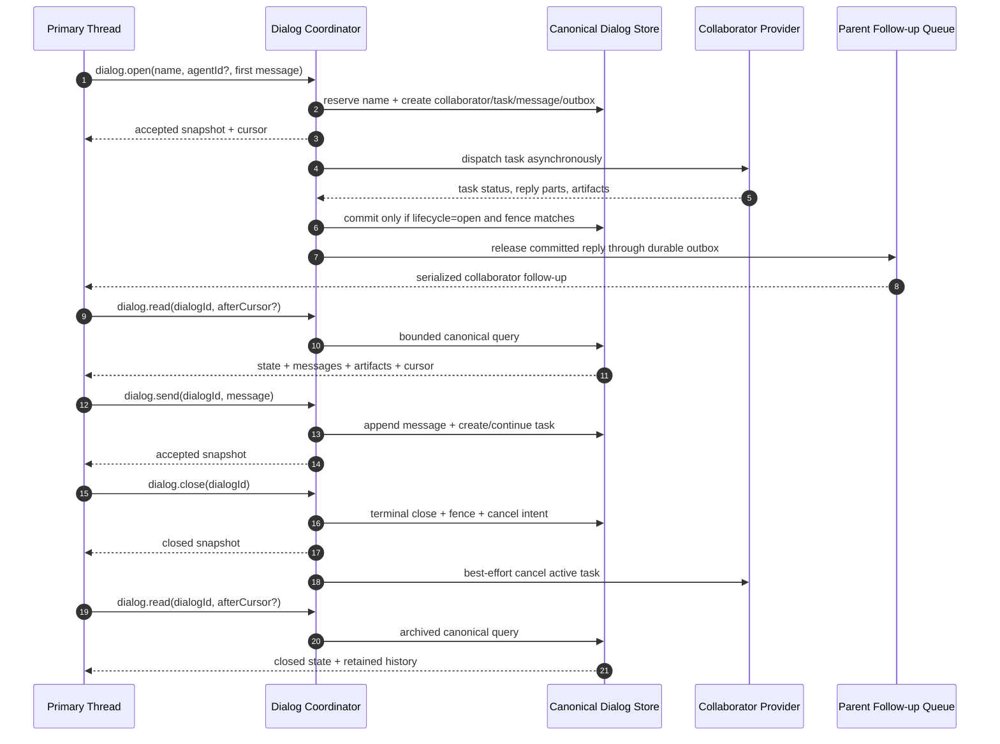
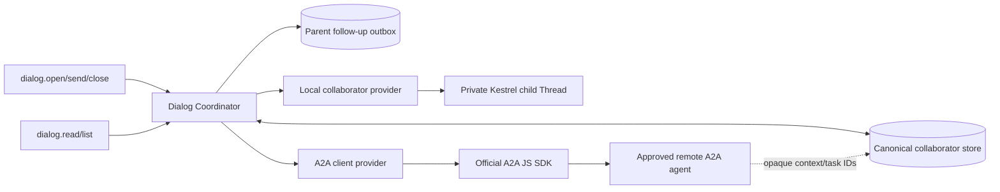

# Named Collaborator and A2A Lifecycle Change Design

## Executive Summary

Kestrel should promote its existing persistent dialog into a durable named
collaborator owned by one primary Thread. The deployed `dialog.*` vocabulary
remains the model-visible contract. `dialog.open` creates the collaborator and
its private child Thread, `dialog.send` starts or continues work,
`dialog.read` checks its durable state without starting work, `dialog.list`
recovers collaborators and IDs, and `dialog.close` is the terminal event for
that named collaborator in that Thread.

The parent learns when to use these tools from plain system instructions,
specific tool and field descriptions, examples, and structured reply state.
The model makes the judgment. Kestrel does not use keyword routing or a hidden
classifier. This report defines the exact production copy and the cases where
the parent should use no dialog tool.

Desktop and Kestrel One must keep collaborator traffic out of the ordinary
chat transcript. Each client shows one quiet collaborator control for the
Thread and a private inspector when the user asks to see the details. Kestrel's
normal answer remains the place where collaborator findings are explained to
the user.

Close means cancel-and-archive. It immediately and permanently rejects future
sends, preserves the child Thread, messages, tasks, and artifacts for reads,
and fences late provider completions. The collaborator name is immutable and
case-insensitively reserved for the lifetime of the parent Thread. Closing
`Peregrine` does not make `Peregrine` available for a different collaborator
in the same parent Thread.

The existing `DelegationSupervisor` and `ThreadRuntime` remain the execution
and parent-fan-in seams, but the dialog state can no longer live only as a
mutable array in `DelegationRecord.policy_json`. Typed, append-oriented
collaborator, task, message, artifact-reference, name-reservation, and outbox
records must become the runtime authority. This is required for cursor reads,
restart recovery, A2A task mappings, and an atomic close fence.

A2A support is a real outbound provider path, not merely an analogy. A local
child Thread and an approved remote A2A agent implement one collaborator
provider boundary. Kestrel remains authoritative for the parent Thread,
authorization, durable history, and delivery. Remote A2A context and task IDs
are opaque bindings to a Kestrel collaborator and its work tasks; they never
replace Kestrel identity. Inbound serving of Kestrel agents over A2A is outside
this change.

## Settled Product Contract

A named collaborator has one durable identity, one immutable display name, and
one private child Thread inside one parent Thread. The child Thread is the
execution context for a local collaborator and the durable local mirror for a
remote A2A collaborator.

The lifecycle is:

```text
not created --dialog.open--> open --dialog.close--> closed
                              ^                     |
                              |                     |
                    dialog.send/read/list     read/list only
```

There is no reopen transition. `dialog.close` is idempotent, but no later send
can revive the identity or attach work to its child Thread. The child Thread is
archived in the collaborator sense: it remains durable and readable and is no
longer an execution target.

Lifecycle and execution are separate:

- collaborator lifecycle: `open` or `closed`;
- current task state: `submitted`, `working`, `input_required`,
  `auth_required`, `completed`, `failed`, `cancelled`, `rejected`,
  `interrupted`, or `delivery_unknown`;
- derived collaborator activity: `idle` when there is no nonterminal task,
  otherwise the current task state.

A failed or completed task does not close its collaborator. An open,
non-busy collaborator can receive another message. A closed collaborator can
only be read or listed.

## Current Behavior and First Wrong Components

Kestrel already exposes exactly `dialog.open`, `dialog.send`, and
`dialog.close` in the managed profile
([policy](../../src/profile/kestrelOnePolicy.ts),
[registry](../../tools/runtime/UnifiedToolRegistry.ts)). Open creates a normal
child Thread, send reuses it, and child replies are queued into a later parent
turn by `ThreadRuntime`
([supervisor](../../src/orchestration/DelegationSupervisor.ts),
[parent fan-in](../../src/orchestration/ThreadRuntime.ts)). The durable
`FollowUpQueue` already serializes those parent continuations and carries
dialog and source-message identity
([queue](../../src/orchestration/FollowUpQueue.ts)). These are the right seams
to retain.

The existing contract is incomplete in five specific places:

1. `DialogServicePort` has no read or list operation, and `DialogSnapshot`
   exposes no messages, cursor, task state, artifacts, or synchronization state
   ([tool contracts](../../tools/contracts.ts)). The primary model can send but
   cannot deliberately check back or recover IDs after compaction.
2. The supervisor stores lifecycle and an ever-growing message array inside
   `DelegationRecord.policy.dialog`, persisted as one `policy_json` value
   ([orchestration record](../../src/kestrel/contracts/orchestration.ts),
   [PostgreSQL store](../../src/orchestration/PostgresOrchestrationStore.ts)).
   Whole-record overwrites do not provide append ordering, cursor reads, task
   history, or a cross-worker close fence.
3. The successful child-turn path constructs its reply from the pre-dispatch
   record and persists it without first proving that the dialog is still open.
   `close` aborts the in-memory controller, but a completion that races or
   ignores cancellation can still overwrite the closed record and enqueue a
   parent follow-up. The success commit is the first component that makes the
   terminal-close contract wrong.
4. Name uniqueness currently applies only while a dialog is open. The unit
   contract explicitly allows a closed name to be reused, and the Web index is
   likewise partial
   ([current test](../../tests/unit/orchestration-error-normalization.test.ts),
   [Web migration](../../apps/web/lib/db/migrations/0040_persistent_collaborator_dialogs.sql)).
   That contradicts terminal identity by name.
5. The parent prompt does not explain when another collaborator would help.
   The three current descriptions explain mechanics but give little decision
   help, input fields have no descriptions, and the reply instruction says only
   to continue “when useful”
   ([prompt assembly](../../src/runtime/agent-context/systemPrompts.ts),
   [reply branch](../../src/orchestration/ThreadRuntime.ts)). The model must
   guess the product behavior.
6. Desktop appends every `dialogMessage` to `RendererTranscriptLine` and
   `ConversationTimeline` renders it as a normal message
   ([Desktop projection](../../apps/desktop/renderer/src/DesktopApp.tsx),
   [Desktop timeline](../../apps/desktop/renderer/src/ConversationTimeline.tsx)).
   Kestrel One persists each dialog message as an assistant message and renders
   it inline in `PreviewMessage`
   ([Web projection](../../apps/web/lib/turns/dialog-messages.ts),
   [Web renderer](../../apps/web/components/chatbot/message.tsx)). Several
   collaborators would therefore turn one human conversation into a noisy copy
   of their private conversations. Those renderers are the first components
   that make the desired quiet experience wrong.

The current `dialog.open` description also asks the model to choose a bird
species, while runtime validates only a nonempty 1-to-40-character name
([tool](../../tools/runtime/dialogOpen.ts)). Named collaborators require a
plain immutable name contract; there should be no unenforced bird-name rule or
new name heuristic.

## Domain Model and Invariants

### Parent Thread

The primary user-facing conversation and the authority boundary for all of its
collaborators. Deleting the parent deletes its collaborator records. A
collaborator ID from another parent Thread is never addressable.

### Collaborator

A parent-thread-scoped durable identity containing:

- `dialogId`, immutable `name`, normalized name key, and private
  `childThreadId`;
- lifecycle state and a monotonically increasing revision/fence;
- provider kind and an opaque approved provider binding;
- creation-time role/profile/capability binding and current policy validity;
- timestamps including terminal `closedAt` when closed.

The display name is not the primary key, but it is immutable and reserved for
the full lifetime of the parent Thread. The durable ID remains the required
input to send, read, and close.

### Collaborator Task

One unit of work initiated by `dialog.open` or `dialog.send`. A collaborator
has at most one nonterminal task. A later message creates a new task unless the
current task is in an interrupted state that explicitly expects more input.

For A2A, `input_required` and `auth_required` continue the same remote task ID.
After a terminal task, a later send starts a new A2A task in the same remote
context. This follows A2A's distinction between a conversational context and a
task; a terminal A2A task cannot accept more messages.

### Message and Artifact

Messages are append-only records with an immutable ID and sequence inside the
collaborator. They carry sender, task ID when applicable, parent run/source
identity, typed content parts, status, and creation time. Rendered text such as
`"Peregrine: result"` is presentation, not provenance.

Artifacts are durable Kestrel artifact references associated with a
collaborator task. Remote file URLs are never the durable artifact. The A2A
provider validates and ingests permitted content through Kestrel's artifact
boundary, then stores a Kestrel reference plus source metadata.

### Required invariants

- One collaborator belongs to exactly one parent Thread and one child Thread.
- A name is case-insensitively unique for the entire parent-Thread lifetime.
- A collaborator has at most one nonterminal task.
- Read and list never send a message, wake a child, create a task, or create a
  parent turn.
- Close is idempotent and terminal. It wins against every completion that has
  not already committed.
- A committed collaborator reply is persisted before it becomes eligible for
  parent delivery.
- Each committed reply produces at most one durable parent follow-up.
- Nested Kestrel collaborator creation remains prohibited.
- A collaborator can retain only the authority granted at creation and still
  allowed by current policy. It never widens authority because an Agent Card,
  model, or remote peer claims more capability.

## Parent and Tool Instruction Contract

The instructions are part of the product contract. Implementing agents must
use the approved text below. They must not replace it with architecture terms
such as “bounded work,” “fan-in,” “delegation unit,” or “execution context.”
Those terms can appear in code and engineering documentation, but not in the
instructions shown to the parent model.

Kestrel keeps the deployed `dialog.*` names and adds `dialog.read` and
`dialog.list`. `agent.spawn`, `delegate.*`, and a second `agent.*` tool set stay
hidden from the parent.

### Instructions given to the parent

The parent system prompt must include this text:

```text
You can ask named collaborators to help with the current task. Each collaborator has a private conversation with you.

Open a collaborator when another teammate could help by researching a question, inspecting a different part of the work, reviewing your work, comparing choices, or working alongside you while you continue.

Do not open a collaborator only to repeat work you can finish now. Do not open one when nobody can continue until the user answers a question.

Give each collaborator a short, memorable name and a clear first message. Include the context they need. A collaborator's name cannot be changed or reused in this task.

After you open or message a collaborator, keep working. Kestrel will bring their reply back to you. Do not repeatedly check for a reply.

Use dialog.send when an existing collaborator needs another instruction, an answer, a correction, or more work. Use dialog.read when you want to see their status, messages, or results without asking them to do more. Use dialog.list when you need to see who is available or recover a dialog ID.

Close a collaborator only when you are sure you will not need them again. Closing stops their work and cannot be undone. You can still read the conversation after closing it.

Collaborators cannot open other collaborators. Do not ask a collaborator to do anything outside the user's current permissions.
```

The model chooses whether another collaborator would help. Kestrel does not
route work by keywords, scores, or a hidden classifier. The runtime only checks
facts it owns: tool access, parent ownership, name rules, busy state, close
state, nesting, and permissions.

The owning prompt seam is the root-turn assembly in
[`ThreadRuntime`](../../src/orchestration/ThreadRuntime.ts). It must append the
collaboration block to `runtimeTurn.systemInstructions` only when the effective
model tool list contains all five dialog tools and the active turn is not a
collaborator child. It must preserve any other application instructions. Do
not put this block in `SHARED_DELIBERATOR_PROMPT`; that prompt is also used by
profiles and child turns that cannot open collaborators
([prompt assembly](../../src/runtime/agent-context/systemPrompts.ts)).

The five tool modules own their descriptions and input-field help. The current
modules provide no field descriptions, and the open description still contains
the bird-name rule
([open](../../tools/runtime/dialogOpen.ts),
[send](../../tools/runtime/dialogSend.ts),
[close](../../tools/runtime/dialogClose.ts)). The dialog follow-up branch in
`ThreadRuntime` owns the reply instruction. These are contract-carrying
surfaces; UI copy or Web projections cannot substitute for them.

### Exact `dialog.open` copy

Tool description:

```text
Start a private conversation with a new named collaborator and send the first message. Use this when another collaborator can research, review, investigate, compare choices, or work on a different part of the task while you continue. Their reply will come back to you later. The name cannot be changed or reused in this task, even after you close the collaborator.
```

Input descriptions:

| Field | Required | Description shown to the parent |
| --- | --- | --- |
| `name` | yes | A short, memorable name for this collaborator. The name must be unique in this task and cannot be changed or reused. |
| `message` | yes | What you want the collaborator to do or answer. Include the context they need. |
| `agentId` | no | The approved remote agent to use. Leave this out to use a Kestrel collaborator. |

Runtime meaning: open reserves the name, creates the collaborator and private
child Thread, saves the first message, creates the first work task, and records
the work to start. It returns the saved collaborator state immediately. The
collaborator works after the tool returns.

### Exact `dialog.send` copy

Tool description:

```text
Send another message to a collaborator you already opened. Use this to answer their question, correct or narrow their work, ask for more detail, or give them another assignment. Their reply will come back to you later. You cannot send a message while they are busy or after you close them.
```

Input descriptions:

| Field | Required | Description shown to the parent |
| --- | --- | --- |
| `dialogId` | yes | The dialog ID returned by dialog.open, dialog.read, or dialog.list. |
| `message` | yes | The message to send. Include any new facts or instructions the collaborator needs. |

Runtime meaning: send fails with `DIALOG_CLOSED` after close and `DIALOG_BUSY`
while the collaborator is still working. It fails with
`DIALOG_DELIVERY_UNKNOWN` when Kestrel cannot tell whether the prior message
arrived; the parent must not create a possible duplicate. Send starts a new
work task after the last one ends. If the collaborator is waiting for an answer
or permission, it continues that same task.

The first model-facing input stays text-only. Internally, messages can contain
A2A text and structured data. Files returned by a provider must become saved
Kestrel artifact references before the parent can use them.

### Exact `dialog.read` copy

Tool description:

```text
Check a collaborator's status, messages, results, and saved files without sending a message or starting more work. Use this when you need to review the private conversation or check what has arrived since an earlier read.
```

Input descriptions:

| Field | Required | Description shown to the parent |
| --- | --- | --- |
| `dialogId` | yes | The collaborator to read. Use the dialog ID returned by dialog.open or dialog.list. |
| `afterCursor` | no | Return only messages and results that arrived after this cursor. Leave this out to get the most recent items. Do not use with `beforeCursor`. |
| `beforeCursor` | no | Return older saved messages before this cursor. Use this when `hasEarlier` is true. Do not use with `afterCursor`. |
| `limit` | no | The maximum number of messages and results to return. |

Read returns the collaborator's name, open or closed status, current work
status, child Thread ID, latest error, messages, saved files, and a cursor for
the next read. Without a cursor, it returns a limited recent window in time
order. `afterCursor` checks for newer messages; `beforeCursor` pages into older
history. With a current `afterCursor`, it returns no new messages.

Read uses only Kestrel's saved state. It does not contact the collaborator,
wake it, start work, or create a parent turn. Kestrel updates remote A2A work
separately and reports when it last checked the remote agent.

### Exact `dialog.list` copy

Tool description:

```text
See the named collaborators in this task and what each one is doing. Use this when you need a dialog ID, have forgotten who is working, or need to find a collaborator after earlier messages are no longer in your context. This does not send a message or start work.
```

Input descriptions:

| Field | Required | Description shown to the parent |
| --- | --- | --- |
| `status` | no | Show open collaborators, closed collaborators, or all collaborators. Leave this out to show all. |
| `cursor` | no | Continue from the cursor returned by an earlier dialog.list call. |
| `limit` | no | The maximum number of collaborators to return. |

List returns each collaborator's dialog ID, name, open or closed status,
current work status, latest task status, newest item cursor, and last update time.
It lists collaborators saved by Kestrel. It does not pass through A2A
`ListTasks`.

### Exact `dialog.close` copy

Tool description:

```text
Stop an open collaborator and end this private conversation for the current task. You can still read its messages, results, and saved files. You cannot send another message, reopen the collaborator, or reuse its name. This cannot be undone.
```

Input description:

| Field | Required | Description shown to the parent |
| --- | --- | --- |
| `dialogId` | yes | The collaborator to stop. Use the dialog ID returned by dialog.open, dialog.read, or dialog.list. |

Runtime meaning: close saves the terminal `closed` state before it asks the
provider to cancel active work. Remote cancellation can fail without reopening
the collaborator. Repeating close is safe. The name stays reserved.

### Tool inputs and results

The input rules are exact:

- Trim `name`. Accept 1 to 40 characters. Compare names without case. Reserve
  the normalized name until the parent Thread is deleted.
- Require nonempty `message`, `dialogId`, `agentId`, and cursor strings when
  those fields are present. The normal runtime request-size limit applies to
  messages; the dialog tools do not create another text-size limit.
- `dialog.read.limit` accepts an integer from 1 through 100 and defaults to 20.
- `dialog.read` accepts at most one of `afterCursor` and `beforeCursor`.
- `dialog.list.status` accepts `open`, `closed`, or `all` and defaults to `all`.
- `dialog.list.limit` accepts an integer from 1 through 100 and defaults to 50.
- Treat every cursor as opaque. Reject a cursor created for another parent
  Thread, collaborator, query, or sort order.
- Reject unknown fields in every tool input.

`dialog.open` returns this summary shape plus `created`. When a normalized name
already exists, open returns its saved summary with `created: false` and does
not resend the opening message. `dialog.send` and `dialog.close` return this
summary shape.
`active` remains as a compatibility field and is derived from `activity`.

```ts
interface DialogSummaryV2 {
  dialogId: string;
  name: string;
  childThreadId: string;
  status: "open" | "closed";
  activity:
    | "idle"
    | "submitted"
    | "working"
    | "input_required"
    | "auth_required"
    | "delivery_unknown"
    | "interrupted";
  active: boolean;
  provider: "local" | "a2a";
  latestTask?: {
    taskId: string;
    status:
      | "submitted"
      | "working"
      | "input_required"
      | "auth_required"
      | "completed"
      | "failed"
      | "cancelled"
      | "rejected"
      | "delivery_unknown"
      | "interrupted";
    error?: { code: string; message: string };
    updatedAt: string;
  };
  cursor: string;
  providerObservedAt?: string;
  createdAt: string;
  updatedAt: string;
  closedAt?: string;
}
```

`active` is true only while `activity` is `submitted` or `working`. It is false
while the collaborator is waiting for input, needs authorization, has an
unknown delivery result, was interrupted, is idle, or is closed. `activity`
becomes `idle` after the latest task completes, fails, is cancelled, or is
rejected. The terminal result remains available in `latestTask.status`. A
closed collaborator is never active, even if a remote provider still reports
work after Kestrel has closed it.

`dialog.read` returns the summary plus one ordered item stream. Messages and
saved artifacts share the same collaborator sequence, so one cursor cannot
skip an artifact that arrived between two messages.

```ts
interface DialogReadResultV2 extends DialogSummaryV2 {
  items: DialogReadItemV2[];
  nextCursor: string;
  previousCursor?: string;
  hasEarlier: boolean;
  hasMore: boolean;
}

type DialogReadItemV2 =
  | {
      kind: "message";
      sequence: number;
      messageId: string;
      taskId?: string;
      sender: "kestrel" | "collaborator" | "system";
      parts: DialogPartV2[];
      status: "sent" | "received" | "failed" | "cancelled";
      createdAt: string;
    }
  | {
      kind: "artifact";
      sequence: number;
      artifactId: string;
      taskId: string;
      name: string;
      mediaType?: string;
      createdAt: string;
    };

type DialogPartV2 =
  | { kind: "text"; text: string }
  | { kind: "data"; data: unknown }
  | {
      kind: "artifact";
      artifactId: string;
      name: string;
      mediaType?: string;
    };
```

Without a cursor, read selects the newest `limit` items and returns them oldest
first. `hasEarlier` says whether older items exist and `previousCursor` marks
the oldest returned item. With `afterCursor`, read selects the next `limit`
items in time order. With `beforeCursor`, it selects the preceding `limit`
items. `hasMore` says whether more items exist after the returned page.
`nextCursor` marks the newest returned item. If nothing new exists after an
`afterCursor`, it repeats the supplied cursor.

`dialog.list` returns summaries ordered by `updatedAt` descending, then
`dialogId` descending. Its cursor preserves that order.

```ts
interface DialogListResultV2 {
  dialogs: DialogSummaryV2[];
  nextCursor?: string;
  hasMore: boolean;
}
```

The tool result must not expose remote credentials, raw provider endpoints, or
an unvalidated remote file URL.

### Errors shown to the parent

Errors must state what happened and what the parent can do next. Use this copy:

| Code | Message |
| --- | --- |
| `DIALOG_NAME_INVALID` | A collaborator name must contain 1 to 40 characters. Choose a short, memorable name. |
| `DIALOG_NAME_RESERVED` | 'Kestrel' is the name of the primary participant. Choose another collaborator name. |
| `DIALOG_NOT_FOUND` | This collaborator does not exist in the current task. Use dialog.list to find the available collaborators. |
| `DIALOG_BUSY` | '{name}' is still working. Wait for the reply or use dialog.read to check the saved status. |
| `DIALOG_DELIVERY_UNKNOWN` | Kestrel does not know whether the last message reached '{name}'. Do not resend it. Use dialog.read to check the saved status. |
| `DIALOG_CLOSED` | '{name}' is closed. You can read its history, but you cannot send another message or reopen it. |
| `DIALOG_NESTING_FORBIDDEN` | Only Kestrel in the main conversation can open collaborators. Continue without opening another collaborator. |
| `DIALOG_AGENT_NOT_APPROVED` | This remote agent is not approved for the current task. Use an approved agent or leave agentId out to use a Kestrel collaborator. |
| `DIALOG_CURSOR_INVALID` | This cursor does not belong to this collaborator or list. Start a new read or list without the cursor. |
| `DIALOG_PROVIDER_UNAVAILABLE` | The collaborator's provider is unavailable. The conversation is still saved. Read the current status or try again later. |

Provider-specific details can appear in structured error metadata for logs and
operators. The parent-facing message must remain actionable and must not expose
credentials, endpoints, stack traces, or raw transport errors.

### Instructions when a collaborator replies

Kestrel must provide the reply as structured collaborator input, not as a
human message. The parent follow-up must include `dialogId`, `dialogName`,
`sourceMessageId`, collaborator status, and current work status. It must also
include this system instruction:

```text
A named collaborator sent you a message. This is not a message from the user.

Use the collaborator's message in your work. Check the supplied collaborator status before choosing what to do next. If the collaborator is open, use dialog.send to reply or give them more work. Use dialog.read to see more of the private conversation. Use dialog.close only when you are sure you will not need this collaborator again.
```

The rendered label `"Name: reply"` can help a person read the conversation,
but the parent must use the structured IDs and states to choose a tool.

### Examples the parent instructions must make easy

| Situation | Expected choice |
| --- | --- |
| The user asks Kestrel to investigate two unrelated failures. | Open two collaborators with different names and clear assignments. Continue useful parent work while they investigate. |
| The parent wants a second opinion on a draft or code change. | Open one collaborator and ask for a review. |
| An existing collaborator asks which option to use. | Send the answer to that collaborator. Do not open another one. |
| The parent wants to see a collaborator's earlier evidence but has no new instruction. | Read the collaborator. Do not send a placeholder message. |
| Earlier context no longer contains the collaborator ID. | List collaborators, then use the returned ID. |
| A collaborator is still working. | Continue other work or wait for the normal reply. Do not repeatedly read or send. |
| The question is simple and the parent can answer it now. | Answer it directly. Do not open a collaborator only to repeat the work. |
| No work can continue until the user answers. | Ask the user. Do not open a collaborator to wait for the same answer. |
| The collaborator has finished and will not be needed again. | Close it after using or saving the result. |
| The user asks Kestrel to stop that collaborator. | Close it immediately. |
| The collaborator is closed. | Read its history if needed. Never send to it or reuse its name. |

### Instruction validation

The model-facing words must be tested as a contract, not left as comments:

- The managed parent prompt contains the approved collaboration instructions.
- The tool registry exposes the five approved descriptions and every field
  description above.
- The follow-up prompt says the message came from a collaborator, includes the
  structured identity and states, and does not present the message as human
  input.
- Contract tests reject the old bird-name instruction and any suggestion that
  close can be undone or that a name can be reused.
- Tool-choice evaluations cover every example above, including the cases where
  the correct choice is to use no dialog tool.
- Read and list evaluations prove that the parent can check saved state without
  sending a message or repeatedly polling.
- Closed and busy evaluations prove that instructions agree with runtime
  errors.

The tests can preserve exact approved copy or assert every required sentence.
They must fail if an edit removes the use case, the important limit, or the
consequence of close.

## Conversation-First Collaborator Experience

The private collaborator conversation is durable Thread data, but it is not a
second stream of chat bubbles. The primary conversation remains between the
user and Kestrel. Kestrel uses collaborator findings in its normal answer.

Each Thread that has at least one collaborator shows one compact
**Collaborators** control in the Thread header. It shows the number of known
collaborators and, when work is active, the names of up to two active ones.
For example: `Collaborators · Research is working` or `Collaborators · 2`.
It is a status control, not a new navigation area, toast, or dashboard.

Selecting the control opens a collaborator inspector. It is a right-side panel
on wide Desktop and Kestrel One windows and a full-height sheet on a narrow
Kestrel One window. The inspector has a compact list first and one selected
private conversation second. It closes without changing the main conversation
or moving the user's input focus.

```text
Thread header
  Project title                         Collaborators · Research is working

Main conversation                       Collaborator inspector
  You: Investigate the failures           Research                 Working
  Kestrel: I am checking both paths.      Kestrel  Please inspect …
  Kestrel: Research found the cause…      Research The request …
                                           [Ask Kestrel about Research]
```

The inspector presents the saved conversation as a private exchange between
Kestrel, the named collaborator, and the system. It shows messages, current
state, failures, and saved artifacts. A user can close the panel, switch
collaborators, and return to the main conversation without losing position.
`Ask Kestrel about Research` focuses the normal composer with a plain-language
request; it does not call `dialog.send`, `dialog.read`, or `dialog.close`
directly. The primary model remains the only participant that manages the
collaborator lifecycle and therefore remains inside the existing policy and
tool contract.

### What appears in the main conversation

| Runtime event | Collaborators control and inspector | Ordinary chat transcript |
| --- | --- | --- |
| Kestrel opens or messages a collaborator | Add or update that collaborator's row and show its working state. | Do not add the private request as a chat message. |
| A collaborator replies | Show `Research replied` as the row's recent event and its current state as `Research is ready`. A local attention dot can mark the new event in the current session. | Do not render the reply text. The parent receives the structured follow-up and can explain the result in its own answer. |
| A collaborator waits, is interrupted, or fails | Update the row with one plain status and keep the diagnostic in the inspector. | Do not add a status bubble or interrupt the user. Kestrel asks the user only if it cannot continue without them. |
| Kestrel closes a collaborator | Move it from active rows to the inspector's archived list. | Do not add a closure bubble. Its private history remains readable. |

An active row uses the latest saved message for that collaborator. It is not a
row per message. The compact control can show a small attention dot when a
reply is ready, but the first slice does not add a cross-device unread model.
It must never show a changing message count as a substitute for useful state.

### Status words and visual behavior

Use the collaborator's immutable name in each label. Do not label a private
message as an ordinary Kestrel answer or as a human message.

| Runtime state | Visible words | Treatment |
| --- | --- | --- |
| open + working | `Research is working` | A small, labeled activity indicator. It has no made-up percentage or time estimate. |
| open + idle | `Research is ready` | Quiet neutral state. |
| open + waiting | `Research is waiting for Kestrel` | Neutral attention state. Kestrel decides whether it can answer or needs the user. |
| open + interrupted | `Research is paused` | Quiet attention state with the reason in the inspector. |
| task failure | `Research ran into a problem` | Attention state. Show the saved plain-language failure in the inspector. |
| closed | `Research is archived` | Remove it from the active summary but retain it in the inspector. |

Color supports these words; it does not replace them. Working uses an
indeterminate activity indicator because collaborator work has no truthful
percentage. The indicator stays in the same header and inspector locations
while it is active. It does not spin or announce inside every saved message.

### Desktop and Kestrel One responsibilities

Both clients use the same grouping rule and the same runtime message metadata.
Neither client calls `dialog.read` to make the screen feel live, polls a
provider, or treats its local display state as lifecycle authority.

| Surface | Primary affordance | Detail behavior |
| --- | --- | --- |
| Kestrel Desktop | A compact header control, with small active-name chips when the window has room. | A resizable right-side inspector. It preserves the conversation scroll position and works with keyboard focus inside the panel. |
| Kestrel One | The same compact header control. On smaller screens it shortens to `Collaborators · 2` rather than wrapping names. | A side panel on wide windows and a sheet on small windows. The underlying chat remains visible only when enough room exists. |

Do not add a permanent sidebar section, a separate collaborators page, a
workflow canvas, raw provider labels, or one global toast per collaborator
event. Local and A2A collaborators share the same presentation; provider type
is an operator concern unless a user-facing permission or failure requires
disclosure.

### Delivery, focus, and accessibility

When a collaborator update arrives, update the compact control in place. Do
not steal focus, auto-open the inspector, scroll the main conversation, or
show a foreground notification. A user who is away from the bottom keeps the
existing return-to-latest control; the collaborator control provides the
discoverable path to the new private result.

The compact state uses `role="status"` or an equivalent polite live region.
Announce a meaningful state change once, such as `Research replied`, but never
announce spinner frames, repeated working updates, or the full private reply.
The inspector opener has an accessible name that includes the collaborator
count and active state. Keyboard focus moves into the inspector only after the
user opens it and returns to the opener when they close it.

Apple's guidance recommends in-context, noninterrupting foreground updates
instead of unnecessary notifications. It also treats a busy indicator as
transient feedback rather than a fake progress measure
([Notifications](https://developer.apple.com/design/human-interface-guidelines/notifications), [Progress indicators](https://developer.apple.com/design/human-interface-guidelines/progress-indicators?changes=_4_6)). WAI-ARIA defines `status` as advisory, polite live feedback that should not receive focus when it changes
([WAI-ARIA status role](https://www.w3.org/TR/wai-aria/#status)). These rules
fit the existing persistent event projection: state can change in place while
the canonical dialog record and parent follow-up remain unchanged.

### Presentation contract

- Group every saved dialog message by `dialogId` before rendering. The latest
  message supplies the row state; the complete ordered group supplies the
  inspector transcript.
- Keep raw dialog messages out of `ConversationTimeline.MessageEntry` and out
  of Kestrel One's ordinary `PreviewMessage` body. The parent reply that uses a
  collaborator result remains an ordinary Kestrel message.
- Rebuild the group from the existing Desktop `view.dialogs` recovery data and
  Kestrel One `thread_messages` dialog parts. Do not add a second message store
  or make a UI state flag authoritative.
- Preserve a closed collaborator's group and artifact links for the life of the
  parent Thread. Its archived row must remain selectable from the inspector.
- Treat the inspector as a reader. Sending, reading, or closing through the
  model tools stays visible in durable runtime events and follows the model's
  policy path, not a browser-side shortcut.

The presentation checks must prove that ten dialog messages from three
collaborators produce at most one header control and one row per collaborator,
not ten transcript entries. They must also prove that an incoming reply leaves
the user's scroll position and input focus unchanged, an archived collaborator
remains readable, and status updates have accessible text without duplicate
live announcements.

## Lifecycle and Delivery



The completion/close race has one durable linearization rule:

- If the reply transaction commits while the collaborator is open and its
  dispatch fence still matches, the reply and follow-up outbox entry exist.
  A later close does not retract them, so the queued parent continuation may
  arrive after close with closed lifecycle metadata.
- If close commits first, a late provider success cannot append a collaborator
  message or enqueue a follow-up. It can be retained only as provider audit
  evidence. The active task remains cancelled or records a late-cancel
  diagnostic; the collaborator stays closed.

The follow-up outbox and reply commit are one transaction. The existing
`FollowUpQueue` remains the consumer: it starts a parent continuation when the
parent is idle and serializes the update when the parent is busy. Multiple
collaborator replies remain separate causally identified entries; they are not
merged by rendered text. Each entry derives its parent turn identity from the
saved collaborator message ID, so recovery replays a completed parent turn
instead of calling the model twice.

## State Ownership and Persistence

The runtime orchestration store is canonical. Web `thread_dialogs` and
`thread_messages` remain presentation/search projections of runtime records
([projection](../../apps/web/lib/turns/dialog-messages.ts)); they do not decide
whether a collaborator is open, whether a message committed before close, or
which provider task is current.

The durable runtime model needs typed stores with these responsibilities:

| Record | Owns |
| --- | --- |
| Collaborator | Parent/child identity, immutable name, lifecycle, provider binding reference, policy revision, close fence |
| Name reservation | Atomic lifetime uniqueness of normalized name within parent Thread |
| Task | Kestrel task ID, task state, dispatch fence, provider task binding, delivery/synchronization state |
| Message | Immutable sequence, sender, typed parts, task/source identities, status |
| Artifact link | Kestrel artifact reference and provider provenance |
| Delivery outbox | Exactly-once eligibility for parent follow-up and runtime projection events |

The existing `orchestration_delegations` row remains the compatibility root and
local child scheduling link. `persistent_dialog_v2` uses typed dialog records
rather than treating `policy_json` as the authoritative message log. The
generic one-shot delegation contract does not need to become a collaborator
task model.

The name reservation is separate from a strict unique index on all historical
dialog rows. The current product permitted reuse, so old data may already
contain duplicate closed names. Backfilling one reservation per normalized
parent/name preserves those records while preventing every future reuse.

Message sequence and close-fence changes are transactional compare-and-set
operations. In-process `AbortController` state is an optimization only; it is
not lifecycle authority.

## Local and A2A Provider Boundary



Both providers implement the same conceptual operations: dispatch or continue
a task, observe updates, and request cancellation. Provider events are
normalized into Kestrel task, message, and artifact records before they can
reach the parent.

The local provider retains the current child-turn path and its no-nesting
instructions. The collaborator's role, model/profile binding, and effective
tool/capability ceiling are persisted at creation. Each later dispatch
revalidates current policy and may narrow or deny that authority; it does not
silently adopt broader parent or profile changes.

The outbound A2A provider uses the official TypeScript SDK. Kestrel's Node 22
runtime satisfies the SDK's Node baseline. The first contract targets released
A2A v1 and enables the SDK's HTTP+JSON/REST and JSON-RPC client transports,
selecting the first supported interface declared by the validated Agent Card.
gRPC and opt-in v0.3 compatibility are outside this change.

An approved `agentId` resolves to an environment-scoped connection, credential
reference, expected provider identity, allowed endpoint/egress policy, and
permitted skills/content modes. The model cannot turn an arbitrary URL into a
collaborator. Agent Cards are schema-validated and treated as untrusted
capability declarations; a card cannot widen Kestrel policy or inject
credentials.

### A2A identity mapping

| Kestrel | A2A | Rule |
| --- | --- | --- |
| Approved collaborator definition | Agent Card | Card is discovered and validated through trusted configuration |
| `dialogId` | none | Kestrel-owned identity; never replaced by a remote ID |
| collaborator context | `contextId` | Store returned server context as opaque provider binding |
| collaborator task | Task | One new task per work unit, except explicit interrupted-task continuation |
| dialog message parts | Message/Part | Preserve IDs and typed text/data; validate all content |
| artifact link | Artifact | Ingest into Kestrel storage before exposing a durable reference |
| provider observer | GetTask | Poll active tasks and normalize changes into the canonical store |
| `dialog.list` | none | Kestrel roster, not raw `ListTasks` |
| `dialog.close` | CancelTask plus local close | A2A cancels only the active task; Kestrel closes the whole collaborator context |

Kestrel does not generate a remote `contextId` unless that approved peer's
contract explicitly accepts client IDs. It normally adopts the server-returned
opaque context. A new work unit uses the context without the previous terminal
task ID; an `input_required` or `auth_required` continuation includes the same
task ID.

A2A message history is not Kestrel's recovery log. The protocol permits
incomplete history and transient messages, so every provider update needed for
Kestrel behavior is normalized and persisted locally. `GetTask` supplies
polling/recovery state; it does not replace the dialog message store.

Send ambiguity is explicit. A2A peers may deduplicate by message ID but are not
required to make send idempotent. After a transport failure where remote
acceptance is unknown, Kestrel records `delivery_unknown`, reconciles by known
task/context identity, and does not blindly create a duplicate task. If the
state cannot be reconciled, the parent receives a durable failure/checkpoint
rather than an automatic duplicate send.

## Restart and Failure Recovery

On runtime startup, durable nonterminal tasks are reconciled without reopening
closed collaborators:

- A remote A2A task with a provider task ID is observed with `GetTask`; any
  returned state, messages, and artifacts pass through the same fenced commit
  path. Temporary network failure leaves the task observable as stale or
  unknown and schedules bounded retry.
- A local task whose process disappeared is marked `interrupted`, its dialog
  remains open, and a durable system message/follow-up explains that work did
  not complete. It is not silently replayed because the previous child turn may
  have produced effects.
- A closed collaborator causes reconciliation to cancel or ignore any
  nonterminal provider work. It never resumes the child.
- A committed reply whose parent follow-up was not delivered remains in the
  outbox and is delivered once after restart.

Task failure, provider rejection, unsupported content, and authentication
requirements are task outcomes, not automatic collaborator closure. Reads
expose the exact state and structured error. A later send is allowed when the
collaborator is open and no task is actively working; authorization-required
continuation follows the approved credential workflow rather than receiving
credentials in an A2A message.

## Security and Policy Boundary

- Every operation resolves `dialogId` under the active parent Thread. A raw ID
  never bypasses parent, organization, user, project, or workspace scope.
- Remote definitions and credentials are operator-controlled. Tool input can
  select only an approved `agentId`; it cannot provide a URL or secret.
- Agent Card URLs and file references use HTTPS, egress allowlisting, DNS/IP
  rebinding defenses, size/content limits, and SSRF validation.
- Credentials are injected by the provider client from an opaque connection
  reference and are never written into messages, Agent Cards, dialog rows, or
  model context.
- Agent Card signatures are verified when present; configured provider
  identity and transport policy remain required even for a signed card.
- Remote output is untrusted input. Parts and artifacts are schema-, media-,
  size-, malware-, and authorization-checked before persistence or rendering.
- A remote agent receives only the content and authority explicitly granted to
  that collaborator. It does not inherit Kestrel's local tool credentials.
- Local children cannot call `dialog.open`; a remote peer cannot call back into
  Kestrel collaborator tools unless a future inbound A2A design explicitly
  grants that path.

## Affected Surface

| Surface | Required change |
| --- | --- |
| Parent prompt | Add the approved plain-language collaboration policy and no hidden routing heuristic |
| Tool contracts/catalog | Add `dialog.read` and `dialog.list`; add approved `agentId` selection to open; use the exact descriptions and field help in this design |
| Managed profile and smoke contract | Expose exactly open, send, read, list, and close; keep legacy delegation tools hidden; remove bird-name language |
| `DelegationSupervisor` | Coordinate typed state, provider dispatch, busy/input continuation, terminal close, and fenced completion |
| `ThreadRuntime`/`FollowUpQueue` | Consume durable outbox entries and preserve structured provenance while serializing parent turns |
| Orchestration store | Add typed collaborator/task/message/artifact-link/name-reservation/outbox operations and compare-and-set transitions |
| PostgreSQL/in-memory stores | Implement the same canonical ordering, uniqueness, fence, and query semantics |
| Local child execution | Preserve one private child Thread, persisted role/policy binding, no nesting, and interrupted-run recovery |
| A2A client provider | Approved discovery, transport negotiation, send/get/cancel, content normalization, and ambiguous-delivery handling |
| Web persistence | Project canonical lifecycle/task/message state; stop treating the partial open-name index as the runtime invariant |
| Web/Desktop/TUI/operator views | Group private messages by collaborator; show the immutable name, open/closed lifecycle, activity, task failures, artifacts, and archived readable history without rendering every private message in the primary transcript |
| Replay/evidence | Include collaborator/task/message/source IDs and close-fence outcomes in deterministic events |
| Prompt and tool-choice tests | Protect the approved words, reply instructions, examples, and no-tool cases as behavior |

## Coexistence and Transition Contract

Existing `persistent_dialog_v1` records remain readable by ID. The v2 reader
can normalize their message arrays into the new response shape, and the
name-reservation backfill reserves every distinct historical normalized name.
If old behavior produced several collaborators with one name, all remain
readable by ID, but the name stays unavailable for any new collaborator.

The first mutating operation on an open v1 dialog promotes it under a durable
row lock: it copies the latest lifecycle and ordered messages into typed v2
records, advances the revision, and only then applies send or close. A v1
dialog that was `RUNNING` when no owner remains is promoted as interrupted,
not automatically replayed. New opens are v2 only.

Runtime events and Web projection payloads are versioned. A generic consumer
that knows only v1 can retain its text fallback. Desktop and Kestrel One group
both v1 and v2 dialog messages by `dialogId` and keep those private messages
out of the ordinary transcript. V2 consumers also render task, artifact,
lifecycle, and synchronization data. `dialogId`, child Thread ID, existing
message IDs, and parent follow-up source metadata remain stable.

Compatibility can be removed only when no persisted v1 dialog remains
unpromoted and all shipped runtime/profile consumers require the five-tool
contract. This is a removal condition, not a second long-term execution path.

## Rejected Alternatives

### Replace `dialog.*` with `agent.*`

This creates contract churn without changing the underlying product. The
deployed tools already express a private collaborator relationship. Product UI
may say “agent” or “collaborator”; the model API remains `dialog.*`.

### Expose `agent.spawn` or `delegate.*`

Those tools represent one-shot delegation and internal orchestration. Exposing
them would bypass the parent-thread-scoped dialog semantics and reopen nested
delegation behavior. They remain internal.

### Use one long-lived A2A task for the collaborator

A2A tasks have terminal states and cannot accept later messages once terminal.
The durable collaborator therefore maps to one context containing sequential
tasks, not one immortal task.

### Let `read` poll or wake the provider

That would make an observational operation mutate state and depend on remote
latency. Provider observers update canonical state independently; read is a
bounded local query.

### Keep the message log only in `policy_json`

This is insufficient for atomic append, cursor pagination, task history,
multi-worker updates, durable outbox delivery, and terminal close fencing.

### Route local collaborators through a network A2A gateway

Local child Threads already have a direct, policy-aware execution path. A2A is
a provider adapter for interoperability, not a mandatory network hop.

### Support inbound A2A in the same change

Serving Agent Cards and accepting externally initiated tasks introduces a new
public trust, tenancy, rate-limit, identity, and lifecycle boundary. It should
reuse the canonical collaborator/task model later but is not required to
complete outbound named collaboration.

## Final Decisions

- **Existing seam:** retain `DelegationSupervisor`, private child Threads,
  `ThreadRuntime`, and `FollowUpQueue`. Confidence: high.
- **Model contract:** retain `dialog.*`; add `read` and `list`. Confidence:
  high.
- **Model instructions:** use the approved plain-language parent policy, tool
  descriptions, field descriptions, reply instruction, and examples in this
  report. Confidence: high.
- **Identity:** one immutable, lifetime-unique name and durable ID per parent
  Thread. Confidence: high.
- **Close:** terminal, idempotent cancel-and-archive with an atomic completion
  fence; reads remain available. Settled; confidence: high.
- **Concurrency:** one nonterminal task per collaborator; busy sends fail
  explicitly. Confidence: high.
- **Parent delivery:** every committed reply creates one durable, serialized
  parent follow-up. Confidence: high.
- **Persistence:** typed append-oriented runtime records and outbox become
  canonical; Web remains a projection. Confidence: high.
- **A2A direction:** outbound v1 client first through the official JS SDK;
  inbound serving, gRPC, and v0.3 compatibility are out of scope. Confidence:
  high.
- **A2A mapping:** one Kestrel collaborator context contains sequential tasks;
  remote IDs are opaque bindings. Confidence: high.
- **Content:** outbound text first; typed text/data results and ingested durable
  artifact references are supported. Confidence: medium-high.
- **Restart:** reconcile remote tasks, mark vanished local work interrupted,
  and never automatically replay uncertain effects. Confidence: high.
- **Nesting and authority:** no nested Kestrel collaborators; persisted
  creation authority is revalidated and can only narrow. Confidence: high.

No material design question remains. Streaming, push notifications, richer
outbound parts, collaborator renaming, name reuse, waiting subscriptions,
cross-parent collaborators, and inbound A2A are explicit future changes rather
than ambiguities in this contract.

## External Findings

The released [A2A v1.0 specification](https://a2a-protocol.org/v1.0.0/specification/)
defines contexts as groupings for multiple tasks and messages, requires new
server-generated task IDs, permits a context-only message to start another
task, and forbids messages to terminal tasks. It also warns that task message
history may be incomplete and requires authorization scoping and SSRF
validation. Those rules directly produce Kestrel's context-plus-sequential-task
mapping, canonical local log, and remote-content security boundary.

The official [A2A JavaScript SDK](https://github.com/a2aproject/a2a-js/blob/main/README.md)
implements v1 clients and servers across JSON-RPC, HTTP+JSON/REST, and gRPC,
and its client factory selects from Agent Card supported interfaces. Kestrel
should use that SDK for protocol correctness rather than hand-writing A2A
envelopes. Its optional
[v0.3 compatibility layer](https://github.com/a2aproject/a2a-js/blob/main/docs/migration-guide.md)
is deliberately not part of this first contract.
