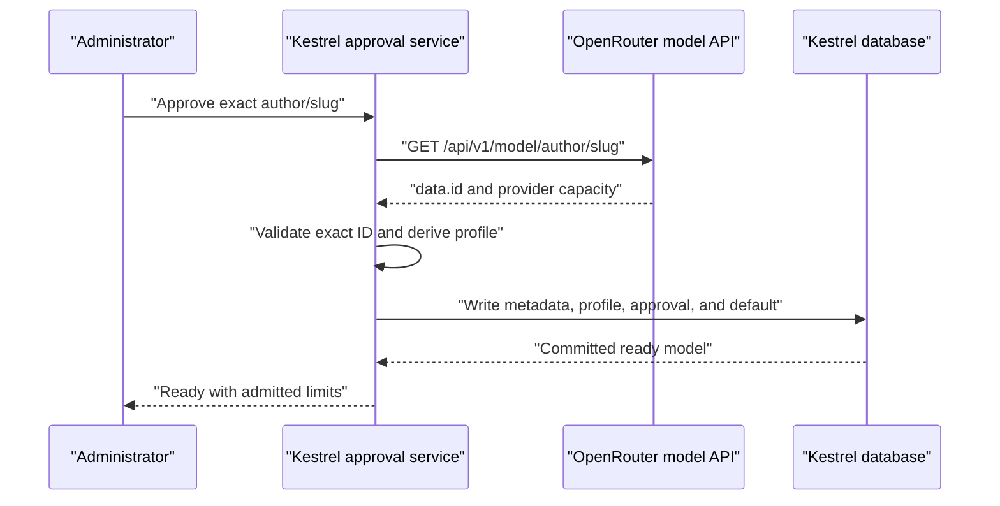

# OpenRouter Model Economics Repair Change Design

## Executive Summary

Kestrel should make hosted model approval a server-owned admission operation. When an administrator adds an OpenRouter model, the server should resolve the exact route with OpenRouter, validate the returned ID, derive its economics profile, and persist the provider payload, profile, and approval together.

The repair also separates administrative approval from runtime eligibility. A legacy row without an exact profile remains visible to administrators but never appears in Kestrel One model selectors or default resolution.

The chosen seam is a new approval operation beside the existing gateway persistence code in `apps/web/lib/ai/gateways.ts`. This seam covers manual addition, later approval, catalog sync, onboarding, and future callers without putting network access inside the database transaction.

## Requested Outcome

An administrator must be able to add an exact OpenRouter model route without manually entering economics data. Kestrel must:

- Fetch the provider facts required for admission.
- Confirm that OpenRouter returned the requested exact route.
- Persist those facts and the derived profile with approval.
- Keep incomplete models out of runtime selection.
- Show administrators the context and output limits Kestrel admitted.
- Use a conservative default only for provider integrations that genuinely cannot publish capacity.

Exact provider and model matching remains a hosted-runtime invariant.

## Relevant Current Behavior

The manual add form posts an approved OpenRouter model with `metadata: null` ([ai-providers-client.tsx](../../apps/web/components/settings/ai-providers-client.tsx)). The server route forwards that browser payload to `saveGatewayModel` without provider resolution ([models route](../../apps/web/app/api/organization/ai/gateways/%5Bid%5D/models/route.ts)).

Catalog synchronization follows a different path. It calls the provider `/models` endpoint and retains each full model object before saving it ([gateways.ts](../../apps/web/lib/ai/gateways.ts)). Manual addition does not reuse this discovery responsibility.

`saveGatewayModel` can derive and persist an economics profile when metadata contains recognized capacity fields. Its database transaction already writes the metadata, profile, approval flag, and default state together. The missing operation happens before that transaction: Kestrel never resolves a manually entered OpenRouter route.

The read side has a second defect. `listApprovedModels` checks only `approved`, modality, and gateway state. Kestrel-specific filtering adds only provider support. As a result, `/api/models/approved`, organization defaults, Environment defaults, and Kestrel One selectors can expose a row without an exact profile. Runtime composition allows that profile to remain undefined, and hosted admission rejects it later in `src/profile/kestrelOnePolicy.ts`.

The shared profile parser also rejects an output limit equal to the context limit ([policy.ts](../../src/economics/policy.ts)). OpenRouter currently reports equal 256,000-token values for `z-ai/glm-5.2:free`, so Kestrel discards complete provider data as if it were missing.

## Affected Surface

The change stays within hosted model admission and selection:

- Gateway provider lookup and exact identity validation
- Model approval and persistence
- Economics profile translation and validation
- Approved-model and default-model queries
- Hosted runtime model composition
- Provider settings status and capacity display
- Existing economics-profile backfill

The existing `ai_gateway_models.metadata` JSON field can retain the provider response, economics profile, and admin provenance. No database schema change is required.

## External Findings That Shaped the Design

OpenRouter provides a model-detail endpoint for an author and slug. The response includes the routable `data.id`, model context, top-provider context, and maximum completion tokens. The endpoint supports suffix-bearing routes such as `:free`. [OpenRouter model detail API](https://openrouter.ai/docs/api/api-reference/models/get-model)

OpenRouter distinguishes the routable `id` from `canonical_slug`. A canonical slug can include a permanent version suffix and need not equal the requested route. Kestrel must compare the request with `data.id`, then retain `canonical_slug` only as provenance. [OpenRouter models guide](https://openrouter.ai/docs/guides/overview/models)

OpenRouter model variants do not all represent exact model identities. Static variants can be distinct routes, while dynamic routing variants and routers can resolve elsewhere. Kestrel should reject any response whose `data.id` differs from the requested route. [Free variant](https://openrouter.ai/docs/guides/routing/model-variants/free), [Exacto variant](https://openrouter.ai/docs/guides/routing/model-variants/exacto), [free router](https://openrouter.ai/docs/guides/routing/routers/free-router)

Live responses on 2026-08-22 showed that `qwen/qwen3.8-27b` has complete top-provider capacity data. They also showed that `z-ai/glm-5.2:free` has equal context and completion limits. These results remove sparse metadata as the primary explanation for either reported workflow failure.

## Options and Candidate Seams

### Chosen: server-owned approval operation

Add a provider-aware approval operation in the gateway domain. It accepts administrator intent, resolves provider evidence, validates the profile, and then invokes a private persistence operation.

This seam owns the invariant across all callers. It keeps the provider request outside the database transaction and uses the existing transaction for the atomic write.

### Conditional lookup inside generic persistence

`saveGatewayModel` could fetch OpenRouter details only when it receives no usable metadata. This is a smaller change, but it mixes network access with persistence and can still trust stale caller-provided metadata without resolving the exact route.

### Admin route lookup

The route could fetch details before calling `saveGatewayModel`. This repairs the visible form but leaves sync, onboarding, scripts, and future server callers able to bypass the admission contract.

### Catalog-only approval

Kestrel could require a synchronized catalog row and remove free-form addition. This avoids manual metadata gaps but delays newly released routes and still leaves alternate approval paths to police.

## Proposed Delta

### Server-owned admission

The admin API sends the model route, alias, modality, and desired approval state. It does not send OpenRouter metadata as evidence.

For an OpenRouter approval, the gateway domain performs this sequence:

The service loads the organization-owned gateway, credential, base URL, and credential revision. It encodes the author and slug as separate path segments. It sends the configured credential because documented behavior requires Bearer authentication.

The service requires `data.id` to equal the requested `rawModelId`. It must not compare the request with `canonical_slug`. When OpenRouter resolves an alias or routing variant to another ID, Kestrel returns that resolved ID and asks the administrator to approve the exact route.

The service prefers `top_provider.context_length` because Kestrel runs through a provider selected by OpenRouter. It uses model `context_length` only when the provider-specific context is absent. It uses `top_provider.max_completion_tokens` for the output limit.

After validation, one database transaction writes the raw provider payload, exact economics profile, approval flag, and default state. Before writing, the transaction confirms that the gateway credential revision still matches the revision used for resolution. Kestrel does not hold a database transaction open while waiting for OpenRouter.

Authentication failure, 404, malformed JSON, identity mismatch, and missing required OpenRouter capacity all fail before persistence. A transient provider failure produces a retryable admin error. None of these conditions creates a default profile.

### Capacity validation

The shared runtime contract should permit `maxOutputTokens <= contextWindowTokens`. It should continue to reject an output limit greater than context.

This admits OpenRouter’s GLM data without inventing a limit. Kestrel’s context controller separately subtracts the configured output reserve, safety reserve, tool schema, and provider overhead before it admits input. The UI should call the profile values provider limits, not allocated per-request budgets.

### Provider fallback

Fallback belongs to the provider adapter contract. It does not belong in a catch-all error branch.

An adapter may use Kestrel’s conservative default only when all of these conditions hold:

- It has positively identified an exact model.
- The provider integration declares that its API does not publish capacity.
- No valid existing exact profile is available.
- The operation records `kestrel_default` provenance for administrators.

The initial fallback-eligible adapters are Anthropic, OpenAI, Lumi, Ollama, and RunPod. Each must positively identify or validate the exact model before using the 32,768-context and 8,192-output Kestrel default. Valid provider capacity and valid existing exact profiles take precedence. Replicate is outside the hosted-language profile path.

OpenRouter does not qualify because it publishes model-detail capacity. A failed OpenRouter lookup, invalid credential, alias, router, dynamic variant, or malformed response must not trigger fallback.

Keep fallback provenance beside the profile in gateway model metadata. Do not add provenance fields to the strict shared version-1 runtime profile.

### Runtime eligibility

Add one shared hosted-model eligibility predicate. A language model is eligible for Kestrel One only when:

- The model is approved.
- The gateway is enabled and supports hosted Kestrel execution.
- Metadata contains a readable economics profile.
- The profile provider and model exactly match the stored route.

Use this predicate in Kestrel model lists, `/api/models/approved`, preferred and default resolution, organization default writes, Environment default writes, and transactional availability checks. Keep other modalities on their existing approval rules.

Runtime composition must reject a missing profile locally instead of constructing a hosted selection with optional economics. The shared hosted admission check remains defense in depth.

### Administrator-visible admission

The admin API should project a stable economics admission view instead of making the browser inspect arbitrary metadata. Each hosted language row reports:

- `ready`, `unapproved`, or `needs_profile`
- admitted context limit
- admitted output limit
- source: provider detail, synchronized catalog, or Kestrel default
- canonical slug when OpenRouter supplies one
- actionable resolution failure when present

The provider settings row displays the admitted limits and source. It permits default selection only for `ready` rows. Manual addition reports success only after the server returns `ready`.

## Transition and Coexistence

Legacy rows can have `approved = true` without a valid profile. The transition must not wait for every row to be repaired before protecting Kestrel One.

First, the runtime eligibility predicate removes invalid rows from selectors and default resolution. The admin catalog still shows them as “Needs economics profile.”

Next, the existing backfill resolves approved OpenRouter rows through the detail endpoint. It applies a result only when the exact ID matches and the row or gateway credential revision has not changed. Successful rows receive provider metadata and a profile. Failed rows become unapproved and non-default rather than remaining selectable.

Existing Environment default references remain for audit history. Default resolution ignores an ineligible reference and chooses the existing deterministic eligible default. The admin UI must show that substitution and prompt the administrator to choose a replacement. An explicit request for the stale model fails rather than substituting silently. If the exact row becomes eligible again, its retained reference can become active again. This avoids a destructive migration while restoring truthful runtime behavior.

After backfill, every approval path enforces `approved implies exact economics profile`. Read-side eligibility remains as defense against direct data changes and future regressions.

## Decisions

- The gateway domain owns hosted model approval. A browser route does not own provider evidence.
- OpenRouter detail resolution is mandatory for manual approval.
- `data.id` is the exact routable identity. `canonical_slug` is provenance.
- Top-provider limits take precedence over model-wide limits.
- Equal output and context limits are valid provider data.
- Provider calls happen before the transaction. Credential revision protects the later write.
- Runtime eligibility requires a valid exact profile, even for a legacy approved row.
- OpenRouter resolution failures never receive conservative defaults.
- Anthropic, OpenAI, Lumi, Ollama, and RunPod may receive the conservative default only after exact identification or validation.
- Economics provenance stays outside the shared runtime profile contract.
- Stale Environment default references remain stored but inactive, and any deterministic runtime substitution is visible to administrators.

## Remaining Design Questions

No unresolved design question blocks this change.
