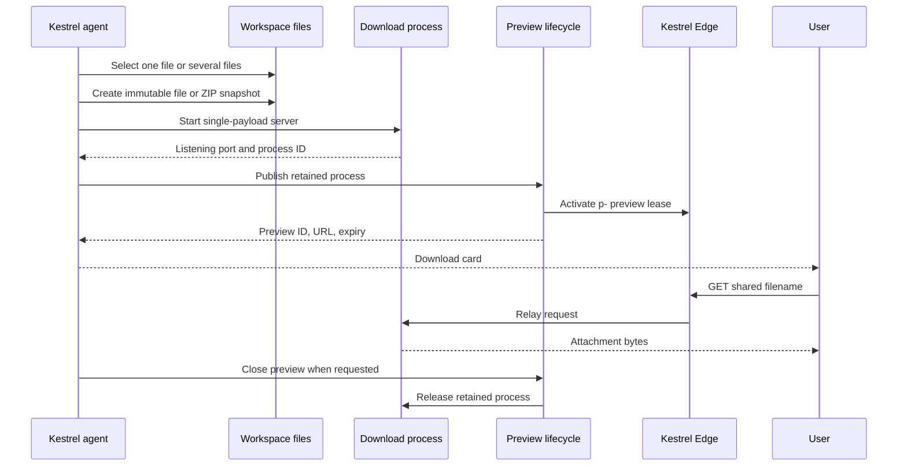

# Workspace File Sharing Change Design

## Executive Summary

Kestrel One should add one model-visible `workspace.files.share` tool. The tool packages selected Workspace files, starts a Kestrel-owned download process, and publishes that process through the existing Kestrel Edge preview lifecycle.

This is a productized version of behavior that already worked in the observed Kestrel One thread. The agent started a server on port 8000, called `workspace.preview.publish`, returned a working `p-...` link to `test.xlsx`, and later revoked it with `workspace.preview.close`.

The earlier object-storage design was too large for the stated need. It invented a requirement for the link to survive Workspace shutdown. The requested experience is a temporary transfer through preview links. It does not justify a new storage upload protocol, database lease type, Edge route type, reconciliation job, or four-tool lifecycle.

## Requested Outcome

A user can ask the agent to share one file or a ZIP of selected files created in the Workspace. The conversation shows a Download card whose link downloads the exact staged bytes.

The first version must preserve these rules:

- `file` mode shares exactly one regular file.
- `zip` mode packages one to 20 selected regular files into one archive.
- The tool serves one immutable staged payload. It never serves a Workspace directory.
- The source files can change after publication without changing the shared bytes.
- The public URL uses the existing `p-...` Kestrel Edge preview contract.
- The URL remains usable after the agent turn finishes while the preview lease is active.
- The URL remains active until the preview expires or is closed.
- The active preview keeps its backing Workspace process available under the existing retention rules.
- Existing preview list, renew, and close tools own lifecycle management.
- The tool accepts all regular file types. It does not use extension or filename heuristics.

## Evidence and Current Behavior

The [observed Kestrel One thread](https://kestrelagents.dev/threads/9739676a-2f3a-4304-8352-16234164daa5) proves the end-to-end seam:

1. The agent created and validated `test.xlsx`.
2. The user asked the agent to serve the file and share a preview link.
3. The agent started a server, published port 8000, inspected the preview, and returned `https://p-...preview.kestrelagents.dev/test.xlsx`.
4. The user downloaded the file successfully.
5. The agent listed and closed the preview when asked.

The current runtime already owns the hard parts. `workspace.preview.publish` requires a listening port and exact process session, retains the process, and returns the public URL ([preview tool](../../tools/kestrelOne/workspacePreviews.ts)). Kestrel One verifies that the port is listening, creates a 60-minute lease by default, and caps the lease at four hours ([preview lifecycle](../../apps/web/lib/apps/preview-lifecycle.ts)). An active preview prevents Workspace idle shutdown ([idle-stop contract](../../apps/web/lib/environments/store.ts)).

The agent can already create and read Workspace files. The shared filesystem policy provides the Workspace root, and the existing resolver enforces allowed roots ([filesystem contract](../../tools/contracts.ts), [filesystem resolver](../../tools/filesystem/shared.ts)). The dev-shell service can start and retain a managed process ([dev-shell contract](../../src/devshell/contracts.ts)).

Conversation presentations already carry an artifact ID, title, kind, URL, media type, and metadata ([conversation contract](../../packages/conversation/src/contracts.ts)). The web renderer needs a specific Download treatment because it labels every linked result as `Artifact` today ([web message renderer](../../apps/web/components/chatbot/message.tsx)).

The current problem is therefore not missing delivery infrastructure. It is that the model must assemble packaging, a server command, preview publication, URL construction, and cleanup correctly each time. The owning repair is a narrow composite tool that makes the proven workflow deterministic.

## Options

### Keep the current model-directed workflow

The thread proves that the agent can run a server and publish it with existing tools. This requires no product work.

It also leaves server choice, routes, download headers, directory exposure, ZIP behavior, and cleanup to each model run. It is a useful fallback and diagnostic path, but it is not a reliable product contract.

### Add object-storage-backed file shares

The earlier design proposed immutable object storage, `file_share_leases`, `f-...` Edge routes, upload plans, multipart uploads, storage cleanup, and separate share lifecycle tools.

That design is appropriate only if downloads must survive Workspace shutdown, remain available without compute, or live beyond preview limits. None of those requirements appears in the request or observed thread. Rejected for this initiative.

### Add a composite preview-backed share tool

The tool stages one immutable payload, starts a single-purpose download process, and invokes the existing preview publication helper. It returns a Download card and the existing preview ID.

This removes model variation while preserving the current Edge, lease, policy, process-retention, expiry, renewal, and revocation contracts. Chosen.

## Proposed Delta

### Tool contract

Add one Build-mode tool:

```json
{
  "name": "workspace.files.share",
  "input": {
    "mode": "zip",
    "paths": ["reports/summary.pdf", "reports/data.csv"],
    "downloadName": "analysis-package.zip",
    "ttlMinutes": 60
  }
}
```

Input rules:

- `mode` is required and is `file` or `zip`. The tool never infers the mode.
- `file` requires exactly one path.
- `zip` accepts one to 20 paths.
- Every path is relative to the Workspace root and resolves to an existing regular file.
- Absolute paths, paths outside the Workspace, directories, symbolic links, sockets, devices, duplicates, and duplicate ZIP entry names fail closed.
- ZIP entries preserve normalized Workspace-relative paths.
- `downloadName` defaults to the source basename in `file` mode and `kestrel-files.zip` in `zip` mode.
- The final staged payload can be at most 500 MiB.
- The default lifetime is 60 minutes. The existing four-hour preview maximum applies.

The successful result contains:

```json
{
  "share": {
    "previewId": "preview-uuid",
    "url": "https://p-<id>.preview.kestrelagents.dev/analysis-package.zip",
    "downloadName": "analysis-package.zip",
    "mediaType": "application/zip",
    "sizeBytes": 153240,
    "fileCount": 2,
    "expiresAt": "2026-08-23T20:00:00.000Z"
  },
  "warning": "Anyone with this link can download the file until the preview closes or expires."
}
```

The tool uses the same effective App policy as preview publication. It does not create a new approval policy. If publication requires approval, the approval shows the selected paths, mode, output name, and lifetime.

### Immutable staging

The handler resolves each input against `context.fileSystem.workspaceRoot` and applies a stricter Workspace-only rule. It opens each selected file read-only, validates the open descriptor as a regular file, and streams the staged payload.

The handler creates a generated temporary directory under an allowed runtime temp root. It copies one file in `file` mode or writes one ZIP in `zip` mode. It computes the final size while writing and stops before exceeding 500 MiB. No user-controlled text appears in the temporary directory name.

The staging copy is the publication boundary. Later source edits cannot alter the served bytes.

### Single-purpose download process

The tool starts a Kestrel-owned Node download server through the existing dev-shell process service. The server:

- binds to loopback on an available non-reserved port;
- serves only the staged payload at the encoded download filename;
- supports `GET`, `HEAD`, and byte ranges;
- sends `Content-Disposition: attachment`, `Content-Length`, `Accept-Ranges`, and `X-Content-Type-Options: nosniff`;
- rejects directory listing, path traversal, mutation methods, and every other route;
- removes its staging directory when it stops normally.

The server reports its selected port before the handler publishes it. If the process exits before publication, the tool fails and removes the staging directory.

### Preview publication and lifecycle

Extract the retained-publication workflow now owned by `workspace.preview.publish` into a shared internal helper. Both tools must use the same helper for provisional process retention, port publication, retention promotion, abort handling, preview closure, and cleanup evidence.

`workspace.files.share` maps to the existing `built_in.previews.publish` capability. The tool does not add an App capability or a second policy record. Its handler calls the same publication route after it starts the controlled download process.

The share result returns the existing `previewId`. The agent uses:

- `workspace.preview.list` to inspect active shares and application previews;
- `workspace.preview.renew` to extend the link;
- `workspace.preview.close` to revoke the link and stop the download process.

The preview name identifies the payload, for example `Download: analysis-package.zip`. Closing or expiry releases the retained process. Process shutdown removes the staging bytes. A later share attempt also removes expired Kestrel file-share staging directories left by an abnormal process exit.

This design intentionally accepts the current preview operating model: the link depends on Workspace availability and active preview retention can keep compute running. Durable, compute-independent Project file delivery is a separate future product.

### Conversation presentation

The result normalizer emits one `ConversationArtifactPresentation` with `kind: "file-share"`. Its metadata contains `previewId`, `sizeBytes`, `fileCount`, and `expiresAt`.

Kestrel One web renders this kind as a Download card with the filename, size, expiry, and direct download action. The card repeats the anonymous bearer-link warning. The hosted artifact projection carries the same additive metadata for downstream clients. Other artifact kinds keep their current presentation. The separate Kestrel One Mobile client is outside this change.

The exact URL follows the existing Preview App persistence contract. It remains in the authenticated conversation, generic tool-result envelope, and artifact presentation so replay and later rendering can reproduce the Download card. File-share-specific operational logs and audit summaries must use the preview ID and stable metadata instead of copying the bearer URL. A future separation of conversation presentation from generic tool-result audit persistence is a cross-cutting security change, not part of this composite tool.

### Failure contract

The tool returns stable failures:

- `WORKSPACE_FILE_SHARE_PATH_INVALID` for an invalid or unsupported source.
- `WORKSPACE_FILE_SHARE_LIMIT_EXCEEDED` for too many files or a payload above 500 MiB.
- `WORKSPACE_FILE_SHARE_ARCHIVE_FAILED` when ZIP creation fails.
- `WORKSPACE_FILE_SHARE_SERVER_FAILED` when the download process does not become ready.
- Existing preview publication failures when Edge publication or process retention fails.
- `WORKSPACE_FILE_SHARE_CLEANUP_PENDING` when publication is closed but temporary cleanup needs a later retry.

A URL is returned only after the local server is listening and the existing preview lifecycle reports an active lease.



## Transition and Verification

The change is additive. Existing application previews and `p-...` links keep their current behavior. There is no data migration, new App capability, or new public route type.

Delivery must verify:

- one-file sharing for a binary file;
- multi-file ZIP sharing with preserved entry names;
- source mutation after publication does not alter the download;
- no directory listing or unselected file is reachable;
- `GET`, `HEAD`, and range requests;
- process-start, packaging, publication, cancellation, and cleanup failures;
- preview list, renew, close, and expiry behavior;
- Kestrel One web Download-card presentation and hosted artifact projection;
- existing preview canaries and process-retention tests remain green.

## Decisions

- Productize the proven preview-backed workflow. Confidence: high.
- Add one composite share tool, not four new share lifecycle tools. Confidence: high.
- Reuse `built_in.previews`, `workspace_preview_leases`, `p-...` Edge routing, and preview close/renew/list. Confidence: high.
- Serve an immutable temporary snapshot through a Kestrel-owned single-purpose process. Confidence: high.
- Do not add managed object storage, upload plans, `file_share_leases`, `f-...` routes, or a cleanup service in this initiative. Confidence: high.
- Support regular files only, with explicit `file` and `zip` modes. Confidence: high.
- Start with 20 paths and a 500 MiB staged payload. Confidence: medium.
- Reuse the 60-minute default and four-hour preview maximum. Confidence: high.
- Map the tool to the existing preview publication capability and policy instead of creating a separate approval model. Confidence: high.

## Future Reopen Condition

Reopen the object-storage design only if Kestrel One requires links that survive Workspace shutdown, avoid retained-compute cost, exceed preview lifetimes, or become durable Project assets. Those are different product requirements, not hidden requirements of temporary file sharing.
