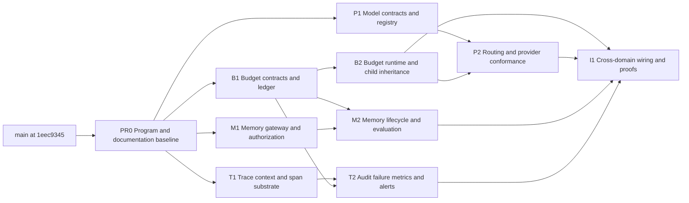

# Kestrel Four-Domain Parallel Integrity Program

## Outcome

Run four coordinated Kestrel improvement streams in parallel:

1. hierarchical budget integrity;
2. provider and model abstraction;
3. memory governance;
4. telemetry and audit integrity.

The program starts from `main` at
`1eec934576e7be9cadbe442aaa91ada39fed4a61`. At that commit the four audited
domains mechanically total **20 / 32**:

| Domain | Current | Full-control ceiling | Possible movement |
|---|---:|---:|---:|
| Memory, 041–048 | 5.5 / 8 | 8 / 8 | +2.5 |
| Budgets, 065–072 | 4 / 8 | 8 / 8 | +4 |
| Telemetry, 089–096 | 5 / 8 | 8 / 8 | +3 |
| Provider abstraction, 097–104 | 5.5 / 8 | 8 / 8 | +2.5 |
| **Program** | **20 / 32** | **32 / 32** | **+12** |

The +12 is a planning ceiling, not booked audit movement. The program does not
change the overall score until implementation and control-specific proofs have
been reinspected.

## Source evidence

- [Architecture](../../ARCHITECTURE.md)
- [Reliability](../../RELIABILITY.md)
- [Security](../../SECURITY.md)

## Delivery shape

The program uses ten PRs: one documentation/governance prerequisite, four
independent foundation PRs, four lane-completion PRs, and one cross-domain
integration/proof PR.



Development can proceed concurrently in separate worktrees. The arrows define
the required merge bases, not a requirement that engineers stop working while
another lane is under review.

## Program rules

- Every PR begins from its declared merged dependencies. Do not stack a review
  branch on an unmerged sibling PR.
- Foundation PRs must preserve runtime behavior. They add strict contracts,
  adapters, repositories, and characterization tests without activating new
  selection or enforcement.
- Each domain keeps one semantic owner. Domain code emits typed evidence; it
  does not import OpenTelemetry or write ad hoc audit metadata.
- Budget, provider, and memory code must not import telemetry. The integration
  layer maps their typed events to spans, audit records, and metrics.
- Provider routing remains exact and ordered. No keyword rule, inferred score,
  dynamic ranking, or hidden fallback is allowed.
- Numeric quality, latency, budget, or alert thresholds are authored policy
  values. Missing values do not cause Kestrel to invent defaults.
- Existing behavior remains the migration default. No tenant cost limit,
  fallback route, memory retention rule, or alert threshold is silently added.
- No Desktop or Web settings UI is part of this program. Authoring is through
  strict profile/configuration contracts and trusted Local Core or hosted APIs.
- New migrations are numbered only after the branch is rebased on the latest
  merged `main`. Parallel lanes do not reserve migration numbers in advance.
- Shared runtime files have a merge owner. Other lanes expose ports and tests,
  then rebase before adding their narrow integration adapter.
- Score, critical-gate status, validation status, and mutation status remain
  separate claims.

## Cross-stream handoff contracts

These are the only intentional dependencies between lanes.

| Producer | Contract handed off | Consumer | Rule |
|---|---|---|---|
| Budget | `BudgetReservationPortV1` | Provider, runtime, delegation | Expensive work receives an authorization or a typed denial before dispatch. |
| Budget | `BudgetUsageV1` | Memory, model, sandbox, evaluation | Producers measure their own resource use; the ledger owns attribution and reconciliation. |
| Provider | `ModelRouteDecisionV1` | Runtime, telemetry integration | Ordered eligibility dispositions are persisted before the selected route is invoked. |
| Memory | `MemoryLifecycleEventV1` and `MemoryEvaluationResultV1` | Budget and telemetry integration | Memory reports usage and lifecycle evidence without directly controlling runtime routing. |
| Telemetry | `TraceContextV1`, `AuditEventV1`, `RuntimeMetricV1` | Integration layer | Domain evidence is projected through registered mappings; arbitrary payload inspection is forbidden. |

### Dependency direction

```text
provider ─┐
memory ───┼──> budget contracts
runtime ──┘

budget events ─┐
provider events ├──> integration projectors ──> trace / audit / metrics
memory events ──┘
```

Telemetry never becomes a control-flow dependency. Exporter or metric failure
cannot authorize, deny, retry, reroute, or change a durable domain decision.
Required audit persistence is a separate fail-closed evidence boundary.

## PR0 — Program and documentation baseline

Branch: `asher/four-domain-program-baseline`

- Add this finalized plan and register it in `docs/PLANS.md`.
- Add required frontmatter to the seven tracked documents currently breaking
  `check:docs`; do not change their substantive content.
- Preserve the untracked audit and research artifacts outside this PR.
- Establish a clean baseline with `pnpm run check:docs` and
  `CI=true pnpm validate`.

All four foundation branches start from merged PR0.

## File ownership and collision control

| Surface | Primary owner | Collision rule |
|---|---|---|
| `src/kestrel/contracts/budget.ts`, `src/budget/**`, economics ledger | B1/B2 | Other lanes consume exported types only. |
| `src/kestrel/contracts/model-io.ts`, model-route contracts, `models/**` | P1/P2 | Budget integration enters through the reservation port. |
| `src/kestrel/contracts/memory.ts`, hosted knowledge implementation | M1/M2 | Do not broaden this into a unified thread/artifact store. |
| `src/kestrel/contracts/telemetry.ts`, `packages/observability/**` | T1/T2 | Domain-specific projection functions wait for I1. |
| `Guardrails`, `RunLifecycleController`, `DelegationSupervisor` | B2 | Provider and telemetry lanes rebase after B2 before touching shared runtime. |
| Primary model selection in `RuntimeIO` and profile resolution | P2 | P2 rebases after B2 and owns the narrow route adapter. |
| Knowledge schema and lifecycle migrations | M2 | M2 owns knowledge tables only. |
| Audit store and failure envelope | T2 | T2 owns audit tables and failure parsing; emitters are completed in I1. |
| `ExecutionEngine`, cross-domain `RuntimeIO` instrumentation, replay projectors | I1 | No lane adds unrelated behavior here after its completion PR. |
| `src/kestrel/index.ts` and root exports | PR being merged | Append only the lane's public surface and rebase before merge. |

## Foundation wave — four PRs in parallel

### B1 — Canonical budgets and durable allocation ledger

Suggested branch: `asher/budget-integrity-contracts`

#### Contracts

Add strict, canonical, versioned contracts under
`src/kestrel/contracts/budget.ts`:

- `BudgetPolicyV1`
- `BudgetScopeV1`
- `BudgetAllocationV1`
- `BudgetReservationV1`
- `BudgetUsageV1`
- `BudgetLedgerEntryV1`
- `BudgetSnapshotV2`
- `BudgetReservationPortV1`

Supported scope lineage is exact:

```text
tenant -> run -> agent -> subagent -> model | tool | sandbox | evaluator | embedding
```

Supported resource units are explicit and integer-based:

- wall-clock milliseconds;
- steps and model/tool/evaluator calls;
- input, output, cached-input, cache-write, reasoning, and embedding tokens;
- model and tool cost in micro-USD;
- sandbox CPU milliseconds, memory-MB milliseconds, storage byte-milliseconds,
  and concurrency slots.

Do not store floating-point currency. Unknown prices remain typed unknowns; they
cannot satisfy a configured cost ceiling.

#### Durable ownership

- Add one `BudgetCoordinator` with `openAllocation`, `reserve`, `commit`,
  `release`, `snapshot`, and `closeAllocation` operations.
- Every operation uses an idempotency key, policy revision, allocation revision,
  and exact parent identity.
- Child allocations reserve from their parent; they do not copy an independent
  maximum.
- Commit reconciles estimated and actual usage against the same reservation.
- Cancellation releases only unconsumed reservation. Duplicate commit/release
  is idempotent and cannot create credit.
- Implement in-memory and PostgreSQL repositories behind the same interface.
- Add the next available root migration only after rebasing on merged `main`.
- Add the `Budget Allocation` term to `CONTEXT.md`.

#### Compatibility

- `BudgetSnapshot` remains a compatibility projection until B2.
- Existing `Guardrails` and economics behavior is unchanged.
- No profile migration or runtime enforcement is activated in B1.

#### Acceptance

- Strict parsing, unknown-field rejection, canonical digest, and integer-bound
  tests.
- Parent/child narrowing and sibling contention tests.
- Atomic concurrent reserve, duplicate settlement, cancellation release, and
  restart tests in memory and PostgreSQL.
- Focused budget/store tests, root typecheck, `pnpm validate`, and
  `pnpm run validate:postgres`.

### P1 — Versioned model contracts, capabilities, and provider registry

Suggested branch: `asher/provider-model-contracts`

#### Contracts

- Add a required versioned model request/response boundary. Existing internal
  callers migrate through a temporary explicit V0-to-V1 adapter; unknown
  versions fail closed.
- Add `ModelCapabilityDescriptorV1` covering:
  - native tool calling and parallel tool calls;
  - structured output modes;
  - streaming;
  - reasoning modes;
  - text and image input modalities;
  - context and maximum output tokens;
  - cache read/write behavior.
- Add `ProviderRuntimeConfigurationV1` for exact authentication reference,
  endpoint/protocol, timeout, allowed headers, region, and data-handling mode.
- Add `ModelRegistrationV1` binding provider, model, capability descriptor,
  provider configuration, price/calibration/latency references, revision, and
  fingerprint.

#### Registry

- Replace factory-only exports with one exact provider adapter registry.
- Every shipped provider identity—OpenRouter, OpenAI, Anthropic, Ollama,
  LM Studio, Lumi, and RunPod—registers its exact ID, supported protocol,
  factory, capability declaration, and conformance fixture. Shared
  OpenAI-compatible implementation does not collapse their identities or
  controls.
- Registration is static and trusted. No dynamic provider/model discovery is
  introduced into runtime selection.

#### Compatibility

- Existing provider/model selection and recovery order remain unchanged.
- P1 does not consume the budget coordinator and does not edit primary routing.
- Existing OpenAI-compatible Ollama/LM Studio mapping remains explicit rather
  than being inferred from URLs.
- Add the `Model Registration` term to `CONTEXT.md`.

#### Acceptance

- Strict version, canonicalization, stale registration, and capability parser
  tests.
- Every current provider factory is present exactly once in the registry.
- Existing mapper, error, reasoning, streaming, retry, and cancellation tests
  pass unchanged.
- Focused model/provider tests, root typecheck, and `pnpm validate`.

### M1 — Memory lifecycle contracts, gateway, and read authorization

Suggested branch: `asher/memory-governance-contracts`

#### Contracts

Add strict contracts under `src/kestrel/contracts/memory.ts`:

- `MemoryTierPolicyV1`
- `MemoryLifecyclePolicyV1`
- `MemoryReadBindingV1`
- `MemoryQueryV1`
- `MemoryRecordProvenanceV1`
- `MemoryQueryResultV1`
- `MemoryBackendV1`
- `MemoryLifecycleEventV1`

Each tier policy names its writer, reader, source of truth, retention mode, and
policy revision. The four existing namespaces remain distinct: thread history,
working memory, durable semantic memory, and artifacts.

#### Authorization

- A trusted runtime/hosted owner mints `MemoryReadBindingV1` before retrieval.
- The binding contains tenant, user, agent, task, policy revision, exact
  permitted document/scope set, request time, and optional expiry.
- The model supplies only the bounded query. It cannot supply or widen the read
  binding.
- The gateway validates the binding before invoking a backend.

#### Adapter

- Put hosted Drizzle/pgvector retrieval behind `MemoryBackendV1`.
- Preserve current vector/lexical behavior and organization/project filtering.
- Add an in-memory conformance adapter for hermetic tests.
- Do not unify thread state, artifacts, and hosted semantic knowledge into one
  storage implementation.
- Add the `Memory Read Binding` term to `CONTEXT.md`.

#### Provenance

- Require source, creator, timestamp, scope, confidence kind, and supersession
  reference on the canonical record.
- Confidence is typed provenance, not a runtime ranking score. Uploaded source
  material uses an asserted-source disposition; evaluated confidence requires
  an exact evaluator/calibration reference.

#### Acceptance

- Missing, stale, expired, tenant-mismatched, user-mismatched,
  agent-mismatched, task-mismatched, and scope-widened bindings fail before the
  backend is called.
- Hosted and in-memory adapters pass the same query/result conformance suite.
- Existing retrieval results and controlled-write behavior remain characterized.
- Focused knowledge tests, Web typecheck, root typecheck, and `pnpm validate`.

### T1 — Trace context, span substrate, and safe correlation

Suggested branch: `asher/telemetry-correlation-contracts`

#### Contracts

Add strict contracts under `src/kestrel/contracts/telemetry.ts`:

- `TraceContextV1`
- `TraceCorrelationV1`
- `RuntimeSpanV1`
- `RuntimeSpanEventV1`
- `RuntimeSpanSinkV1`

`TraceContextV1` uses validated W3C-compatible trace/span identities and trace
flags. Untrusted baggage is not propagated. `TraceCorrelationV1` has typed
optional references for event sequence, checkpoint, workspace snapshot,
replay, fork, delegation, interaction, and approval.

#### Observability package

- Extend `@kestrel-agents/observability` from one operation span to a generic
  nested-span API.
- Preserve SDK `run`, `stream`, `resume`, and `subscribe` wrapping.
- Add explicit parent/child/link semantics. Resume continues a trace only with
  persisted valid context; replay/fork creates a linked trace rather than
  pretending to be the original execution.
- Define required attributes by span kind, including model/provider, latency,
  usage, tool identity, retry, result, and termination reason.
- Keep prompt/response/tool payload capture off by default.

#### Compatibility

- Runtime event observation continues to work when no span sink is configured.
- Export failure remains non-authoritative and cannot change run behavior.
- T1 does not instrument domain internals yet; I1 owns the final mappings.

#### Acceptance

- Parent/child/link, invalid context, resume, replay/fork, and required-attribute
  tests.
- OpenTelemetry export retains correct IDs, parents, links, status, and safe
  attributes.
- Observability build/test/release check, root typecheck, and `pnpm validate`.

## Completion wave — domain runtime and proofs

### B2 — Runtime enforcement and child-budget inheritance

Suggested branch: `asher/budget-integrity-runtime`

Merge base: B1 plus all merged foundation PRs.

#### Runtime wiring

- `RunLifecycleController` opens and closes the run allocation.
- `Guardrails` becomes a compatibility facade over the coordinator snapshot,
  not an independent source of truth.
- `RuntimeIO` reserves before model dispatch and tool preparation, then commits
  actual usage or releases unused reservation.
- Sandbox creation reserves resource/concurrency units before container start.
- Evaluation reserves finalization/evaluator capacity before evaluation begins.
- Recovery consumes the authoritative snapshot and cannot bypass a hard denial.
- `DelegationSupervisor` atomically allocates child budget before spawning.
- Every child model/tool/sandbox/evaluator debit also debits the parent lineage.

#### Policy integration

- Add the budget policy through the currently active profile migration seam.
  Assign the next profile version only after rebasing and preserve every
  existing field and managed-environment binding exactly.
- Custom profiles resolve current limits into a run-scoped policy with no
  inferred tenant or cost ceiling.
- Managed profiles may author tenant/run/child ceilings through trusted APIs.
- Managed profiles warn at 80% of each finite allocation. At 90%, they block
  new delegation and remove only policy-named optional tools. Existing closeout
  reserves remain in force.
- Soft thresholds allow only authored deterministic actions:
  `emit_warning`, `disable_new_delegations`, `remove_named_optional_tools`, and
  `reserve_closeout`.
- An absent threshold produces no new behavior.

#### Failure behavior

- A hard ceiling returns a typed budget failure and cannot trigger automatic
  model/tool fallback.
- Unknown price fails closed only when a cost ceiling requires price evidence.
- Cancellation, restart, duplicate settlement, and partial streaming reconcile
  without granting new budget.

#### Acceptance

- Controls 065–072 receive direct unit/integration evidence.
- Concurrent sibling, restart, cancellation, streaming abort, retry, partial
  failure, price revision, and shared-allocation tests pass.
- Focused tests, `CI=true pnpm validate`, `pnpm run validate:postgres`,
  `pnpm run validate:process`, and focused budget mutations pass.

### P2 — Exact routing policy and provider conformance

Suggested branch: `asher/provider-routing-conformance`

Merge base: P1 and merged B2.

#### Route policy

Add strict `ModelRoutePolicyV1` and `ModelRouteDecisionV1` contracts.

- Policies name exact ordered registration IDs.
- Eligibility checks exact capabilities, policy permission, budget
  authorization, credential validity, availability evidence, residency,
  data-handling mode, and authored price/calibration/latency constraints.
- Selection is the first eligible candidate in authored order.
- Every candidate receives a persisted selected/rejected/skipped disposition
  with a stable reason code.
- Missing, stale, unregistered, or incompatible candidates fail closed.
- No dynamic ranking, weighted score, or inferred fallback is introduced.

Numeric quality or latency bounds, if used, must be present in the authored
policy and reference a revisioned calibration/latency record. There is no
system default.

#### Runtime ownership

- The route resolver is the sole owner of primary model selection.
- Recovery continues to own post-failure route changes through its existing
  ordered policy.
- `RuntimeIO` invokes only the resolved registration and records the decision
  before provider dispatch.
- Visible output still prohibits route switching.

#### Conformance harness

Every registered adapter runs the same cases:

- text and supported multimodal requests;
- tool calling, parallel tool calls, and tool history;
- structured-output success and rejection;
- streaming text/reasoning and abort;
- usage/cache/reasoning normalization;
- rate limit, timeout, provider error, malformed response, and retry;
- unsupported capability typed failure;
- region/data-handling configuration propagation where supported.

#### Acceptance

- Controls 097–104 receive direct evidence without regressing 099, 101, or 104.
- Candidate order, stale registration, capability, residency, budget,
  credential, and visible-output tests pass.
- Focused provider tests, `CI=true pnpm validate`, `pnpm run validate:process`,
  and focused provider mutations pass.

### M2 — Durable lifecycle, correction, and retrieval evaluation

Suggested branch: `asher/memory-lifecycle-evaluation`

Merge base: M1 and B1.

#### Hosted lifecycle

- Add tombstone/expiry/supersession/confidence fields through the next available
  hosted migration number after rebase.
- Add durable lifecycle operations with exact target acknowledgements for
  object storage, database records, vector/lexical indexes, and caches.
- Deletion first makes the record non-retrievable, then persists propagation
  work and returns a durable operation ID, then completes only after every
  required target acknowledges.
- Crash/retry is idempotent. Object deletion failure is no longer silently
  treated as complete.
- TTL uses the same lifecycle path.
- Legal hold blocks ordinary deletion and expiry. A trusted legal override is
  separately authorized with trusted authority, tenant binding, and an audited
  reason.
- Correction creates a new record that supersedes the old record; retrieval
  excludes superseded records unless an exact historical query is authorized.

#### Evaluation harness

Add a hermetic frozen corpus and expected-result contract measuring:

- relevance;
- contamination;
- stale/superseded-memory use;
- cross-tenant leakage with a required zero-leak result;
- downstream task impact against a no-memory baseline.

Evaluation output does not control runtime retrieval or routing. It produces
evidence for releases and policy authoring only.

#### Usage handoff

- Embedding and evaluation paths emit exact `BudgetUsageV1` records.
- Hosted capability output carries the usage identity needed for runtime
  reconciliation; it does not obtain authority from telemetry.

#### Acceptance

- Controls 041–048 receive direct evidence without weakening controlled writes.
- Deletion interruption points, retry, legal hold, expiry, correction,
  supersession, index/cache propagation, and tenant isolation tests pass.
- Frozen evaluation results are deterministic and Docker-independent.
- Focused knowledge/evaluation tests, Web typecheck, `CI=true pnpm validate`,
  `pnpm run validate:postgres`, and focused memory mutations pass.

### T2 — Immutable audit, failure envelope, metrics, and alerts

Suggested branch: `asher/telemetry-audit-operations`

Merge base: T1 and B1.

#### Audit contract and storage

Add strict `AuditEventV1` with:

- event/category/action identity and schema version;
- tenant, actor, session/thread/run/call and decision references when present;
- policy/authority revisions;
- outcome, reason code, payload digest, and timestamp;
- secret-free typed detail.

Add append-only runtime and hosted audit repositories. No application API can
update an audit event, and the database rejects ordinary update operations.
Audit records are retained indefinitely by default, and no application deletion
API is provided. Required audit persistence occurs before the
budget, credential, policy, approval, routing, memory-lifecycle, or
external-effect authority is acted upon.

Use the next available root and hosted migration numbers only after rebasing.
Existing run events and admin logs remain operational projections; they do not
replace the canonical audit envelope.

#### Failure envelope

Add strict `RuntimeFailureV1` requiring:

- stable code;
- responsible layer;
- retryability;
- user-safe summary;
- causal failure references;
- secret-free diagnostic details.

Keep a compatibility constructor for current callers, but persistence and
boundary serialization require the strict envelope. A missing layer or unsafe
summary fails validation rather than becoming arbitrary details.

#### Metrics and alerts

- Add vendor-neutral counter, histogram, gauge, and event projections from
  durable evidence.
- Cover success, verified outcome, cost, latency, queue depth/wait, retries,
  denials, and sandbox failures.
- Alert rules are versioned, authored operational policy. They observe but do
  not alter runtime control flow.
- Managed alert policy immediately reports audit-integrity failure,
  sandbox-integrity failure, budget denial, verified-outcome failure, and
  recovery exhaustion. Latency and queue alerts use authored SLOs.
- Add deterministic alert fixtures; no external monitoring service is required
  by the hermetic gate.
- Add the `Required Audit Event` term to `CONTEXT.md`.
- Add an ADR documenting why audit persistence is authoritative while trace and
  metric export are not.

#### Acceptance

- Audit append-only, update-rejection, tenant binding, persistence-before-action,
  retention, and exporter-independence tests pass.
- Failure wrapping/redaction/replay and every-layer conformance pass.
- Metric completeness and alert fixture tests pass.
- Observability tests, `CI=true pnpm validate`,
  `pnpm run validate:postgres`, and focused telemetry mutations pass.

## I1 — Cross-domain wiring, interruption, and audit movement

Suggested branch: `asher/four-domain-integrity-proofs`

Merge base: merged B2, P2, M2, and T2.

I1 adds no new policy or feature. It connects the completed ports and proves
that the combined system preserves each domain's authority.

### Wiring

- Propagate `TraceContextV1` through ingress, run lifecycle, checkpoints, model
  routes/calls, tools, sandboxes, delegation, approvals, memory retrieval,
  evaluation, waiting/resume, and terminal settlement.
- Register explicit domain-event-to-span/audit/metric projectors.
- Persist audit evidence before budget authorization, route dispatch, memory
  lifecycle action, credential use, approval consumption, and external effect.
- Link replay/fork evidence to original event sequence, checkpoint, workspace
  snapshot, route decision, budget allocation, and memory decision without
  re-executing consumed actions.
- Ensure telemetry/export failure cannot create budget, route, memory, or
  approval authority.

### Interruption matrix

Inject restart or failure at:

- budget reservation persisted, dispatch not started;
- dispatch started, usage not committed;
- child allocation created, child not spawned;
- model route decision persisted, provider not called;
- provider streaming after first visible output;
- memory tombstone persisted, one propagation target incomplete;
- audit event persisted, action not started;
- action completed, audit/metric projection pending;
- operator wait created and resumed;
- terminal settlement before exporter flush.

After restart, Kestrel must resume the same authorized operation, remain
waiting, reconcile exact usage, or fail closed. It must not mint new budget,
change route order, return deleted/superseded memory, repeat a consumed effect,
or lose required audit evidence.

### New mutation proofs

The registry contains **70** mutations at the frozen commit. Add at least these
16 exact mutations, bringing the expected minimum to **86/86 killed** unless
merged `main` adds more first:

Budget:

1. expensive dispatch before reservation;
2. hard cost ceiling bypass;
3. child debit omitted from parent;
4. duplicate settlement creates credit.

Provider:

5. model contract version bypass;
6. required capability bypass;
7. stale registration acceptance;
8. registered adapter omitted from conformance.

Memory:

9. read-binding validation bypass;
10. cross-tenant binding acceptance;
11. superseded record returned by normal retrieval;
12. deletion completes before every target acknowledgement.

Telemetry:

13. child span parent propagation removed;
14. required audit persistence omitted;
15. responsible failure layer omitted;
16. replay/checkpoint correlation dropped.

The final expected count is always “current merged baseline + 16,” not a stale
hard-coded historical count.

### Audit artifact

Publish a dated control-delta report covering controls 041–048, 065–072, and
089–104. For every moved control it must cite:

- production contract and runtime owner;
- focused test and failure/mutation proof;
- applicable PostgreSQL/process evidence;
- any remaining exclusion.

Do not claim the +12 program ceiling or a new 200-point score unless the
control reinspection supports it. A full overall score requires completing the
remaining 121–200 audit separately.

### Final gates

- All lane-focused unit, integration, conformance, evaluation, interruption,
  and mutation tests.
- `CI=true pnpm validate`
- `pnpm run validate:postgres`
- `pnpm run validate:process`
- `pnpm run validate:audit`, requiring current baseline plus all new mutations
- Desktop resource preparation/check if mirrored runtime sources change
- clean tracked state after every gate

## Merge and worktree protocol

### Foundation wave

1. Create B1, P1, M1, and T1 worktrees from merged PR0.
2. Each lane edits only its owned surface.
3. Rebase each branch on current `origin/main` immediately before review.
4. Merge the four PRs independently after their own gates pass.

### Completion wave

1. Start B2, M2, and T2 from the merged foundation main.
2. Provider work on P2 can proceed behind the B1 reservation port, but the PR
   rebases after B2 before final runtime integration and review.
3. M2 and T2 coordinate hosted migration numbering at final rebase; neither
   lane preallocates a number.
4. Merge B2 before P2. M2 and T2 may merge in either order after rebasing.

### Integration wave

1. Create I1 only after all four completion PRs merge.
2. I1 owns shared runtime instrumentation, cross-domain replay, and the final
   mutation/audit artifact.
3. No lane carries an unmerged follow-up into I1. Any discovered domain defect
   returns to its owner as a narrow prerequisite PR.

## Expected parallelism

At steady state the useful concurrent work is:

| Period | Budget lane | Provider lane | Memory lane | Telemetry lane |
|---|---|---|---|---|
| Foundation | B1 | P1 | M1 | T1 |
| Early completion | B2 | P2 resolver/harness development | M2 | T2 |
| Late completion | B2 review/fixes | P2 rebase and runtime adapter | M2 review/fixes | T2 review/fixes |
| Integration | I1 support | I1 support | I1 support | I1 primary instrumentation |

This preserves four active workstreams without allowing four independent
owners to rewrite the runtime coordinator at once.

## Explicit non-goals

- No unified memory service spanning thread state, artifacts, and semantic
  knowledge.
- No dynamic model ranking, automatic candidate discovery, or learned routing.
- No new evaluator control flow.
- No egress, filesystem TOCTOU, live-fork semantics, or approval redesign.
- No new UI for budget, provider, memory, telemetry, or alert policy authoring.
- No replacement of existing replay, recovery, approval, or effect-idempotency
  authorities.
- No score movement based on schemas, plans, or passing generic validation
  alone.

## Locked design decisions

1. **Budget compatibility:** existing limits remain the default; no cost or
   tenant ceiling is invented.
2. **Provider policy:** exact authored order plus Boolean eligibility; no
   dynamic ranking. Numeric quality/latency bounds have no default.
3. **Memory deletion:** tombstone first, then durable propagation; legal hold
   blocks ordinary deletion.
4. **Telemetry authority:** trace/metrics export is non-authoritative, while
   required audit persistence is fail-closed before action.
5. **Mutation baseline:** use the registry present on merged main, currently 70,
   and add the 16 program mutations.
6. **Managed thresholds:** warn at 80% of each finite allocation; at 90%, block
   new delegation and remove only policy-named optional tools while preserving
   closeout reserves.
7. **Audit retention:** retain audit records indefinitely by default with no
   application deletion API.
8. **Managed alerts:** immediately report audit-integrity failure,
   sandbox-integrity failure, budget denial, verified-outcome failure, and
   recovery exhaustion; use authored SLOs for latency and queue alerts.
