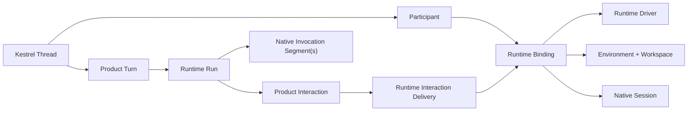
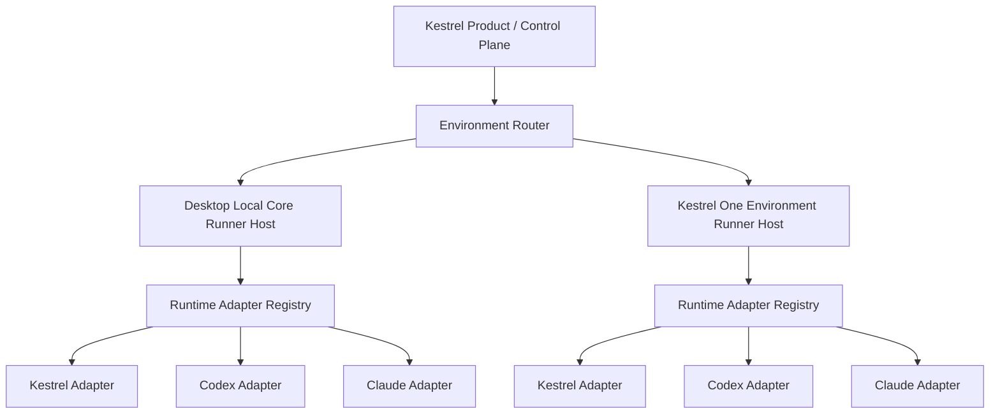

# How Should the Runtime Extraction Change After Grounding Codex and Claude?

## Answer

The ownership correction remains right: Codex and Claude should implement only
the agent Runtime boundary, while Kestrel continues to own execution
environments and product services.

The vendor API review changes the proposed boundary in four material ways:

1. The common object should be a **Runtime binding**, not merely a native
   session reference. A binding joins a Kestrel participant, a Runtime driver,
   an execution placement, a capability snapshot, authentication readiness,
   and zero or one materialized native session.
2. One Kestrel product turn may span multiple native invocation segments.
   Claude's deferred approval flow exits and later resumes a query, while a
   Codex approval normally continues the original app-server turn.
3. Interaction presentation and interaction delivery need separate records.
   Kestrel's existing `thread_interactions` table is a strong product ledger,
   but it should not own encrypted vendor request correlation or connection
   routing.
4. `startTurn(): Promise<terminal result>` is too narrow as the durable core.
   The adapter must emit lifecycle events independently of the initiating
   request and support explicit `suspended` and `resumed` run states.

The next design exercise should therefore be the normalized Runtime lifecycle
and identifier map, especially suspension and resumption. Finalizing the
TypeScript interface before that state machine would encode today's Kestrel
resume behavior as if it were universal.

Confidence is high in the current-code observations and ownership split. The
exact persistence shape and whether Codex can recover a pending approval after
app-server process replacement remain open.

## Findings

### Observed

#### The present host is still a single-Runtime Kestrel facade

`RunnerRuntime` has 62 members spanning execution, product read models,
workspaces, terminals, Git, validation, projects, Mission Control, and
reasoning administration. Its only required execution method is `runTurn`, and
its factory always creates `KestrelChatRuntime`
([interface](../../cli/runner/RunnerHost.ts#L185),
[factory](../../cli/runner/RunnerHost.ts#L500)).

The factory is selected in exactly the two places Hydra needs:

- Desktop Local Core creates a `KestrelChatRuntime` with a Core-owned store and
  environment resolver
  ([source](../../src/localCore/executionRuntime.ts#L30)).
- The hosted Runner creates a `KestrelChatRuntime` with the hosted store
  ([source](../../cli/runner/HostedRunnerStore.ts#L31)).

Kestrel One already resolves an execution environment before constructing the
Runner client, and records the environment and workspace used for that
execution
([source](../../apps/web/lib/agent/kestrel-runtime.ts#L370)). This is the right
placement boundary: the Codex app-server process or Claude Agent SDK query
belongs inside that environment-side Runner, not inside the web application.

#### Product, provider, and native Runtime identities are currently conflated

`TuiProfile` describes an agent profile, environment shell/preset/capability
packs, model provider, model, credentials, policies, and tools, but it has no
independent Runtime driver or Runtime binding identity
([source](../../cli/contracts.ts#L204)).

The product's existing "runtime identity" metadata actually identifies an
agent profile plus environment assembly. It does not identify Codex, Claude,
or a materialized native session
([source](../../src/profile/runtimeProfile.ts#L50)).

The hosted `threads` and `thread_turns` records likewise have no Runtime
binding. A turn records requested environment and model, while an environment
execution records a Runtime image and eventual Runtime run ID
([thread schema](../../apps/web/drizzle/schema.ts#L594),
[turn schema](../../apps/web/drizzle/schema.ts#L749)).

Consequently, choosing `modelProvider: "anthropic"` cannot mean "use the Claude
Runtime." Kestrel's own Runtime can call Anthropic models, and Runtime selection
must remain independent of provider/model selection.

#### The current run contract assumes a request-scoped terminal result

`RunnerHost` awaits `runtime.runTurn(...)` and emits `run.completed`,
`run.failed`, or `run.cancelled` from the returned result
([source](../../cli/runner/RunnerHost.ts#L882)). Runtime activity is delivered
through seven positional callbacks, while command/run/session correlation is
held in host maps.

Kestrel represents a user-facing wait in `RunTurnResult.output.waitFor`, then a
later invocation passes `resumeRequestId` back through `runTurn`
([source](../../src/runtime/RuntimeTurnCoordinator.ts#L245)). That works for
Kestrel's persisted engine, but it is not the universal native lifecycle:

- Codex normally keeps the native turn and its JSON-RPC approval request alive.
- Claude may keep a callback alive, or terminate a query at a deferred tool call
  and resume the transcript later.

The current public Runner event list contains run start, activity, cancellation,
completion, and failure events, but no explicit run suspension or resumption
event
([source](../../packages/protocol/src/execution.ts#L140)).

#### Kestrel already has most of the product-side durable interaction ledger

`thread_interactions` persists a user-visible request envelope, response
envelope, exact request ID, owning thread/turn, status, resolution actor, and
resume timestamp
([source](../../apps/web/drizzle/schema.ts#L4339)). Resolving an interaction is
transactional and idempotent: it locks the active turn, validates the request,
persists the user's answer, marks the request resolved, resumes the queue, and
emits `interaction.resolved`
([source](../../apps/web/lib/turns/store.ts#L1423)).

That table is explicitly documented as the presentation and response contract,
while a source-specific checkpoint remains execution authority. This ownership
rule is exactly what Hydra needs to preserve.

What it does not contain is the delivery route needed by a foreign Runtime:

- binding ID;
- normalized run and invocation-segment IDs;
- delivery strategy such as live JSON-RPC, live callback, or deferred resume;
- placement/connection ownership;
- encrypted opaque native correlation;
- delivery attempt and acknowledgement state.

The existing Runtime interaction envelope also only supports `user_input` and
`approval` with a prompt, schema, and optional tool call
([source](../../src/kestrel/contracts/execution.ts#L52)). It is a useful
presentation contract, not yet a complete adapter-delivery contract.

#### Sender identity is not ready for first-class Runtime participants

Top-level messages use the generic `assistant` role. Collaborator dialog
messages additionally constrain sender to `kestrel | collaborator | system`
([source](../../apps/web/drizzle/schema.ts#L690)). That cannot faithfully
represent a Codex or Claude participant without either lying about the sender
or embedding display logic in message text.

Participant identity therefore belongs in product contracts, independently of
the Runtime binding. A participant may change Runtime bindings over time, and
multiple participants may use the same Runtime kind.

### Inferred

#### Revised Domain Model



The identities should mean:

| Identity | Owner | Meaning |
|---|---|---|
| `threadId` | Kestrel Product | The durable conversation. |
| `participantId` | Kestrel Product | Who is speaking/acting, independent of implementation. |
| `bindingId` | Kestrel Runtime Control | A participant connected to one Runtime and one execution placement under a capability snapshot. |
| `turnId` | Kestrel Product | One user/operator intent and its durable lifecycle. |
| `runId` | Kestrel Runtime Control | One logical Runtime execution for the product turn. |
| `segmentId` | Runtime Adapter | One native process/query/connection execution segment within the run. |
| native IDs | Runtime Adapter | Opaque Runtime-specific session, turn/query, item/tool, and request correlation. |

The segment distinction is required, not decorative. A Claude deferred approval
can continue the same logical run in a new query segment. A Codex live approval
usually continues the same native turn and segment. Kestrel's existing blocked
run resume can be translated by the compatibility adapter without redefining
the product turn.

#### Revised Runtime Binding

The binding is the durable join point:

```ts
interface RuntimeBindingV1 {
  bindingId: string;
  participantId: string;
  runtimeId: "kestrel" | "codex" | "claude";

  environment: {
    environmentId: string;
    workspaceId: string;
    runtimeHomeKey: string;
  };

  adapter: {
    adapterVersion: string;
    nativeVersion: string;
    descriptorFingerprint: string;
  };

  nativeSession: {
    state: "prepared" | "materialized" | "unavailable";
    encryptedReference?: string;
    portability: "placement_affine" | "externally_mirrored";
  };

  capabilities: RuntimeCapabilitySnapshotV1;
  auth: { state: "ready" | "required" | "expired" | "unsupported" };
  state: "ready" | "degraded" | "disconnected" | "closed";
}
```

This is illustrative rather than a final persistence schema. In particular,
native references and credentials must not be exposed through UI or general
conversation contracts.

#### Revised Adapter Contract

The adapter should be binding-centric and event-driven:

```ts
interface RuntimeAdapterV1 {
  describe(input: DescribeRuntimeInput): Promise<RuntimeDescriptorV1>;

  prepareBinding(
    input: PrepareRuntimeBindingInput,
  ): Promise<RuntimeBindingMaterializationV1>;

  startRun(input: StartRuntimeRunInput): Promise<RuntimeRunReferenceV1>;

  respondToInteraction(
    input: DeliverRuntimeInteractionResponseInput,
  ): Promise<RuntimeInteractionDeliveryDispositionV1>;

  steerRun(input: SteerRuntimeRunInput): Promise<RuntimeCommandDispositionV1>;
  cancelRun(input: CancelRuntimeRunInput): Promise<RuntimeCommandDispositionV1>;
  reconcileBinding(
    input: ReconcileRuntimeBindingInput,
  ): Promise<RuntimeBindingReconciliationV1>;

  releaseBinding(input: ReleaseRuntimeBindingInput): Promise<void>;
  dispose(): Promise<void>;
}
```

All methods are present in the versioned interface. Capability negotiation
determines whether a command may be invoked and what disposition is possible;
optional TypeScript members should not become a second, contradictory
capability system.

`startRun` accepts the run and returns its identity. It does not own product
presentation and does not need to keep the initiating HTTP/Runner request open
for the entire logical run. The adapter emits authoritative normalized events
to a structured `RuntimeEventSink` supplied in its context.

At minimum, the lifecycle needs:

- `run.started`;
- activity/message/tool events;
- `interaction.requested`;
- `run.suspended` with the interaction and recovery posture;
- `run.resumed` with a new segment when applicable;
- `run.completed`, `run.failed`, or `run.cancelled`.

The Kestrel compatibility adapter can initially translate today's `waitFor`
terminal result into `interaction.requested` plus `run.suspended`, then translate
the later `resumeRequestId` invocation into `run.resumed`.

#### Split Interaction Presentation from Delivery

Hydra should retain `thread_interactions` as the product ledger and introduce a
separate Runtime-owned delivery record concept:

```ts
interface RuntimeInteractionDeliveryV1 {
  interactionId: string;
  bindingId: string;
  runId: string;
  segmentId: string;
  strategy:
    | "live_connection"
    | "live_callback"
    | "resume_deferred_session";
  durableWait: "native" | "connection_bound" | "unsupported";
  encryptedNativeCorrelation: string;
  state: "pending" | "delivering" | "delivered" | "failed" | "expired";
}
```

This preserves the existing source-specific-authority rule:

- the product ledger owns what the operator sees and the idempotent answer;
- the delivery record owns how that answer reaches the native Runtime;
- the adapter's subsequent native event acknowledges whether execution actually
  continued.

Merely marking the product interaction resolved must not be treated as proof
that the foreign Runtime received it.

#### Capability Negotiation

The binding snapshot should include more than booleans:

```ts
interface RuntimeCapabilityV1 {
  supported: boolean;
  fidelity: "native" | "translated" | "emulated";
  availability: "ready" | "auth_required" | "version_mismatch" | "unavailable";
  recovery?: {
    live: boolean;
    durable: "native" | "connection_bound" | "unsupported";
  };
  constraints: RuntimeCapabilityConstraintV1[];
}
```

The descriptor reports what the installed adapter/native version can do. The
binding snapshot reports what is actually available for this environment,
workspace, authentication state, and storage mode. Product policy then decides
what is allowed. Those are three different questions and should not be merged.

#### Desktop and Kestrel One Wiring

The same Runtime contract can serve both products while preserving placement:



For Desktop:

- the registry runs in Local Core;
- Runtime homes and native sessions are local-placement resources;
- Codex can use its app-server authentication surface;
- Claude product authentication still follows Anthropic's third-party rules;
- Desktop reconnects to Local Core using the binding ID, not a guessed CLI
  process.

For Kestrel One:

- the registry runs inside the selected environment Runner;
- the control plane persists the binding and normalized product events;
- the environment owns the native binary/SDK process and workspace access;
- Claude can use an application-backed `SessionStore` mirror;
- Codex remains placement-affine unless a tested portable-store strategy is
  added;
- a connection-bound wait requires the owning Runner process to remain alive
  and routable, and must not be advertised as restart-durable.

#### What We Should Preserve

- `RunnerHost` remains the environment-side command and event boundary during
  migration.
- Existing `run.start` consumers can be preserved through a Kestrel adapter and
  protocol compatibility projection.
- Existing product interaction presentation and idempotent response behavior
  remain intact.
- Existing environment routing, workspace authority, and execution records
  remain the placement authority.
- Kestrel-specific operator, task graph, project, Mission Control, workspace,
  and evidence services remain available outside the common adapter.

#### What We Should Not Preserve as the New Contract

- `TuiProfile.modelProvider` as a proxy for Runtime selection;
- `sessionId === threadId === nativeSessionId`;
- one native invocation per product turn;
- a terminal Promise as the only run lifecycle;
- product interaction resolution as proof of native delivery;
- hard-coded `kestrel | collaborator | system` sender identity;
- optional interface members as capability negotiation;
- native correlation in UI-visible metadata.

## Contradictions and Unknowns

- Codex app-server documents live approval delivery but not recovery of the
  exact pending request after process replacement. Hydra should treat it as
  connection-bound until a process-kill contract test proves otherwise.
- Claude's durable defer flow has constraints, including the documented
  single-tool-call limitation. The capability snapshot must carry those
  constraints rather than presenting a generic durable-approval boolean.
- The current Kestrel product and orchestration stores have separate Thread and
  interaction models. Hydra must decide whether Runtime bindings live in one
  shared control-plane contract with projections, or in parallel local/hosted
  persistence implementations.
- A schema migration will eventually be required for hosted bindings,
  participant identity, and Runtime interaction delivery. Per repository
  guardrails, that migration requires an explicit design decision before
  implementation.
- Native subagents could be represented as Kestrel participants, internal
  Runtime activity, or both. The first adapter slice should normalize their
  events without prematurely making them full product participants.

## Implications

1. Settle the identifier map and `started -> suspended -> resumed -> terminal`
   state machine before finalizing TypeScript contracts.
2. Define versioned descriptor, binding snapshot, normalized event, and
   interaction-delivery contracts in the shared protocol package.
3. Implement a `KestrelRuntimeAdapter` compatibility layer and a Runtime adapter
   registry behind the existing Desktop and hosted factories.
4. Add participant identity to product message/event contracts additively,
   defaulting existing data to Kestrel behavior.
5. Keep `thread_interactions` as the product ledger; design a separate adapter
   delivery store instead of expanding user-visible envelopes with vendor data.
6. Only after the compatibility path passes existing Runner and durable-turn
   tests, add Codex and Claude drivers behind the same contract suite.

## Sources

- [Current `RunnerRuntime`](../../cli/runner/RunnerHost.ts#L185)
- [Current Runtime ownership classification](./2026-08-04-runner-runtime-ownership.md)
- [Codex and Claude API surface research](./2026-08-04-codex-claude-runtime-api-surfaces.md)
- [OpenAI Codex app-server](https://github.com/openai/codex/tree/main/codex-rs/app-server)
- [Anthropic Claude Agent SDK overview](https://code.claude.com/docs/en/agent-sdk/overview)
- [Anthropic Claude Agent SDK sessions](https://code.claude.com/docs/en/agent-sdk/sessions)
- [Anthropic Claude Agent SDK user input](https://code.claude.com/docs/en/agent-sdk/user-input)
- [Anthropic Claude deferred tool calls](https://code.claude.com/docs/en/hooks#defer-a-tool-call-for-later)
