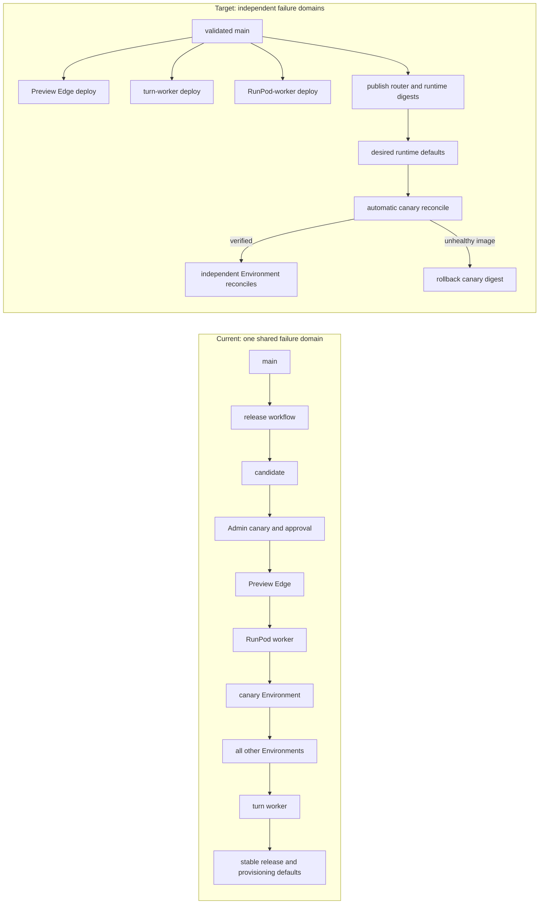

# Kestrel One release architecture audit

Date: 2026-08-06

## Question and intended decision

Why does Kestrel One have a database-backed, canary-approved, globally serialized Fly release system, which parts are actually required for agents to run safely, and how can the release orchestrator be retired without risking the hosted runtime?

The intended decision is whether to keep repairing the current release controller or replace it incrementally with a smaller deployment and reconciliation model.

## Answer

Retire the global release orchestrator. Do not retire the Environment lifecycle worker, immutable images, health checks, execution draining, or persisted per-Environment and per-Workspace image state.

The current system turns five separately deployable images and every hosted Environment into one database transaction. It introduces a candidate, saved canary, approval, ordered target list, active-release singleton, execution-route lock, retry budget, pause, manual retry, rollback release, controller contract, and stable-release authority. A failure in one Workspace can therefore stop unrelated image deployments, prevent new agent executions in its Environment, and prevent the bundle from becoming stable.

That coordination layer is not an old runtime invariant. It was introduced on 2026-08-04 by commit `40d63dacdf2573d0c0ada1e6749f736b48d42530`, which added 3,994 lines across 46 files. The separate control worker and controller fencing were added the following day. The hosted agent runtime predates both.

The durable replacement should have two normal deployment paths and one exceptional path:

1. CI deploys the three global Fly services independently: Preview Edge, the turn worker, and the RunPod worker. Each uses its own health gate and Fly rollback history.
2. CI publishes the Environment Router and Workspace Runtime images, records two desired immutable digests, and lets the existing lifecycle worker reconcile each Environment and Workspace independently. One configured canary Environment is attempted first automatically. There is no per-release approval and no global pause state.
3. A genuinely incompatible database, protocol, or Workspace-data migration uses an explicit maintenance runbook. That exceptional coordination must not be imposed on every code-only image change.

The queue should wake reconciliation work, not own truth. Desired and last-verified image state in Postgres should own truth. A worker restart, lost job, or ambiguous Fly response should be recoverable by comparing desired state, persisted verified state, and authoritative Fly state.

## Findings

### Observed

#### 1. The global release system is new; the runtime and lifecycle surfaces are not

- Commit `40d63dacdf2573d0c0ada1e6749f736b48d42530` introduced the candidate publisher, release tables, Releases Admin page, release runtime, image catalog, and the execution-route release lock in one change. It also removed the Environment Runtime form and its public update route.
- Before that commit, an administrator could submit an immutable Workspace Runtime digest for one Environment. The existing `environment.update` operation performed the work. The function still exists in `apps/web/lib/admin/environments.ts:183-283`, but its API and UI callers were removed.
- A July 0.6 production release used separate source/CI verification, database migration, Fly deployment, Vercel promotion, and hosted health verification. That proves a DB-backed global release transaction is not required to ship Kestrel One, although the earlier process was manual and should not simply be restored unchanged.

#### 2. Five unlike artifacts are forced into one ordered transaction

The catalog identifies two per-Environment images and three global applications (`deploy/fly/image-catalog.json:2-109`). The release runtime nevertheless orders them as Preview Edge, RunPod worker, canary Environment, every other Environment, then turn worker (`apps/web/lib/releases/runtime.ts:489-510`). Only when every target is complete does the release become the stable source for new Environment provisioning (`apps/web/lib/releases/store.ts:350-416`).

This creates dependencies that are broader than the code demonstrates. A Workspace provider failure can prevent the turn worker from deploying. A turn-worker change can require an Environment rollout even when the Environment images are unchanged. The current workflow also deploys the controller, waits for the exact Vercel production SHA, and then publishes a candidate on every `main` push (`.github/workflows/fly-image-release.yml:3-75`).

#### 3. The first wrong component is the Environment update retry envelope

The observed wrong behavior is a retryable Fly 408 causing an Environment rollout to revisit gateway mutation, Workspace backup, and Workspace mutation instead of resuming at the exact unresolved resource.

The component that first makes this wrong is `EnvironmentProvisioner.updateEnvironment()`:

- `process()` claims an operation and calls `updateEnvironment()` from its entry point on every attempt (`apps/web/lib/environments/provisioner.ts:292-320`).
- One invocation creates a new gateway service token and updates the gateway (`apps/web/lib/environments/provisioner.ts:557-673`).
- It then backs up every eligible Workspace, including special repair behavior for failed or unreachable Workspaces (`apps/web/lib/environments/provisioner.ts:674-747`).
- It then updates every Workspace and finally records the Environment runtime (`apps/web/lib/environments/provisioner.ts:748-809`).
- A retryable error queues the same operation again with retry metadata (`apps/web/lib/environments/provisioner.ts:335-395`), but the recorded stage is descriptive; it is not a resume checkpoint.

The Fly adapter already does the correct low-level thing for ambiguous writes: it reads the Machine first, avoids an already-satisfied mutation, and re-reads after network/408/409/412 failures before deciding to throw (`apps/web/lib/environments/providers/fly-machines.ts:926-1029`). That safe primitive is undermined by the caller re-entering a larger multi-resource transaction and generating new credential state.

The existing Environment lifecycle/reconciliation surface owns the repair. The Releases UI and its pause/retry policy are downstream symptoms.

#### 4. The global release layer expands one local failure into agent unavailability

The release runtime processes the first incomplete target only and pauses the whole active release when that target fails (`apps/web/lib/releases/runtime.ts:24-75`, `90-159`). An Environment target creates one large `environment.update` operation for both images and all Workspaces (`apps/web/lib/releases/runtime.ts:257-447`).

While an Environment release target is draining, applying, or verifying, the execution route refuses authorization and waits instead of starting or routing the Workspace (`apps/web/lib/environments/execution-route.ts:382-447`, `603-700`). The release target is therefore not just an observability record; it is a production traffic lock.

This is why a provider 408 can become a user-visible outage. More retry states inside the global release object make the outage longer-lived; they do not reduce the failure domain.

#### 5. Kestrel agents need compatibility and resource lifecycle safety, not a release ceremony

Kestrel One routes trusted server work to a remote runner service (`ARCHITECTURE.md:167-179`). In the hosted path, the Environment Router authenticates and proxies execution to a Workspace Runtime. The router currently reports contract revision 2 (`apps/environment-router/src/server.ts:18-18`, `64-72`), and the Workspace Runtime reports revision 3 only after its skills and runner are ready (`apps/workspace-runtime/src/server.ts:56-65`, `105-134`).

The runtime therefore needs these invariants:

- immutable, attributable images;
- an explicitly tested compatibility window between control plane, router, and Workspace Runtime;
- no mutation of a resource during an active execution using it;
- authoritative provider reads before mutation replay;
- last-verified image state and a reversible prior digest;
- stopped Workspaces updated or verified when they next start;
- additive database migration ordering for workers and web code;
- credentials kept at trusted boundaries.

None of those invariants requires a candidate object, saved canary draft, approval acknowledgment, five-role bundle, global active-release singleton, or release-wide pause.

#### 6. Useful desired-state machinery already exists

The dedicated control worker is correctly separated from the durable turn worker (`apps/web/scripts/control-worker.ts:48-62`; `apps/web/scripts/turn-worker.ts:22-32`). It should remain as the Environment lifecycle owner, but be named and operated as a control/lifecycle worker rather than a release controller.

The scheduled reconciler already recovers queued/running operations in bounded batches and reconciles provider state (`apps/web/lib/environments/reconcile.ts:42-111`). It also ensures each gateway matches the image persisted on its Environment while skipping active updates (`apps/web/lib/environments/reconcile.ts:470-520`). This is the natural owner for desired-versus-observed convergence.

The current release tables became a provisioning dependency only because `processEnvironmentOperation()` now reads the stable release before using the previous environment-variable defaults (`apps/web/lib/environments/process-runtime.ts:42-60`). That dependency can be dual-read and then removed without replacing the lifecycle system.

#### 7. Backups and credential rotation are incorrectly coupled to code deployment

A Workspace volume is mounted independently of its Machine image (`apps/web/lib/environments/providers/fly-machines.ts:1130-1192`). An ordinary image update does not itself replace the volume. Yet every normal Environment update performs `pre_destructive` backups unless explicitly skipped, and it creates fresh gateway and Workspace service tokens as part of image reconciliation (`apps/web/lib/environments/provisioner.ts:593-673`, `674-747`, `824-847`, `864-907`).

Content-aware backup and retention remain valuable independent recovery features. They should not be in the critical path for a code-only image change. Backup should be required only when an update explicitly declares a Workspace data-format migration or another destructive storage operation. Token rotation should be its own credential-lifecycle operation, not an implicit side effect of retrying an image update.

### Inferred

- The 2026-08-04 unified 0.8 release plan required a one-time frozen, atomic suite cutover (`docs/plans/2026-08-04-kestrel-0.8.0-unified-integration-release.md:23-47`). The permanent orchestrator appears to have generalized that exceptional cutover model into every `main` deployment. This is an inference from timing and structure, not an explicit design record.
- The large release system accumulated controller fencing and increasingly specialized retry logic because it crossed ownership boundaries: CI deployment, global Fly apps, per-Environment lifecycle, Workspace backup, credential rotation, and execution admission. The code volume is a consequence of that boundary mixing.
- A release-wide 15-minute retry budget is the wrong durability abstraction. Transient convergence should continue at capped backoff while the prior verified service remains available. A new image that repeatedly fails its health contract should be rolled back for that resource, not retried forever and not converted into a global platform pause.

## Contradictions and unknowns

- There is no explicit compatibility matrix proving which control-plane, router, and Workspace Runtime revisions can communicate during a staggered rollout. Before removing Environment-wide maintenance behavior, tests must prove current and previous supported combinations. The differing router revision 2 and Workspace revision 3 show that a single shared numeric revision is not already the contract.
- Some schema or protocol changes really may be incompatible. The replacement must classify them explicitly as maintenance releases; it cannot assume every change is safe to stagger.
- The exact dependency of Preview Edge and managed RunPod code on a given web revision needs contract tests before their deployment order is fully independent.
- This audit did not re-query live production state. Production release status, image digests, and Machine health remain time-sensitive and must be read again before any operational action.

## Target design

### 1. Keep the lifecycle worker; remove release ownership from it

Keep one dedicated Kestrel One control worker for Environment operations, deletion, backup lifecycle, and reconciliation. The turn worker continues to own only durable user turns. Remove candidate registration and release-target processing from the control worker after cutover. Its heartbeat should report worker revision and readiness, not gate release-candidate creation.

### 2. Deploy global services directly and independently

After required CI passes, deploy each changed global application from the exact commit:

- Preview Edge;
- turn worker;
- RunPod worker;
- control worker when its own inputs change.

Each deployment records the immutable digest and source revision, waits for that application's health contract, and uses Fly's previous release for rollback. Failure of one deployment fails that CI job; it does not create or pause a database release spanning other applications.

### 3. Use a minimal desired-state record for managed runtime images

Replace stable-release lookup with one small platform runtime settings record containing:

- desired Environment Router digest;
- desired Workspace Runtime digest;
- source revision;
- prior verified digests;
- update time.

Add `targetRouterImage` and `targetRuntimeImage` to each Environment. Existing `routerImage` and `runtimeImage` remain last-verified values during migration. Existing `environmentWorkspaces.runtimeImage` remains each Workspace's last-verified value. New Environments initialize targets from the platform defaults.

Do not create another release, component, target, or approval state machine.

### 4. Reconcile one resource at a time

One automatic rollout does this:

1. Set the configured canary Environment's target digests.
2. Wait for its active executions to drain.
3. Update only its gateway image, preserving credentials; read Fly state before and after mutation; health-check; record the verified gateway digest.
4. Enqueue or reconcile each running Workspace independently. Lock only that Workspace while it changes. Stopped Workspaces remain stopped and upgrade on their next start.
5. After canary gateway and running Workspaces verify, set targets for other Environments. Each then converges independently.

The current saved canary can migrate as one persistent platform setting. It is not selected and approved for every release. If it is unavailable, the runtime-image rollout waits and alerts while all Environments remain on their last verified images. Global services are not blocked.

An Environment gateway rollout briefly drains that Environment because every execution traverses it. A Workspace rollout drains only that Workspace. This is the smallest lock scope that matches the resource being changed.

### 5. Make failure state local and availability-preserving

| Condition | Behavior |
|---|---|
| Network error, 408, 429, or 5xx | Read authoritative Machine state. If desired state is present, continue verification. Otherwise retry that resource with capped backoff. |
| Worker restart or lost queue job | Scheduled reconciliation finds target != verified or provider mismatch and resumes. |
| New image fails health | Restore the prior verified digest for that resource, mark the desired digest rejected, alert, and do not advance the canary gate. |
| Contradictory provider state | Isolate that Environment or Workspace, preserve other rollouts, and require operator diagnosis. |
| Long provider outage | Continue capped reconciliation attempts; expose age and last response. Do not create a global paused release. |
| Existing service is healthy but upgrade is pending | Keep routing to the verified service until its exact resource drain begins. |

The operation record remains useful evidence, but it is not the truth source. A queue retry may always reconstruct the next action from desired, verified, and provider state.

### 6. Keep backups independent

- Preserve KWB1 restore compatibility, KWB2 streaming, content revisions, protections, deduplication, and bounded retention.
- Remove automatic backup from ordinary image reconciliation.
- Require backup only for an explicit `workspaceDataMigrationRevision` or destructive volume operation.
- Let backup failure block only the destructive operation that declared it, never unrelated image deployments.

### 7. Replace Releases Admin with a runtime deployment status surface

The normal path needs no approval UI. An operational status page should show:

- global app source revision, digest, and health;
- platform desired router/runtime digests;
- each Environment's target and verified images;
- the resource currently reconciling, last provider response, and next attempt;
- per-resource rollback or reconcile controls after automatic recovery fails.

Historical releases can remain read-only until their tables are retired.

## Incremental migration and rollback plan

This must be a strangler migration, not a rewrite or a one-pass production cutover.

### Phase 0: Contain the current system

- Stop publishing additional candidates while an active release exists.
- Do not remove current queues, tables, or Admin recovery controls.
- Treat production incident recovery as a separate, evidence-driven operation; re-read live authority before acting.

Rollback: no architecture change yet.

### Phase 1: Repair the owning lifecycle seam under the current interface

- Refactor `environment.update` so provider retries resume at the unresolved gateway or Workspace rather than re-entering the entire Environment.
- Preserve existing service tokens during code-only image updates.
- Skip backups unless the operation explicitly declares a destructive data migration.
- Use the provider adapter's existing authoritative read behavior for every mutation.
- Keep the current release runtime as a caller temporarily so the active production release can use the safer operation without a database edit or Machine patch.

Acceptance: injected 408s never repeat completed backups, token rotations, or completed Machine mutations; worker restart resumes the exact resource; the prior verified service remains routable outside the exact drain window.

Rollback: deploy the prior control-worker revision; no schema dependency is required for this phase.

### Phase 2: Add desired-versus-verified runtime state behind a temporary mode switch

- Add the minimal platform runtime settings record and Environment target image columns additively.
- Dual-read platform defaults: new settings first, current stable-release record second, environment variables last.
- Teach the reconciler to compute actions without executing them in shadow mode.
- Add compatibility tests for current and previous web/control-worker, router, and Workspace Runtime contracts.

Acceptance: shadow output exactly identifies the Machines the legacy release would change, while producing no Fly mutations and no execution locks.

Rollback: switch reads back to the stable-release record. Leave additive columns unused.

### Phase 3: Prove one real Environment through the new reconciler

- Use the already configured canary; do not introduce selection heuristics.
- Reconcile its gateway and Workspaces one resource at a time.
- Verify active-turn drain/resume, old/new contract compatibility, stopped-Workspace lazy upgrade, provider ambiguity recovery, and rollback to prior digests.
- Run the legacy release code in observation-only comparison for the same desired digests.

Acceptance: the canary converges without a release row or release-target execution lock, and an injected failure affects only the exact resource.

Rollback: clear target digests or return to legacy mode; verified image fields and prior digests remain authoritative.

### Phase 4: Cut over normal automation

- Change the image workflow from candidate publication to independent global-app deploys plus desired router/runtime default publication.
- Automatically reconcile the configured canary, then independently target other Environments after canary verification.
- Stop creating new release candidates.
- Remove release-target checks from execution routing. Lifecycle operation locks remain.

Acceptance: two production runtime changes complete without Admin approval; a provider 408 is reconciled without platform pause; one Environment failure does not block global apps or unrelated Environments; agent runs outside the exact changing resource continue.

Rollback: restore the previous workflow and legacy mode while the old release code and tables still exist.

### Phase 5: Retire the orchestrator

After at least two successful production runtime changes and one rollback drill:

- remove the Releases approval/canary/rollback UI and mutation APIs;
- remove the Fly release queue and active-release recovery;
- rename release-controller heartbeat and queue terminology to control-worker terminology;
- make release tables read-only historical data;
- remove stable-release fallback only after all provisioning/start/restore paths use platform defaults;
- drop the release tables in a later, separately reviewed migration after confirming no readers.

The content-aware backup tables and lifecycle remain. The dedicated control worker remains. The turn worker remains independent.

## Acceptance criteria for the replacement

- A failed Workspace upgrade cannot pause or block deployment of the turn worker, Preview Edge, RunPod worker, another Environment, or the control plane.
- An ambiguous Fly mutation performs an authoritative read before any replay and resumes at the same Machine.
- A retry never rotates a credential or recreates a backup merely because an image mutation was ambiguous.
- A worker restart converges from Postgres plus Fly state even if its queue job disappeared.
- An unavailable provider leaves verified services running and exposes pending convergence rather than a global pause.
- A health-rejected image rolls back the canary resource automatically and does not advance to other Environments.
- Stopped Workspaces remain stopped and verify the desired runtime on next start.
- Current/previous control-plane, router, and Workspace Runtime compatibility is tested explicitly.
- Code-only image changes create zero Workspace archives and zero Fly volume snapshots.
- No provisioning, start, restore, or execution route requires a fly-image release row.

## Implications

The answer is not to add another controller, retry budget, readiness gate, or manual recovery button. The correct simplification is to remove the global release as an execution concept and put durability at the resource lifecycle boundary that already owns Fly state.

This preserves the parts that keep agents safe while eliminating the parts that made one provider response a system-wide event. It also gives the current production incident a direct repair path: fix the resumability of `environment.update` first, then use that same primitive to migrate away from the orchestrator.

## Sources

Primary local sources:

- `ARCHITECTURE.md:13-23, 72-95, 167-203`
- `.github/workflows/fly-image-release.yml:3-75`
- `deploy/fly/image-catalog.json:2-109`
- `docs/fly-image-releases.md:13-111`
- `docs/plans/2026-08-04-kestrel-0.8.0-unified-integration-release.md:23-55`
- `apps/web/lib/db/migrations/0058_fly_image_releases.sql:1-92`
- `apps/web/lib/releases/runtime.ts:24-159, 193-255, 257-523`
- `apps/web/lib/releases/store.ts:350-416, 444-520`
- `apps/web/lib/releases/controller-contract.ts:1-19`
- `apps/web/lib/environments/process-runtime.ts:14-63`
- `apps/web/lib/environments/provisioner.ts:292-439, 557-919`
- `apps/web/lib/environments/providers/fly-machines.ts:926-1029, 1130-1245`
- `apps/web/lib/environments/execution-route.ts:360-447, 590-700`
- `apps/web/lib/environments/reconcile.ts:42-111, 148-343, 470-520`
- `apps/web/lib/knowledge/queue.ts:14-40, 353-520`
- `apps/web/scripts/control-worker.ts:1-84`
- `apps/web/scripts/turn-worker.ts:1-53`
- `apps/environment-router/src/server.ts:18-18, 64-75, 121-159`
- `apps/workspace-runtime/src/server.ts:56-65, 105-179`
- Git commit `40d63dacdf2573d0c0ada1e6749f736b48d42530` and its parent
- Git commit `c6c65fff6d20ba88bb58d56503ed8abf1f2e3587`

Historical operational evidence:

- Prior 0.6 rollout summary, 2026-07-16: separate validation, migration, Fly/Vercel deployment, and hosted health verification. This is historical evidence, not current production state.
